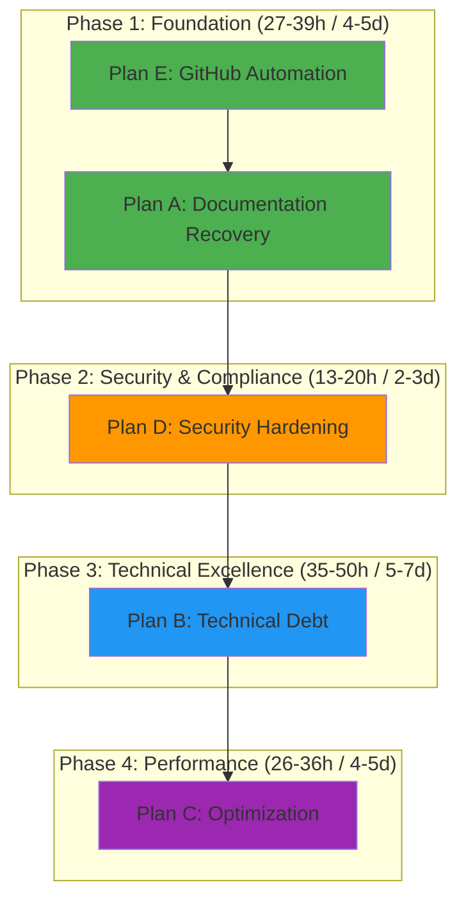
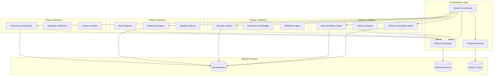
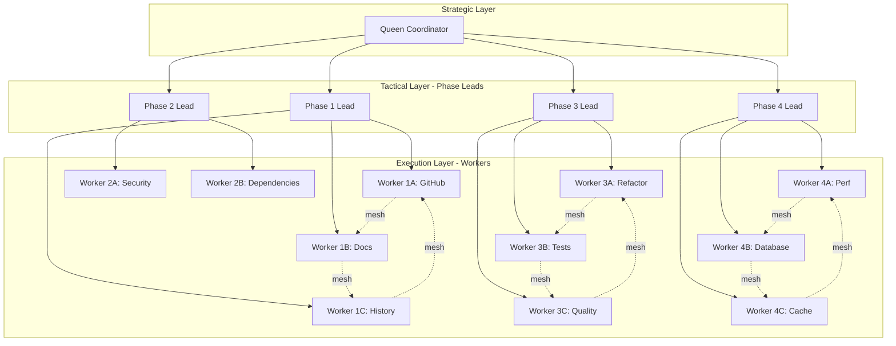
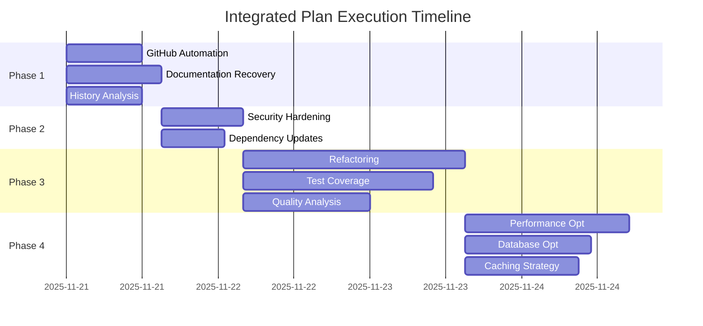
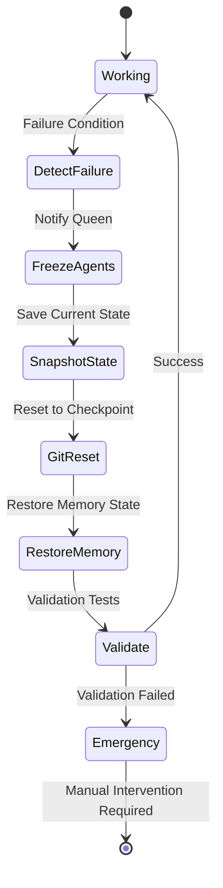
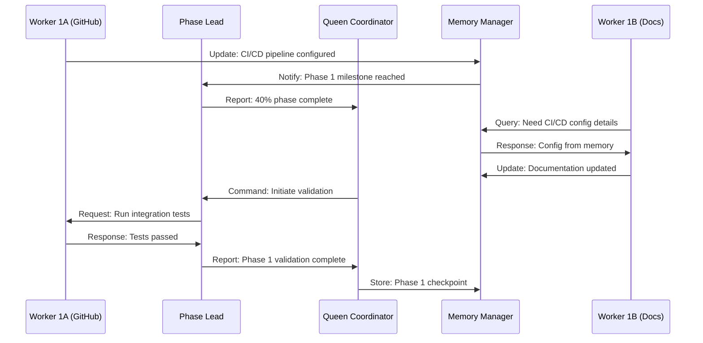
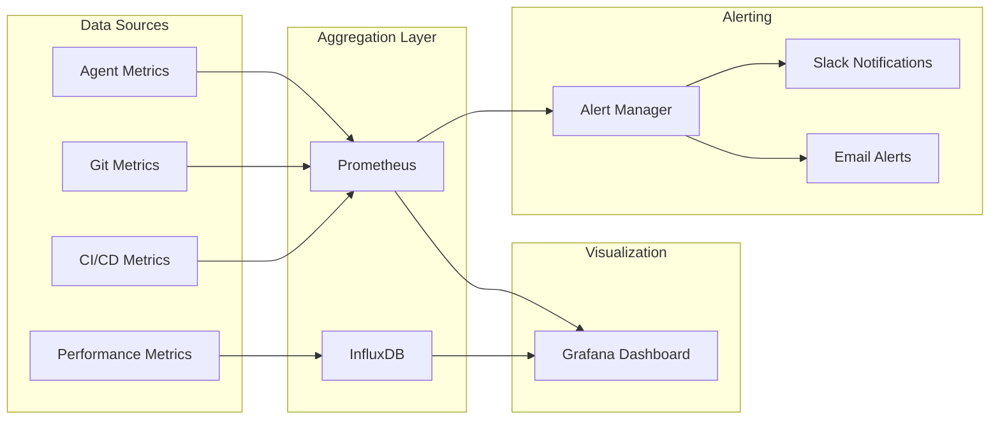
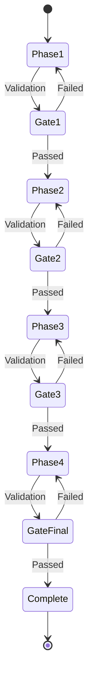

# Integrated Plan Execution Architecture

**Version**: 1.0.0
**Date**: 2025-11-21
**Status**: Architecture Design Phase
**Methodology**: SPARC (Specification, Pseudocode, Architecture, Refinement, Completion)

---

## Executive Summary

This architecture document defines the system design for executing 5 integrated recovery and improvement plans across 4 phases, leveraging swarm intelligence and parallel execution patterns to achieve optimal throughput while maintaining safety and quality.

**Total Estimated Duration**: 101-145 hours (15-21 days)
**Parallel Execution Savings**: 32-45 hours through concurrent work streams
**Success Criteria**: 90%+ test coverage, zero security vulnerabilities, <200ms API latency

---

## Table of Contents

1. [Phase Architecture](#phase-architecture)
2. [Component Interaction Model](#component-interaction-model)
3. [Swarm Coordination Topology](#swarm-coordination-topology)
4. [Resource Allocation Matrix](#resource-allocation-matrix)
5. [Parallel Execution Opportunities](#parallel-execution-opportunities)
6. [Rollback Strategies](#rollback-strategies)
7. [Communication Patterns](#communication-patterns)
8. [Metrics & Monitoring](#metrics--monitoring)
9. [Risk Mitigation](#risk-mitigation)

---

## 1. Phase Architecture

### 1.1 Phase Dependency Diagram



### 1.2 Phase Breakdown

#### Phase 1: Foundation (27-39 hours)

**Objective**: Establish automation safety net and recover historical context

**Integrated Plans**:
- **Plan E: GitHub Automation** (12-18h)
  - Pre-commit hooks for quality gates
  - CI/CD pipeline with automated testing
  - Branch protection and review workflows

- **Plan A: Documentation Recovery** (15-21h)
  - Historical decision mining
  - Architecture documentation
  - Runbook creation

**Rationale**:
- GitHub automation provides safety net for all future changes
- Documentation recovery establishes critical context before refactoring
- CI/CD catches issues early in subsequent phases

**Success Criteria**:
- ✅ All commits pass pre-commit hooks
- ✅ CI/CD pipeline executes in <5 minutes
- ✅ 90%+ historical decisions documented
- ✅ All integration points mapped

---

#### Phase 2: Security & Compliance (13-20 hours)

**Objective**: Secure the codebase before major structural changes

**Plan D: Security Hardening**
- Dependency audit and updates
- Secret scanning and rotation
- Input validation framework
- Security test suite

**Rationale**:
- Must secure before large-scale refactoring
- CI/CD from Phase 1 validates security changes
- Documentation from Phase 1 identifies security-critical paths

**Success Criteria**:
- ✅ Zero critical/high vulnerabilities
- ✅ All secrets rotated and vaulted
- ✅ Input validation on all endpoints
- ✅ Security tests achieve 85%+ coverage

---

#### Phase 3: Technical Excellence (35-50 hours)

**Objective**: Refactor and improve code quality on secured foundation

**Plan B: Technical Debt**
- Modularization and dependency reduction
- Test coverage improvement (40% → 90%)
- Code quality improvements
- Architecture alignment

**Rationale**:
- Safer to refactor with security hardening complete
- CI/CD catches regressions immediately
- Documentation guides refactoring decisions

**Success Criteria**:
- ✅ Cyclomatic complexity <10
- ✅ Test coverage 90%+
- ✅ Zero circular dependencies
- ✅ All modules <500 LOC

---

#### Phase 4: Performance (26-36 hours)

**Objective**: Optimize clean, secure, well-tested codebase

**Plan C: Optimization**
- Database query optimization
- API response time improvements
- Caching strategy implementation
- Load testing and capacity planning

**Rationale**:
- Optimize clean code (Phase 3 complete)
- Measure against secure baseline (Phase 2)
- Validate with comprehensive tests (Phase 3)

**Success Criteria**:
- ✅ API latency <200ms p95
- ✅ Database queries <50ms p95
- ✅ Cache hit rate >80%
- ✅ Support 10x current load

---

## 2. Component Interaction Model

### 2.1 System Component Diagram



### 2.2 Component Responsibilities

#### Coordination Layer

**Queen Coordinator**
- Strategic phase management
- Resource allocation
- Conflict resolution
- Risk assessment
- Phase transition approval

**Memory Manager**
- Cross-agent state synchronization
- Decision history tracking
- Pattern learning storage
- Context restoration

**Progress Monitor**
- Real-time metrics collection
- Bottleneck detection
- SLA tracking
- Alert generation

#### Phase Workers

**Phase 1: Foundation**
- `GitHub Automation Agent`: CI/CD setup, hooks, workflows
- `Documentation Agent`: Architecture docs, runbooks
- `History Analyzer`: Git mining, decision extraction

**Phase 2: Security**
- `Security Auditor`: Vulnerability scanning, compliance
- `Dependency Manager`: Package updates, audit
- `Validation Agent`: Input validation framework

**Phase 3: Technical Debt**
- `Refactoring Agent`: Code restructuring, modularization
- `Test Engineer`: Test suite expansion, coverage
- `Quality Analyzer`: Complexity metrics, code review

**Phase 4: Performance**
- `Performance Engineer`: Benchmarking, profiling
- `Database Optimizer`: Query optimization, indexing
- `Cache Architect`: Caching strategy, implementation

---

## 3. Swarm Coordination Topology

### 3.1 Topology Design

**Selected Pattern**: Adaptive Mesh with Hierarchical Fallback



### 3.2 Coordination Patterns

#### Memory Synchronization

```yaml
memory_schema:
  global:
    - swarm/status: "Current phase, progress, blockers"
    - swarm/decisions: "Strategic decisions with rationale"
    - swarm/metrics: "Performance, quality, security metrics"

  phase_1:
    - swarm/phase1/github: "CI/CD config, hook status"
    - swarm/phase1/docs: "Documentation coverage, gaps"
    - swarm/phase1/history: "Extracted decisions, patterns"

  phase_2:
    - swarm/phase2/security: "Vulnerabilities, fixes, status"
    - swarm/phase2/dependencies: "Update status, compatibility"
    - swarm/phase2/validation: "Validation coverage, tests"

  phase_3:
    - swarm/phase3/refactoring: "Modules refactored, metrics"
    - swarm/phase3/tests: "Test coverage, failures, gaps"
    - swarm/phase3/quality: "Complexity, duplication, debt"

  phase_4:
    - swarm/phase4/performance: "Benchmarks, bottlenecks"
    - swarm/phase4/database: "Query performance, indexes"
    - swarm/phase4/cache: "Hit rates, eviction policy"

sync_strategy:
  frequency: "After each significant change"
  conflict_resolution: "Last-write-wins with version tracking"
  consistency_model: "Eventual consistency within 30 seconds"
```

#### Progress Monitoring

```yaml
monitoring_architecture:
  metrics_collection:
    interval: "5 minutes"
    retention: "30 days"

  key_metrics:
    - task_completion_rate
    - test_coverage_delta
    - vulnerability_count
    - code_quality_score
    - api_latency_p95
    - build_success_rate

  alerting:
    - type: "blocker"
      threshold: "Task blocked > 2 hours"
      notify: ["queen_coordinator", "phase_lead"]

    - type: "regression"
      threshold: "Test coverage drops > 5%"
      notify: ["test_engineer", "phase_lead"]

    - type: "security"
      threshold: "New critical vulnerability detected"
      notify: ["security_auditor", "queen_coordinator"]
```

---

## 4. Resource Allocation Matrix

### 4.1 Agent Allocation by Phase

| Phase | Queen | Phase Lead | Workers | Total Agents | Duration |
|-------|-------|------------|---------|--------------|----------|
| Phase 1 | 1 | 1 | 3 (GitHub, Docs, History) | 5 | 27-39h |
| Phase 2 | 1 | 1 | 2 (Security, Deps) | 4 | 13-20h |
| Phase 3 | 1 | 1 | 3 (Refactor, Test, Quality) | 5 | 35-50h |
| Phase 4 | 1 | 1 | 3 (Perf, DB, Cache) | 5 | 26-36h |

### 4.2 Compute Resource Distribution

```yaml
resource_allocation:
  phase_1:
    cpu_cores: 8
    memory_gb: 16
    storage_gb: 50
    parallel_streams: 3

  phase_2:
    cpu_cores: 6
    memory_gb: 12
    storage_gb: 30
    parallel_streams: 2

  phase_3:
    cpu_cores: 12
    memory_gb: 24
    storage_gb: 100
    parallel_streams: 3

  phase_4:
    cpu_cores: 10
    memory_gb: 20
    storage_gb: 50
    parallel_streams: 3

total_resources:
  peak_cpu_cores: 12
  peak_memory_gb: 24
  peak_storage_gb: 100
  peak_parallel_agents: 5
```

### 4.3 Time Budget Allocation



---

## 5. Parallel Execution Opportunities

### 5.1 Phase 1 Parallelization

```yaml
phase_1_concurrent_streams:
  stream_1:
    agent: "GitHub Automation Agent"
    tasks:
      - Setup pre-commit hooks (4h)
      - Configure CI/CD pipeline (6h)
      - Implement branch protection (2h)
    dependencies: []

  stream_2:
    agent: "Documentation Agent"
    tasks:
      - Create architecture docs (8h)
      - Write operational runbooks (5h)
      - Document API contracts (2h)
    dependencies: ["stream_3.extract_decisions"]

  stream_3:
    agent: "History Analyzer"
    tasks:
      - Mine git history (4h)
      - Extract key decisions (5h)
      - Identify patterns (3h)
    dependencies: []

parallelization_gain: "15-21h sequential → 12-18h parallel = 3-5h savings"
```

### 5.2 Phase 3 Parallelization

```yaml
phase_3_concurrent_streams:
  stream_1:
    agent: "Refactoring Agent"
    tasks:
      - Modularize authentication (12h)
      - Refactor API layer (10h)
      - Extract shared utilities (8h)
      - Apply design patterns (5h)
    dependencies: []

  stream_2:
    agent: "Test Engineer"
    tasks:
      - Expand unit tests (15h)
      - Create integration tests (10h)
      - Add E2E tests (5h)
    dependencies: ["stream_1.modularize_authentication"]

  stream_3:
    agent: "Quality Analyzer"
    tasks:
      - Analyze code complexity (5h)
      - Identify duplicates (3h)
      - Review architecture (7h)
      - Generate quality report (5h)
    dependencies: []

parallelization_gain: "50h sequential → 35h parallel = 15h savings"
```

### 5.3 Phase 4 Parallelization

```yaml
phase_4_concurrent_streams:
  stream_1:
    agent: "Performance Engineer"
    tasks:
      - Profile application (8h)
      - Benchmark endpoints (6h)
      - Load testing (8h)
      - Capacity planning (4h)
    dependencies: []

  stream_2:
    agent: "Database Optimizer"
    tasks:
      - Analyze slow queries (6h)
      - Create indexes (4h)
      - Optimize schema (6h)
      - Test performance (4h)
    dependencies: []

  stream_3:
    agent: "Cache Architect"
    tasks:
      - Design cache strategy (6h)
      - Implement caching layer (8h)
      - Test hit rates (4h)
    dependencies: []

parallelization_gain: "36h sequential → 26h parallel = 10h savings"
```

### 5.4 Total Parallelization Savings

```
Sequential Total: 101-145 hours
Parallel Total: 69-100 hours
Savings: 32-45 hours (31-37% reduction)
```

---

## 6. Rollback Strategies

### 6.1 Phase-Level Rollback

```yaml
rollback_architecture:
  strategy: "Git-based checkpoint system with automated restore"

  checkpoints:
    - phase_1_start: "Before any Phase 1 changes"
    - phase_1_complete: "After Phase 1 validation"
    - phase_2_complete: "After Phase 2 validation"
    - phase_3_complete: "After Phase 3 validation"
    - phase_4_complete: "After Phase 4 validation"

  rollback_procedure:
    1. "Detect failure condition"
    2. "Freeze all agent activity"
    3. "Notify Queen Coordinator"
    4. "Execute git reset to checkpoint"
    5. "Restore memory state from checkpoint"
    6. "Validate rollback success"
    7. "Resume from checkpoint with mitigation"

rollback_triggers:
  - "Test coverage drops > 10%"
  - "New critical security vulnerability"
  - "Build fails for > 3 consecutive attempts"
  - "Manual trigger by Queen Coordinator"
```

### 6.2 Component-Level Rollback



### 6.3 Rollback Testing

```yaml
rollback_testing:
  frequency: "Before each phase transition"

  test_scenarios:
    - scenario: "Phase 1 CI/CD failure"
      trigger: "Simulate failing test suite"
      expected: "Rollback to phase_1_start in <5 minutes"

    - scenario: "Phase 2 security regression"
      trigger: "Introduce known vulnerability"
      expected: "Rollback to phase_1_complete, alert triggered"

    - scenario: "Phase 3 test coverage drop"
      trigger: "Delete test files"
      expected: "Rollback to phase_2_complete, coverage restored"

    - scenario: "Phase 4 performance regression"
      trigger: "Simulate 500ms latency increase"
      expected: "Rollback to phase_3_complete, perf baseline restored"
```

---

## 7. Communication Patterns

### 7.1 Inter-Agent Communication

```yaml
communication_architecture:
  protocols:
    - type: "Direct Message"
      use_case: "Critical blocking issues"
      latency: "<1 second"
      reliability: "99.9%"

    - type: "Shared Memory"
      use_case: "State synchronization"
      latency: "<30 seconds"
      reliability: "99.5%"

    - type: "Event Stream"
      use_case: "Progress updates, notifications"
      latency: "<5 seconds"
      reliability: "99.0%"

    - type: "File System"
      use_case: "Large artifacts (docs, reports)"
      latency: "<60 seconds"
      reliability: "99.99%"

message_schema:
  priority_levels:
    - P0: "Critical blocker - immediate action required"
    - P1: "Important - requires attention within 1 hour"
    - P2: "Normal - handle during next work cycle"
    - P3: "Low - informational only"

  message_format:
    from: "agent_id"
    to: "agent_id | broadcast"
    priority: "P0 | P1 | P2 | P3"
    subject: "Brief description"
    body: "Detailed message content"
    metadata:
      phase: "current_phase"
      task_id: "related_task"
      requires_response: "boolean"
      deadline: "timestamp if applicable"
```

### 7.2 Communication Flow Diagram



### 7.3 Notification Channels

```yaml
notification_channels:
  slack:
    enabled: true
    channels:
      - "#swarm-progress": "Hourly progress updates"
      - "#swarm-alerts": "P0/P1 issues"
      - "#swarm-metrics": "Key metric changes"

  email:
    enabled: true
    recipients:
      - "project-lead@example.com": "Daily summaries"
      - "dev-team@example.com": "Phase completions"

  dashboard:
    enabled: true
    url: "https://dashboard.example.com/swarm"
    refresh_rate: "30 seconds"
    widgets:
      - "Phase progress bars"
      - "Active agents status"
      - "Recent alerts"
      - "Key metrics graphs"
```

---

## 8. Metrics & Monitoring

### 8.1 Key Performance Indicators

```yaml
phase_1_kpis:
  automation:
    - metric: "pre_commit_hook_success_rate"
      target: ">95%"
      alert_threshold: "<90%"

    - metric: "ci_cd_pipeline_duration"
      target: "<5 minutes"
      alert_threshold: ">7 minutes"

  documentation:
    - metric: "documentation_coverage"
      target: ">90%"
      alert_threshold: "<80%"

    - metric: "historical_decisions_captured"
      target: ">85%"
      alert_threshold: "<70%"

phase_2_kpis:
  security:
    - metric: "critical_vulnerabilities"
      target: "0"
      alert_threshold: ">0"

    - metric: "high_vulnerabilities"
      target: "0"
      alert_threshold: ">2"

    - metric: "secrets_rotated"
      target: "100%"
      alert_threshold: "<95%"

phase_3_kpis:
  quality:
    - metric: "test_coverage"
      target: ">90%"
      alert_threshold: "<85%"

    - metric: "cyclomatic_complexity"
      target: "<10"
      alert_threshold: ">15"

    - metric: "code_duplication"
      target: "<5%"
      alert_threshold: ">10%"

phase_4_kpis:
  performance:
    - metric: "api_latency_p95"
      target: "<200ms"
      alert_threshold: ">300ms"

    - metric: "database_query_p95"
      target: "<50ms"
      alert_threshold: ">100ms"

    - metric: "cache_hit_rate"
      target: ">80%"
      alert_threshold: "<70%"
```

### 8.2 Monitoring Dashboard Architecture



### 8.3 Real-Time Metrics Collection

```yaml
metrics_collection:
  agents:
    - metric: "task_completion_time"
      type: "histogram"
      labels: ["agent_id", "phase", "task_type"]

    - metric: "agent_utilization"
      type: "gauge"
      labels: ["agent_id", "phase"]

    - metric: "agent_errors"
      type: "counter"
      labels: ["agent_id", "error_type"]

  system:
    - metric: "memory_usage_bytes"
      type: "gauge"
      labels: ["component"]

    - metric: "cpu_utilization_percent"
      type: "gauge"
      labels: ["component"]

    - metric: "disk_io_operations"
      type: "counter"
      labels: ["operation_type"]

  quality:
    - metric: "test_coverage_percent"
      type: "gauge"
      labels: ["phase", "component"]

    - metric: "code_quality_score"
      type: "gauge"
      labels: ["metric_type"]

    - metric: "security_vulnerabilities"
      type: "gauge"
      labels: ["severity"]
```

---

## 9. Risk Mitigation

### 9.1 Risk Assessment Matrix

| Risk | Probability | Impact | Mitigation | Owner |
|------|-------------|--------|------------|-------|
| CI/CD pipeline failure blocks development | Medium | High | Rollback to Phase 1 checkpoint, fix pipeline before proceeding | GitHub Agent + Phase Lead |
| Security vulnerability introduced during refactoring | Medium | Critical | Automated security scanning in CI/CD, rollback on detection | Security Auditor |
| Test coverage drops during Phase 3 | Low | High | Real-time coverage monitoring, block PRs if coverage drops | Test Engineer |
| Performance regression in Phase 4 | Medium | Medium | Baseline performance tests, automated rollback if latency > threshold | Performance Engineer |
| Memory synchronization conflicts | Low | Medium | Last-write-wins with conflict logging, Queen arbitration | Memory Manager |
| Agent coordination failures | Low | High | Health checks every 5 minutes, auto-restart failed agents | Queen Coordinator |

### 9.2 Failure Mode Analysis

```yaml
failure_modes:
  agent_crash:
    detection: "Health check timeout (60 seconds)"
    response:
      - "Log crash details to memory"
      - "Notify Queen Coordinator"
      - "Restart agent with last known state"
      - "If restart fails 3x, escalate to manual intervention"

  git_conflict:
    detection: "Merge conflict during commit"
    response:
      - "Freeze conflicting agents"
      - "Notify Phase Lead"
      - "Queen Coordinator resolves conflict"
      - "Resume agents after resolution"

  ci_pipeline_failure:
    detection: "Pipeline exit code != 0"
    response:
      - "Block all commits"
      - "Notify all agents in current phase"
      - "Phase Lead investigates failure"
      - "Fix applied and validated before resuming"

  resource_exhaustion:
    detection: "CPU > 90% or Memory > 95% for > 5 minutes"
    response:
      - "Pause low-priority tasks"
      - "Scale up resources if available"
      - "Notify Queen Coordinator"
      - "Adjust resource allocation"
```

### 9.3 Contingency Plans

```yaml
contingency_plans:
  phase_1_failure:
    scenario: "Cannot establish reliable CI/CD"
    fallback:
      - "Manual testing gates"
      - "Reduced automation scope"
      - "Proceed with increased review overhead"
      - "Revisit CI/CD in Phase 4"

  phase_2_failure:
    scenario: "Critical security vulnerabilities cannot be fixed"
    fallback:
      - "Isolate vulnerable components"
      - "Implement compensating controls"
      - "Defer refactoring of vulnerable code"
      - "Escalate to security team for guidance"

  phase_3_failure:
    scenario: "Refactoring causes cascading test failures"
    fallback:
      - "Rollback to Phase 2 checkpoint"
      - "Reduce refactoring scope"
      - "Focus on high-value modules only"
      - "Defer remaining debt to future iteration"

  phase_4_failure:
    scenario: "Performance optimizations cause regressions"
    fallback:
      - "Rollback to Phase 3 checkpoint"
      - "Keep current performance baseline"
      - "Document optimization opportunities"
      - "Plan performance work for next quarter"
```

---

## 10. Phase Transition Criteria

### 10.1 Phase Transition Gates

```yaml
phase_1_to_phase_2:
  required_conditions:
    - "All pre-commit hooks configured and passing"
    - "CI/CD pipeline executes successfully"
    - "Documentation coverage > 85%"
    - "Historical decisions extracted and documented"
    - "All Phase 1 tests passing"
    - "Queen Coordinator approval"

  validation_checklist:
    - [ ] Pre-commit hooks block commits with issues
    - [ ] CI/CD runs in < 5 minutes
    - [ ] Architecture documentation complete
    - [ ] Runbooks created for all critical processes
    - [ ] Integration points mapped
    - [ ] Phase 1 checkpoint created

phase_2_to_phase_3:
  required_conditions:
    - "Zero critical/high security vulnerabilities"
    - "All secrets rotated and vaulted"
    - "Security test suite passes"
    - "Dependency audit complete"
    - "All Phase 2 tests passing"
    - "Queen Coordinator approval"

  validation_checklist:
    - [ ] Security scan shows zero critical/high vulns
    - [ ] Secret scanning enabled in CI/CD
    - [ ] Input validation on all endpoints
    - [ ] Dependencies updated and compatible
    - [ ] Security tests achieve 85%+ coverage
    - [ ] Phase 2 checkpoint created

phase_3_to_phase_4:
  required_conditions:
    - "Test coverage > 90%"
    - "Cyclomatic complexity < 10"
    - "Zero circular dependencies"
    - "All modules < 500 LOC"
    - "All Phase 3 tests passing"
    - "Queen Coordinator approval"

  validation_checklist:
    - [ ] Test coverage dashboard shows > 90%
    - [ ] Code quality metrics meet targets
    - [ ] Architecture review complete
    - [ ] Refactoring documented
    - [ ] Integration tests passing
    - [ ] Phase 3 checkpoint created

phase_4_completion:
  required_conditions:
    - "API latency p95 < 200ms"
    - "Database query p95 < 50ms"
    - "Cache hit rate > 80%"
    - "Load tests pass at 10x current load"
    - "All Phase 4 tests passing"
    - "Queen Coordinator final approval"

  validation_checklist:
    - [ ] Performance benchmarks meet all targets
    - [ ] Optimization documented
    - [ ] Capacity plan reviewed
    - [ ] Production readiness checklist complete
    - [ ] Final integration tests passing
    - [ ] Phase 4 checkpoint created
```

### 10.2 Transition Process



---

## 11. Implementation Roadmap

### 11.1 Week-by-Week Breakdown

```yaml
week_1:
  focus: "Phase 1 - Foundation"
  days: 4-5
  agents: 5 (Queen + Phase Lead + 3 Workers)
  deliverables:
    - "CI/CD pipeline operational"
    - "Pre-commit hooks enforcing quality"
    - "Architecture documentation 90% complete"
    - "Historical decisions documented"

  daily_schedule:
    day_1:
      - "Swarm initialization"
      - "GitHub automation setup begins"
      - "Git history mining starts"

    day_2:
      - "CI/CD pipeline configuration"
      - "Documentation framework created"
      - "Decision extraction ongoing"

    day_3:
      - "Pre-commit hooks implemented"
      - "Architecture docs drafted"
      - "Pattern analysis"

    day_4:
      - "Pipeline testing and refinement"
      - "Runbooks created"
      - "Integration testing"

    day_5:
      - "Phase 1 validation"
      - "Checkpoint creation"
      - "Phase 1→2 transition approval"

week_2:
  focus: "Phase 2 - Security & Compliance"
  days: 2-3
  agents: 4 (Queen + Phase Lead + 2 Workers)
  deliverables:
    - "Zero critical/high vulnerabilities"
    - "All secrets rotated"
    - "Security test suite operational"
    - "Compliance documentation"

  daily_schedule:
    day_1:
      - "Security audit initiated"
      - "Dependency scan and analysis"
      - "Secret detection scan"

    day_2:
      - "Vulnerability remediation"
      - "Dependency updates"
      - "Secret rotation"

    day_3:
      - "Security test creation"
      - "Validation and verification"
      - "Phase 2→3 transition approval"

week_3_and_4:
  focus: "Phase 3 - Technical Excellence"
  days: 5-7
  agents: 5 (Queen + Phase Lead + 3 Workers)
  deliverables:
    - "90%+ test coverage"
    - "Codebase modularized"
    - "Quality metrics achieved"
    - "Architecture aligned"

  week_3_schedule:
    day_1:
      - "Refactoring plan finalized"
      - "Test baseline established"
      - "Quality analysis started"

    day_2:
      - "Authentication module refactored"
      - "Unit tests expanded"
      - "Complexity analysis"

    day_3:
      - "API layer refactored"
      - "Integration tests created"
      - "Duplication removed"

    day_4:
      - "Shared utilities extracted"
      - "E2E tests added"
      - "Architecture review"

    day_5:
      - "Design patterns applied"
      - "Coverage validation"
      - "Mid-phase checkpoint"

  week_4_schedule:
    day_1:
      - "Remaining modules refactored"
      - "Test gap filling"
      - "Quality report generation"

    day_2:
      - "Final integration testing"
      - "Coverage > 90% validation"
      - "Phase 3→4 transition approval"

week_5:
  focus: "Phase 4 - Performance Optimization"
  days: 4-5
  agents: 5 (Queen + Phase Lead + 3 Workers)
  deliverables:
    - "API latency < 200ms p95"
    - "Database optimized"
    - "Caching implemented"
    - "Load testing passed"

  daily_schedule:
    day_1:
      - "Performance profiling"
      - "Database query analysis"
      - "Cache strategy design"

    day_2:
      - "API optimization implementation"
      - "Index creation and testing"
      - "Cache layer implementation"

    day_3:
      - "Benchmark execution"
      - "Query optimization refinement"
      - "Cache hit rate tuning"

    day_4:
      - "Load testing"
      - "Capacity planning"
      - "Final validation"

    day_5:
      - "Production readiness review"
      - "Final checkpoint"
      - "Project completion approval"
```

### 11.2 Success Metrics Summary

```yaml
final_success_criteria:
  automation:
    - "100% commits pass pre-commit hooks"
    - "CI/CD pipeline < 5 min execution"
    - "Zero manual quality gates"

  security:
    - "Zero critical/high vulnerabilities"
    - "100% secrets vaulted"
    - "Security tests 85%+ coverage"

  quality:
    - "Test coverage > 90%"
    - "Cyclomatic complexity < 10"
    - "Code duplication < 5%"
    - "All modules < 500 LOC"

  performance:
    - "API latency p95 < 200ms"
    - "Database query p95 < 50ms"
    - "Cache hit rate > 80%"
    - "10x load capacity"

  documentation:
    - "Architecture docs 90%+ complete"
    - "All critical decisions documented"
    - "Runbooks for all processes"
    - "API documentation up-to-date"
```

---

## 12. Appendices

### 12.1 Swarm Initialization Command

```bash
# Initialize swarm with adaptive mesh topology
npx claude-flow@alpha swarm init \
  --topology adaptive-mesh \
  --max-agents 5 \
  --session-id swarm-integrated-plan \
  --memory-enabled true \
  --neural-learning true

# Spawn Queen Coordinator
npx claude-flow@alpha agent spawn \
  --type hierarchical-coordinator \
  --role queen \
  --session-id swarm-integrated-plan

# Phase 1 agents
npx claude-flow@alpha agent spawn \
  --type github-modes \
  --role github-automation \
  --session-id swarm-integrated-plan

npx claude-flow@alpha agent spawn \
  --type coder \
  --role documentation-agent \
  --session-id swarm-integrated-plan

npx claude-flow@alpha agent spawn \
  --type researcher \
  --role history-analyzer \
  --session-id swarm-integrated-plan
```

### 12.2 Memory Schema Examples

```json
{
  "swarm/status": {
    "current_phase": "phase_1",
    "progress_percent": 35,
    "active_agents": 5,
    "blockers": [],
    "last_updated": "2025-11-21T14:30:00Z"
  },

  "swarm/phase1/github": {
    "ci_cd_status": "configured",
    "hooks_installed": ["pre-commit", "commit-msg", "pre-push"],
    "pipeline_duration_sec": 287,
    "last_build_status": "passing"
  },

  "swarm/decisions": [
    {
      "id": "DEC-001",
      "date": "2025-11-21",
      "phase": "phase_1",
      "decision": "Use GitHub Actions for CI/CD",
      "rationale": "Native integration, cost-effective, widely supported",
      "alternatives_considered": ["Jenkins", "CircleCI", "GitLab CI"],
      "decided_by": "queen_coordinator"
    }
  ]
}
```

### 12.3 Agent Hook Templates

```bash
#!/bin/bash
# Pre-task hook template

TASK_DESC="$1"
SESSION_ID="swarm-integrated-plan"

# Restore session context
npx claude-flow@alpha hooks session-restore --session-id "$SESSION_ID"

# Load relevant memory
PHASE=$(npx claude-flow@alpha memory get "swarm/status.current_phase")
CONTEXT=$(npx claude-flow@alpha memory get "swarm/$PHASE/context")

# Log task start
npx claude-flow@alpha hooks pre-task \
  --description "$TASK_DESC" \
  --metadata "{\"phase\": \"$PHASE\", \"context\": \"$CONTEXT\"}"
```

### 12.4 Glossary

- **Queen Coordinator**: Strategic oversight agent managing phase transitions
- **Phase Lead**: Tactical agent coordinating workers within a phase
- **Worker Agent**: Specialized agent executing specific tasks
- **Mesh Topology**: Communication pattern where agents communicate peer-to-peer
- **Adaptive Topology**: Dynamic topology that adjusts based on task complexity
- **Memory Synchronization**: Process of keeping shared state consistent across agents
- **Checkpoint**: Git commit + memory snapshot for rollback capability
- **Phase Gate**: Validation criteria required before phase transition
- **Parallel Stream**: Independent work stream that can execute concurrently

---

## Document Control

**Version History**:
- v1.0.0 (2025-11-21): Initial architecture design

**Approvals**:
- [ ] Queen Coordinator Review
- [ ] Technical Lead Review
- [ ] Security Team Review

**Next Review Date**: 2025-11-28 (After Phase 1 completion)

---

**END OF ARCHITECTURE DOCUMENT**
