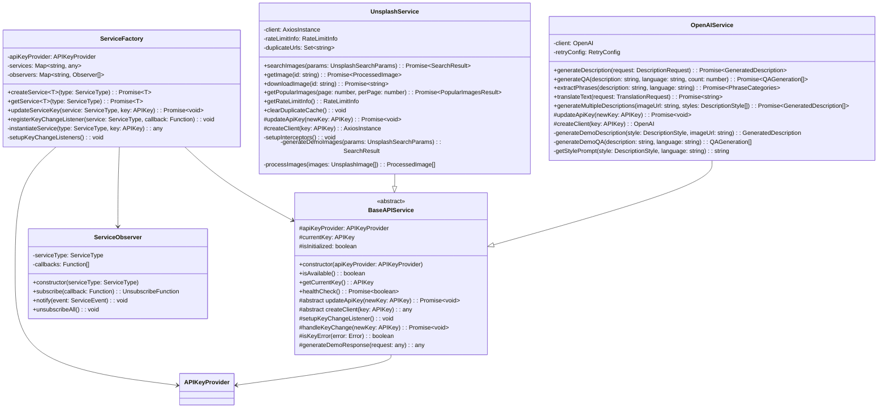
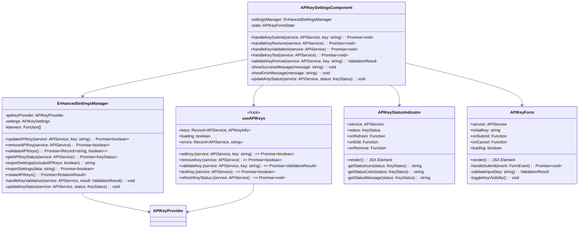
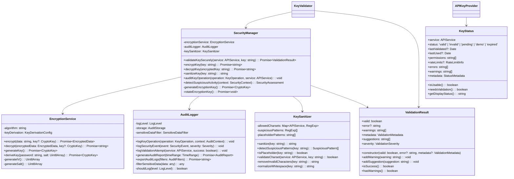
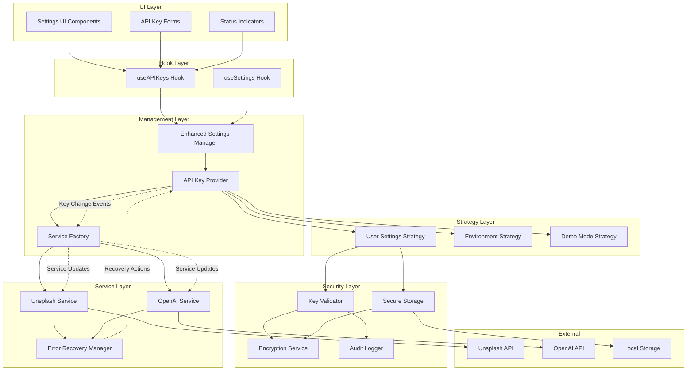

# API Key Integration - Class & Component Diagrams

## Core Component Class Diagram

```mermaid
classDiagram
    class APIKeyProvider {
        <<singleton>>
        -strategies: KeyStrategy[]
        -observers: Observer[]
        -cache: Map~string, CachedKey~
        +getKey(service: APIService, context?: KeyContext): Promise~APIKey~
        +setKey(service: APIService, key: string, options?: KeyOptions): Promise~boolean~
        +removeKey(service: APIService): Promise~boolean~
        +validateKey(service: APIService, key: string): Promise~ValidationResult~
        +subscribe(callback: KeyChangeCallback): UnsubscribeFunction
        +getKeyStatus(service: APIService): KeyStatus
        +markKeyInvalid(service: APIService): Promise~void~
        -resolveKey(service: APIService): Promise~APIKey~
        -notifyObservers(service: APIService, key: APIKey): void
    }

    class KeyStrategy {
        <<interface>>
        +priority: number
        +name: string
        +getKey(service: APIService): Promise~APIKey~
        +isAvailable(): boolean
        +supports(service: APIService): boolean
    }

    class UserSettingsStrategy {
        -settingsManager: SettingsManager
        -secureStorage: SecureStorage
        +priority: 1
        +name: "user-settings"
        +getKey(service: APIService): Promise~APIKey~
        +setKey(service: APIService, key: string): Promise~boolean~
        +removeKey(service: APIService): Promise~boolean~
        +isAvailable(): boolean
        +supports(service: APIService): boolean
    }

    class EnvironmentStrategy {
        -envConfig: EnvironmentConfig
        +priority: 2
        +name: "environment"
        +getKey(service: APIService): Promise~APIKey~
        +isAvailable(): boolean
        +supports(service: APIService): boolean
        -getEnvKeyName(service: APIService): string
    }

    class DemoModeStrategy {
        +priority: 3
        +name: "demo-mode"
        +getKey(service: APIService): Promise~APIKey~
        +isAvailable(): boolean
        +supports(service: APIService): boolean
    }

    class APIKeyManager {
        -provider: APIKeyProvider
        -validator: KeyValidator
        -storage: SecureStorage
        -auditLogger: AuditLogger
        +storeKey(service: APIService, key: string): Promise~boolean~
        +retrieveKey(service: APIService): Promise~APIKey~
        +removeKey(service: APIService): Promise~boolean~
        +rotateKeys(): Promise~RotationResult~
        +clearAllKeys(): Promise~void~
        -encryptKey(key: string): Promise~string~
        -decryptKey(encryptedKey: string): Promise~string~
    }

    class KeyValidator {
        <<interface>>
        +validateFormat(service: APIService, key: string): ValidationResult
        +validatePermissions(service: APIService, key: string): Promise~ValidationResult~
        +sanitizeKey(key: string): string
    }

    class UnsplashKeyValidator {
        +validateFormat(service: APIService, key: string): ValidationResult
        +validatePermissions(service: APIService, key: string): Promise~ValidationResult~
        +sanitizeKey(key: string): string
        -containsSuspiciousPatterns(key: string): boolean
        -testKeyWithAPI(key: string): Promise~boolean~
    }

    class OpenAIKeyValidator {
        +validateFormat(service: APIService, key: string): ValidationResult
        +validatePermissions(service: APIService, key: string): Promise~ValidationResult~
        +sanitizeKey(key: string): string
        -validateKeyFormat(key: string): boolean
        -testKeyWithAPI(key: string): Promise~boolean~
    }

    class SecureStorage {
        <<interface>>
        +store(key: string, value: string): Promise~void~
        +retrieve(key: string): Promise~string~
        +remove(key: string): Promise~void~
        +clear(): Promise~void~
    }

    class ClientSecureStorage {
        -encryptionKey: string
        -storagePrefix: string
        +store(key: string, value: string): Promise~void~
        +retrieve(key: string): Promise~string~
        +remove(key: string): Promise~void~
        +clear(): Promise~void~
        -encrypt(value: string): Promise~string~
        -decrypt(encryptedValue: string): Promise~string~
        -generateStorageKey(key: string): string
    }

    APIKeyProvider --> KeyStrategy
    APIKeyProvider --> APIKeyManager
    UserSettingsStrategy --|> KeyStrategy
    EnvironmentStrategy --|> KeyStrategy
    DemoModeStrategy --|> KeyStrategy
    APIKeyManager --> KeyValidator
    APIKeyManager --> SecureStorage
    UnsplashKeyValidator --|> KeyValidator
    OpenAIKeyValidator --|> KeyValidator
    ClientSecureStorage --|> SecureStorage
    UserSettingsStrategy --> SecureStorage
```

## Service Integration Class Diagram

## Settings & State Management Class Diagram

## Security & Validation Class Diagram

## Error Handling & Recovery Class Diagram

```mermaid
classDiagram
    class ErrorRecoveryManager {
        -strategies: RecoveryStrategy[]
        -failureTracker: FailureTracker
        -circuitBreaker: CircuitBreaker
        +handleError(error: APIError, context: ErrorContext): Promise~RecoveryResult~
        +registerRecoveryStrategy(strategy: RecoveryStrategy): void
        +getErrorStats(): ErrorStatistics
        +resetErrorState(service: APIService): void
        -selectRecoveryStrategy(error: APIError): RecoveryStrategy
        -shouldAttemptRecovery(error: APIError): boolean
    }

    class RecoveryStrategy {
        <<interface>>
        +canHandle(error: APIError): boolean
        +recover(error: APIError, context: ErrorContext): Promise~RecoveryResult~
        +priority: number
        +name: string
    }

    class KeyRotationRecovery {
        -apiKeyProvider: APIKeyProvider
        -backupKeyManager: BackupKeyManager
        +canHandle(error: APIError): boolean
        +recover(error: APIError, context: ErrorContext): Promise~RecoveryResult~
        +priority: 1
        +name: "key-rotation"
        -hasBackupKey(service: APIService): Promise~boolean~
        -rotateToBackupKey(service: APIService): Promise~boolean~
    }

    class DemoModeRecovery {
        -demoResponseGenerator: DemoResponseGenerator
        +canHandle(error: APIError): boolean
        +recover(error: APIError, context: ErrorContext): Promise~RecoveryResult~
        +priority: 3
        +name: "demo-mode"
        -generateDemoResponse(request: any, service: APIService): any
    }

    class RetryRecovery {
        -retryConfig: RetryConfig
        -backoffCalculator: BackoffCalculator
        +canHandle(error: APIError): boolean
        +recover(error: APIError, context: ErrorContext): Promise~RecoveryResult~
        +priority: 2
        +name: "retry"
        -shouldRetry(error: APIError, attempt: number): boolean
        -calculateDelay(attempt: number): number
    }

    class CircuitBreaker {
        -state: CircuitState
        -failureThreshold: number
        -recoveryTimeout: number
        -failureCount: number
        +execute~T~(operation: () => Promise~T~): Promise~T~
        +isOpen(): boolean
        +reset(): void
        +getState(): CircuitState
        -onSuccess(): void
        -onFailure(): void
        -shouldAllowRequest(): boolean
    }

    class FailureTracker {
        -failures: Map~string, FailureRecord[]~
        -maxHistorySize: number
        +recordFailure(service: APIService, error: APIError): void
        +getFailureRate(service: APIService, timeWindow: number): number
        +getRecentFailures(service: APIService, count: number): FailureRecord[]
        +clearFailures(service: APIService): void
        -cleanOldFailures(service: APIService): void
    }

    ErrorRecoveryManager --> RecoveryStrategy
    ErrorRecoveryManager --> FailureTracker
    ErrorRecoveryManager --> CircuitBreaker
    KeyRotationRecovery --|> RecoveryStrategy
    DemoModeRecovery --|> RecoveryStrategy
    RetryRecovery --|> RecoveryStrategy
    BaseAPIService --> ErrorRecoveryManager
```

## Data Flow Component Diagram

This comprehensive class diagram architecture provides:

1. **Clear Separation of Concerns**: Each layer has distinct responsibilities
2. **Strategy Pattern Implementation**: Flexible key source management
3. **Observer Pattern**: Real-time key change propagation
4. **Factory Pattern**: Service instantiation and management
5. **Secure Storage**: Client-side encryption and secure handling
6. **Robust Error Handling**: Multiple recovery strategies
7. **Comprehensive Validation**: Format and permission validation
8. **Audit & Monitoring**: Complete operation tracking
9. **State Management**: React hooks and enhanced settings integration
10. **Migration Support**: Backward compatibility and gradual rollout

The architecture ensures scalability, maintainability, and security while providing a seamless user experience for API key management.