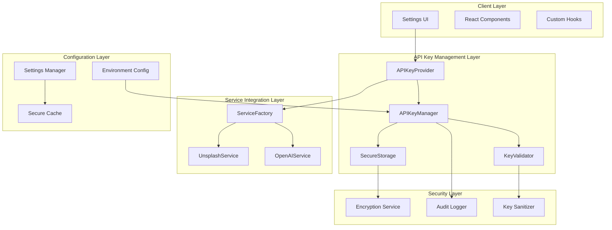
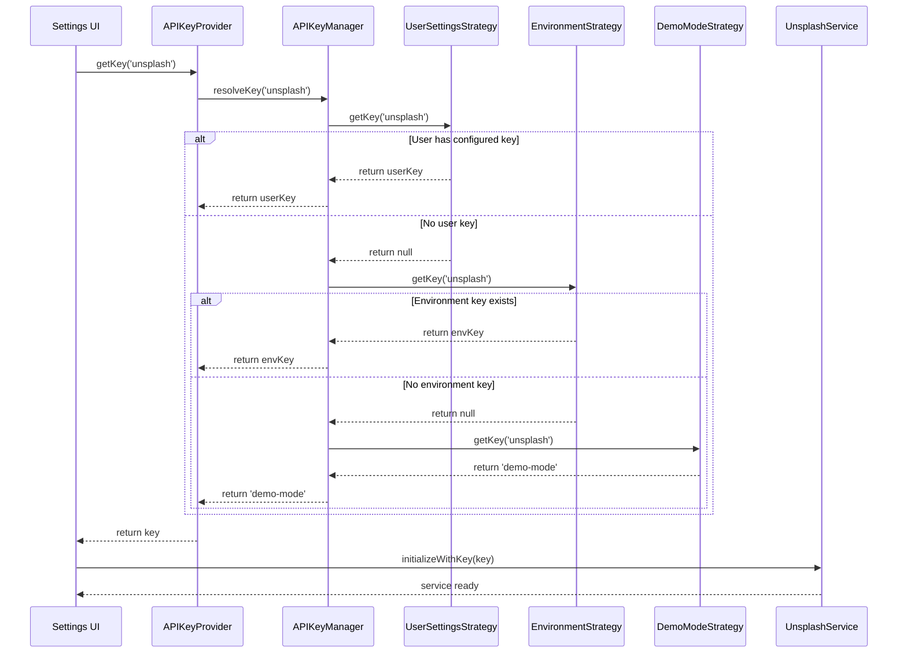
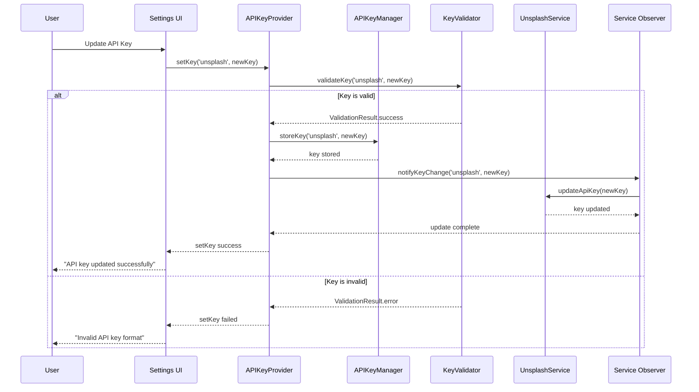

# User-Configurable API Keys Integration Architecture

## Overview

This document outlines the comprehensive architecture for integrating user-configurable API keys into the describe_it application. The design follows enterprise security practices, clean architecture principles, and provides seamless runtime key switching capabilities.

## 1. System Architecture Overview



## 2. Core Components Architecture

### 2.1 API Key Provider (Singleton)

```typescript
interface APIKeyProvider {
  // Core Methods
  getKey(service: APIService, context?: KeyContext): Promise<APIKey | null>
  setKey(service: APIService, key: string, options?: KeyOptions): Promise<boolean>
  removeKey(service: APIService): Promise<boolean>
  validateKey(service: APIService, key: string): Promise<ValidationResult>
  
  // State Management
  subscribe(callback: KeyChangeCallback): UnsubscribeFunction
  getKeyStatus(service: APIService): KeyStatus
  refreshKey(service: APIService): Promise<boolean>
  
  // Security
  clearAllKeys(): Promise<void>
  rotateKeys(): Promise<RotationResult>
  auditKeyUsage(): Promise<AuditReport>
}

interface KeyStrategy {
  priority: number
  name: string
  getKey(service: APIService): Promise<APIKey | null>
  isAvailable(): boolean
  supports(service: APIService): boolean
}
```

### 2.2 Key Source Strategies (Strategy Pattern)

```typescript
// Priority-based key resolution
class UserSettingsStrategy implements KeyStrategy {
  priority = 1 // Highest priority
  async getKey(service: APIService): Promise<APIKey | null> {
    return await this.settingsManager.getAPIKey(service)
  }
}

class EnvironmentStrategy implements KeyStrategy {
  priority = 2
  async getKey(service: APIService): Promise<APIKey | null> {
    return process.env[this.getEnvKey(service)] || null
  }
}

class DemoModeStrategy implements KeyStrategy {
  priority = 3 // Lowest priority
  async getKey(service: APIService): Promise<APIKey | null> {
    return 'demo-mode' // Triggers demo behavior
  }
}
```

### 2.3 Service Factory (Factory Pattern)

```typescript
class ServiceFactory {
  private services = new Map<string, any>()
  private keyProvider: APIKeyProvider

  constructor(keyProvider: APIKeyProvider) {
    this.keyProvider = keyProvider
    this.setupKeyChangeListeners()
  }

  async createService<T>(type: ServiceType): Promise<T> {
    const key = await this.keyProvider.getKey(type)
    const service = this.instantiateService(type, key)
    
    // Register for key updates
    this.services.set(type, service)
    return service
  }

  private setupKeyChangeListeners(): void {
    this.keyProvider.subscribe((service, newKey) => {
      this.updateServiceKey(service, newKey)
    })
  }
}
```

## 3. Sequence Diagrams

### 3.1 Key Retrieval Flow



### 3.2 Runtime Key Update Flow



## 4. Security Architecture

### 4.1 Client-Side Security

```typescript
interface SecureStorage {
  // Never store keys in plain text
  store(key: string, value: string): Promise<void>
  retrieve(key: string): Promise<string | null>
  remove(key: string): Promise<void>
  clear(): Promise<void>
}

class ClientSecureStorage implements SecureStorage {
  private readonly encryptionKey: string
  
  async store(key: string, value: string): Promise<void> {
    // 1. Encrypt the value
    const encrypted = await this.encrypt(value)
    
    // 2. Store with prefix and timestamp
    const storageData = {
      value: encrypted,
      timestamp: Date.now(),
      version: '1.0'
    }
    
    localStorage.setItem(`api_key_${key}`, JSON.stringify(storageData))
  }

  private async encrypt(value: string): Promise<string> {
    // Use Web Crypto API for client-side encryption
    const encoder = new TextEncoder()
    const data = encoder.encode(value)
    
    const cryptoKey = await window.crypto.subtle.importKey(
      'raw',
      encoder.encode(this.encryptionKey),
      { name: 'AES-GCM' },
      false,
      ['encrypt']
    )
    
    const iv = window.crypto.getRandomValues(new Uint8Array(12))
    const encrypted = await window.crypto.subtle.encrypt(
      { name: 'AES-GCM', iv },
      cryptoKey,
      data
    )
    
    return btoa(String.fromCharCode(...new Uint8Array(encrypted)))
  }
}
```

### 4.2 Key Validation Security

```typescript
interface KeyValidator {
  validateFormat(service: APIService, key: string): ValidationResult
  validatePermissions(service: APIService, key: string): Promise<ValidationResult>
  sanitizeKey(key: string): string
}

class UnsplashKeyValidator implements KeyValidator {
  validateFormat(service: APIService, key: string): ValidationResult {
    const sanitized = this.sanitizeKey(key)
    
    // Check format
    if (!sanitized || sanitized.length < 20) {
      return { valid: false, error: 'Key too short' }
    }
    
    // Check for suspicious patterns
    if (this.containsSuspiciousPatterns(sanitized)) {
      return { valid: false, error: 'Key contains invalid characters' }
    }
    
    // Validate character set
    if (!/^[a-zA-Z0-9_-]+$/.test(sanitized)) {
      return { valid: false, error: 'Invalid character set' }
    }
    
    return { valid: true }
  }

  async validatePermissions(service: APIService, key: string): Promise<ValidationResult> {
    try {
      // Test key with minimal API call
      const response = await fetch('https://api.unsplash.com/me', {
        headers: { Authorization: `Client-ID ${key}` }
      })
      
      if (response.ok) {
        return { valid: true }
      } else {
        return { valid: false, error: 'Key authentication failed' }
      }
    } catch (error) {
      return { valid: false, error: 'Network error during validation' }
    }
  }

  sanitizeKey(key: string): string {
    return key.trim().replace(/[<>"'`\\]/g, '')
  }
}
```

## 5. Service Integration Points

### 5.1 Modified Unsplash Service

```typescript
class UnsplashService {
  private apiKeyProvider: APIKeyProvider
  private client: AxiosInstance | null = null
  private currentKey: string | null = null

  constructor(apiKeyProvider: APIKeyProvider) {
    this.apiKeyProvider = apiKeyProvider
    this.setupKeyChangeListener()
    this.initializeClient()
  }

  private setupKeyChangeListener(): void {
    this.apiKeyProvider.subscribe(async (service, newKey) => {
      if (service === 'unsplash') {
        await this.updateApiKey(newKey)
      }
    })
  }

  private async initializeClient(): Promise<void> {
    const key = await this.apiKeyProvider.getKey('unsplash')
    await this.updateApiKey(key)
  }

  private async updateApiKey(newKey: string | null): Promise<void> {
    this.currentKey = newKey
    
    if (!newKey || newKey === 'demo-mode') {
      this.client = null
      return
    }

    this.client = axios.create({
      baseURL: 'https://api.unsplash.com',
      timeout: 30000,
      headers: {
        'Accept-Version': 'v1',
        Authorization: `Client-ID ${newKey}`,
      },
    })

    this.setupInterceptors()
  }

  async searchImages(params: UnsplashSearchParams): Promise<SearchResult> {
    // Check if we have a valid client
    if (!this.client || this.currentKey === 'demo-mode') {
      return this.generateDemoImages(params)
    }

    try {
      // Use the client with current key
      return await this.performSearch(params)
    } catch (error) {
      // If API fails, check if it's due to invalid key
      if (this.isKeyError(error)) {
        // Notify provider of invalid key
        await this.apiKeyProvider.markKeyInvalid('unsplash')
        
        // Fallback to demo mode
        return this.generateDemoImages(params)
      }
      throw error
    }
  }
}
```

### 5.2 Modified OpenAI Service

```typescript
class OpenAIService {
  private apiKeyProvider: APIKeyProvider
  private client: OpenAI | null = null
  private currentKey: string | null = null

  constructor(apiKeyProvider: APIKeyProvider) {
    this.apiKeyProvider = apiKeyProvider
    this.setupKeyChangeListener()
    this.initializeClient()
  }

  private async updateApiKey(newKey: string | null): Promise<void> {
    this.currentKey = newKey
    
    if (!newKey || newKey === 'demo-mode') {
      this.client = null
      return
    }

    this.client = new OpenAI({
      apiKey: newKey,
      timeout: 60000,
    })
  }

  async generateDescription(request: DescriptionRequest): Promise<GeneratedDescription> {
    if (!this.client || this.currentKey === 'demo-mode') {
      return this.generateDemoDescription(request)
    }

    try {
      return await this.performGeneration(request)
    } catch (error) {
      if (this.isKeyError(error)) {
        await this.apiKeyProvider.markKeyInvalid('openai')
        return this.generateDemoDescription(request)
      }
      throw error
    }
  }
}
```

## 6. State Management Integration

### 6.1 Settings Manager Enhancement

```typescript
interface APIKeySettings extends AppSettings {
  apiKeys: {
    unsplash: {
      key: string
      status: 'valid' | 'invalid' | 'pending' | 'demo'
      lastValidated: string | null
      permissions: string[]
    }
    openai: {
      key: string
      status: 'valid' | 'invalid' | 'pending' | 'demo'
      lastValidated: string | null
      model: string
    }
  }
}

class EnhancedSettingsManager extends SettingsManager {
  private apiKeyProvider: APIKeyProvider

  async updateAPIKey(service: APIService, key: string): Promise<boolean> {
    // Validate key first
    const validation = await this.apiKeyProvider.validateKey(service, key)
    if (!validation.valid) {
      throw new Error(validation.error)
    }

    // Update in provider (handles encryption and storage)
    const success = await this.apiKeyProvider.setKey(service, key)
    
    if (success) {
      // Update settings with metadata
      this.updateSection('apiKeys', {
        [service]: {
          ...this.settings.apiKeys[service],
          status: 'valid',
          lastValidated: new Date().toISOString()
        }
      })
    }

    return success
  }

  async validateAPIKeys(): Promise<Record<string, boolean>> {
    const results: Record<string, boolean> = {}
    
    for (const service of ['unsplash', 'openai']) {
      const status = await this.apiKeyProvider.getKeyStatus(service)
      results[service] = status.valid
    }

    return results
  }
}
```

## 7. Migration Strategy

### 7.1 Backward Compatibility

```typescript
class MigrationManager {
  async migrateExistingKeys(): Promise<void> {
    // 1. Check for existing environment keys
    const existingUnsplashKey = process.env.NEXT_PUBLIC_UNSPLASH_ACCESS_KEY
    const existingOpenAIKey = process.env.OPENAI_API_KEY

    // 2. Migrate to new system if not already configured
    if (existingUnsplashKey && !await this.apiKeyProvider.hasUserKey('unsplash')) {
      await this.apiKeyProvider.setKey('unsplash', existingUnsplashKey, {
        source: 'migration',
        validated: false
      })
    }

    if (existingOpenAIKey && !await this.apiKeyProvider.hasUserKey('openai')) {
      await this.apiKeyProvider.setKey('openai', existingOpenAIKey, {
        source: 'migration',
        validated: false
      })
    }

    // 3. Mark migration complete
    await this.settingsManager.updateSection('system', {
      migrationVersion: '2.0.0',
      migrationDate: new Date().toISOString()
    })
  }
}
```

### 7.2 Phased Rollout

```typescript
// Phase 1: Introduce APIKeyProvider alongside existing system
class HybridAPIKeyProvider {
  async getKey(service: APIService): Promise<string | null> {
    // Try new system first
    const newKey = await this.newProvider.getKey(service)
    if (newKey && newKey !== 'demo-mode') {
      return newKey
    }

    // Fallback to legacy system
    return this.legacyProvider.getKey(service)
  }
}

// Phase 2: Migrate users gradually
class GradualMigration {
  async shouldUseLegacySystem(userId?: string): Promise<boolean> {
    // Feature flag based migration
    const migrationFlags = await this.featureFlags.getFlags('api-key-migration')
    
    if (migrationFlags.forceNew) return false
    if (migrationFlags.forceLegacy) return true
    
    // Gradual rollout based on user ID hash
    if (userId) {
      const hash = this.hashUserId(userId)
      return hash % 100 < migrationFlags.legacyPercentage
    }
    
    return true
  }
}
```

## 8. Error Handling & Recovery

### 8.1 Graceful Degradation

```typescript
class ResilientAPIKeyProvider implements APIKeyProvider {
  async getKey(service: APIService, context?: KeyContext): Promise<APIKey | null> {
    try {
      // Try primary key source
      const key = await this.primaryStrategy.getKey(service)
      if (key) return key
      
      // Try fallback sources
      for (const strategy of this.fallbackStrategies) {
        try {
          const fallbackKey = await strategy.getKey(service)
          if (fallbackKey) {
            this.auditLog.warn(`Using fallback key source: ${strategy.name}`, {
              service,
              strategy: strategy.name
            })
            return fallbackKey
          }
        } catch (fallbackError) {
          this.auditLog.error(`Fallback strategy failed: ${strategy.name}`, {
            error: fallbackError.message
          })
        }
      }
      
      // Final fallback to demo mode
      this.auditLog.info(`No valid keys found, using demo mode`, { service })
      return 'demo-mode'
      
    } catch (error) {
      this.auditLog.error(`Key provider error`, {
        service,
        error: error.message
      })
      return 'demo-mode'
    }
  }
}
```

## 9. Performance Considerations

### 9.1 Caching Strategy

```typescript
class CachedAPIKeyProvider implements APIKeyProvider {
  private cache = new Map<string, CachedKey>()
  private readonly cacheTTL = 5 * 60 * 1000 // 5 minutes

  async getKey(service: APIService): Promise<APIKey | null> {
    const cacheKey = `key_${service}`
    const cached = this.cache.get(cacheKey)
    
    if (cached && Date.now() - cached.timestamp < this.cacheTTL) {
      return cached.key
    }

    const key = await this.resolveKey(service)
    
    this.cache.set(cacheKey, {
      key,
      timestamp: Date.now()
    })

    return key
  }

  invalidateCache(service?: APIService): void {
    if (service) {
      this.cache.delete(`key_${service}`)
    } else {
      this.cache.clear()
    }
  }
}
```

### 9.2 Lazy Loading

```typescript
class LazyServiceFactory {
  private servicePromises = new Map<string, Promise<any>>()

  async getService<T>(type: ServiceType): Promise<T> {
    if (!this.servicePromises.has(type)) {
      this.servicePromises.set(type, this.createService(type))
    }
    
    return this.servicePromises.get(type)!
  }

  private async createService(type: ServiceType): Promise<any> {
    const key = await this.apiKeyProvider.getKey(type)
    return this.instantiateService(type, key)
  }
}
```

## 10. Testing Strategy

### 10.1 Unit Tests

```typescript
describe('APIKeyProvider', () => {
  it('should prioritize user settings over environment variables', async () => {
    const mockUserStrategy = {
      priority: 1,
      getKey: jest.fn().mockResolvedValue('user-key')
    }
    
    const mockEnvStrategy = {
      priority: 2,
      getKey: jest.fn().mockResolvedValue('env-key')
    }

    const provider = new APIKeyProvider([mockUserStrategy, mockEnvStrategy])
    const key = await provider.getKey('unsplash')
    
    expect(key).toBe('user-key')
    expect(mockUserStrategy.getKey).toHaveBeenCalled()
    expect(mockEnvStrategy.getKey).not.toHaveBeenCalled()
  })

  it('should fallback to environment when user key is not available', async () => {
    // Test implementation
  })
})
```

### 10.2 Integration Tests

```typescript
describe('Service Integration', () => {
  it('should update service when API key changes', async () => {
    const provider = new APIKeyProvider()
    const service = new UnsplashService(provider)
    
    // Simulate key change
    await provider.setKey('unsplash', 'new-key')
    
    // Verify service was updated
    expect(service.getCurrentKey()).toBe('new-key')
  })
})
```

## 11. Monitoring & Observability

### 11.1 Metrics Collection

```typescript
interface APIKeyMetrics {
  keyValidationAttempts: number
  keyValidationFailures: number
  keyRotations: number
  serviceErrors: number
  demoModeUsage: number
}

class APIKeyMetricsCollector {
  private metrics: APIKeyMetrics = {
    keyValidationAttempts: 0,
    keyValidationFailures: 0,
    keyRotations: 0,
    serviceErrors: 0,
    demoModeUsage: 0
  }

  recordKeyValidation(success: boolean): void {
    this.metrics.keyValidationAttempts++
    if (!success) {
      this.metrics.keyValidationFailures++
    }
  }

  recordDemoModeUsage(): void {
    this.metrics.demoModeUsage++
  }

  getMetrics(): APIKeyMetrics {
    return { ...this.metrics }
  }
}
```

## 12. Implementation Timeline

### Phase 1 (Week 1-2): Foundation
- [ ] Implement APIKeyProvider interface and base classes
- [ ] Create Strategy pattern implementations
- [ ] Implement secure storage layer
- [ ] Add basic validation

### Phase 2 (Week 3-4): Service Integration
- [ ] Modify UnsplashService and OpenAIService
- [ ] Implement ServiceFactory
- [ ] Add observer pattern for key changes
- [ ] Create migration utilities

### Phase 3 (Week 5-6): UI & UX
- [ ] Enhance Settings UI
- [ ] Add real-time key validation
- [ ] Implement status indicators
- [ ] Add error handling and user feedback

### Phase 4 (Week 7-8): Testing & Deployment
- [ ] Comprehensive testing suite
- [ ] Performance optimization
- [ ] Security audit
- [ ] Gradual rollout strategy

This architecture provides a robust, secure, and maintainable foundation for user-configurable API keys while maintaining backward compatibility and ensuring graceful degradation when keys are invalid or unavailable.