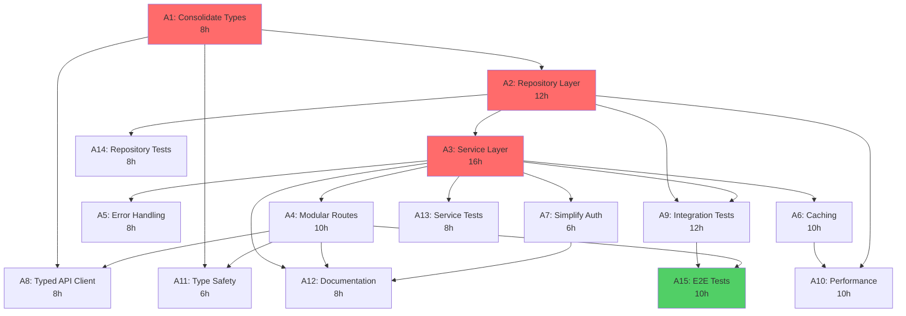

# GOAP Production Plan - Quick Start Guide

## Executive Summary

This GOAP (Goal-Oriented Action Planning) plan transforms describe-it from **6.7/10** to **9.0/10** production readiness through **15 carefully sequenced actions** over **14 calendar days** with a **3-person team**.

### Current State → Goal State

```
Current Score: 6.7/10          Goal Score: 9.0/10
├─ Type Safety: ❌ → ✅         ├─ Repository Layer: ❌ → ✅
├─ Service Layer: ❌ → ✅       ├─ API Modular: ❌ → ✅
├─ Tests Realistic: ❌ → ✅     ├─ Error Handling: ❌ → ✅
└─ Performance: ❌ → ✅         └─ Documentation: ❌ → ✅
```

## Critical Path (58 hours)

The **minimum time to completion** following the longest dependency chain:

```
A1 (8h) → A2 (12h) → A3 (16h) → A4 (10h) → A9 (12h) → A15 (10h)
   ↓         ↓          ↓          ↓          ↓          ↓
 Types   Repository  Service   Modular  Integration  E2E Tests
         Layer       Layer     Routes   Tests
```

## 5-Phase Execution Plan

### Phase 1: Foundation (36 hours, Sequential)

**Goal**: Establish type system and layered architecture

#### A1: Consolidate Type System (8 hours)
```bash
# System Architect
- Audit all type files (36 files found)
- Merge duplicate definitions
- Create /src/types/domain/ structure
- Update all imports
- Validation: npm run typecheck passes
```

#### A2: Create Repository Layer (12 hours)
```bash
# Backend Developer
- Implement BaseRepository<T>
- Create UserRepository, VocabularyRepository, SessionRepository
- Connection pooling with pg/Supabase
- Unit tests for each repository
```

#### A3: Create Service Layer (16 hours)
```bash
# Backend Developer
- Implement AuthService, VocabularyService, DescriptionService
- Business logic separated from routes
- Transaction handling
- Service unit tests with mocked repositories
```

**Milestone M1**: Foundation Complete (code_quality: 7.5, architecture: 8.5)

---

### Phase 2: Parallel Infrastructure (18 hours, 3 parallel tracks)

**Goal**: Build API layer, error handling, and testing foundation

#### Track 1: API Layer (18 hours)
- **A4**: Modularize API Routes (10h)
- **A8**: Type-Safe API Client (8h)

#### Track 2: Cross-cutting Concerns (14 hours)
- **A5**: Error Handling (8h)
- **A7**: Simplify Auth (6h)

#### Track 3: Repository Testing (8 hours)
- **A14**: Repository Tests (8h)

**Execution Strategy**:
```javascript
// Spawn 3 parallel agents via Claude Code Task tool
Task("API Refactorer", "A4 + A8: Modularize routes and create typed client", "coder")
Task("Infrastructure Engineer", "A5 + A7: Error handling and auth", "backend-dev")
Task("Test Engineer", "A14: Repository integration tests", "tester")
```

**Milestone M2**: Infrastructure Complete (code_quality: 8.5, test_quality: 8.0)

---

### Phase 3: Performance & Services (20 hours, 2 parallel tracks)

**Goal**: Optimize performance and test services

#### Track 1: Performance (20 hours)
- **A6**: Advanced Caching (10h)
- **A10**: Performance Optimization (10h)

#### Track 2: Service Testing (8 hours)
- **A13**: Service Layer Tests (8h)

**Execution Strategy**:
```javascript
Task("Performance Engineer", "A6 + A10: Caching and optimization", "perf-analyzer")
Task("Test Engineer", "A13: Service unit tests", "tester")
```

**Milestone M3**: Performance Optimized (performance: ✅, architecture: 9.0)

---

### Phase 4: Integration & Quality (22 hours, 2 parallel tracks)

**Goal**: Complete testing and type safety

#### Track 1: Testing (22 hours)
- **A9**: Realistic Integration Tests (12h)
- **A15**: E2E Critical Path Tests (10h)

#### Track 2: Type Safety (6 hours)
- **A11**: Complete Type Safety (6h)

**Execution Strategy**:
```javascript
Task("Integration Tester", "A9 + A15: Integration and E2E tests", "tester")
Task("Type Safety Engineer", "A11: Eliminate 'any', enable strict mode", "coder")
```

**Milestone M4 (Almost)**: All code and tests complete

---

### Phase 5: Documentation (8 hours, Sequential)

**Goal**: Comprehensive production documentation

#### A12: Production Documentation (8 hours)
```bash
# Technical Writer
- Architecture overview and diagrams
- OpenAPI specification
- Deployment runbook
- Troubleshooting guide
```

**Milestone M4**: **Production Ready** (overall_score: 9.0)

---

## Action Dependencies Graph



**Legend**:
- 🔴 Red: Critical path actions
- 🟢 Green: Final action (E2E tests)
- ⚪ White: Parallel-eligible actions

---

## Agent Resource Allocation

```
┌─────────────────┬───────┬────────────────────────────────┐
│ Agent Type      │ Count │ Actions                        │
├─────────────────┼───────┼────────────────────────────────┤
│ system-architect│   1   │ A1                             │
│ backend-dev     │   2   │ A2, A3, A5, A6, A7             │
│ coder           │   1   │ A4, A8, A11                    │
│ tester          │   1   │ A9, A13, A14, A15              │
│ perf-analyzer   │   1   │ A10                            │
│ api-docs        │   1   │ A12                            │
└─────────────────┴───────┴────────────────────────────────┘

Total Team Size: 3-4 developers
Timeline: 14 calendar days
Total Effort: 142 hours (sequential) → 104 hours (parallelized)
```

---

## Daily Sprint Schedule (2 weeks)

### Week 1: Foundation + Infrastructure

**Days 1-3**: Phase 1 (Foundation)
- Day 1: A1 - Type consolidation
- Day 2: A2 - Repository layer
- Days 2-3: A3 - Service layer

**Days 4-5**: Phase 2 (Parallel Infrastructure)
- 3 parallel tracks running simultaneously
- Daily integration checkpoints

### Week 2: Performance + Quality

**Days 6-8**: Phase 3 (Performance)
- Caching and optimization
- Service testing

**Days 9-11**: Phase 4 (Quality)
- Integration and E2E tests
- Type safety completion

**Days 12-13**: Phase 5 (Documentation)
- Production documentation

**Day 14**: Final validation and deployment prep

---

## Success Validation Checklist

### Phase 1 Complete ✅
- [ ] `npm run typecheck` passes with zero errors
- [ ] All repositories have unit tests
- [ ] All services have unit tests
- [ ] Clear separation: Routes → Services → Repositories → DB

### Phase 2 Complete ✅
- [ ] API routes < 50 lines each
- [ ] Error handling consistent across all routes
- [ ] Auth flow simplified (single middleware)
- [ ] Repository integration tests passing

### Phase 3 Complete ✅
- [ ] Cache hit rate > 70% in development
- [ ] API response time < 200ms (p95)
- [ ] Service test coverage > 90%
- [ ] No N+1 database queries

### Phase 4 Complete ✅
- [ ] Integration tests using real database
- [ ] E2E tests covering critical user flows
- [ ] TypeScript strict mode enabled
- [ ] Zero `any` types in codebase

### Phase 5 Complete ✅
- [ ] Architecture diagrams complete
- [ ] OpenAPI spec generated and validated
- [ ] Deployment runbook tested
- [ ] Overall score: 9.0/10

---

## Risk Mitigation

### High-Risk Actions

**A2 (Repository Layer)**
- **Risk**: Database schema changes
- **Mitigation**: Test migrations in staging, rollback procedures

**A3 (Service Layer)**
- **Risk**: Refactoring regressions
- **Mitigation**: Feature flags, gradual migration, comprehensive tests

**A10 (Performance)**
- **Risk**: Optimization introduces bugs
- **Mitigation**: Performance regression tests, A/B testing

### External Dependencies

**Supabase** (Actions: A2, A9, A14)
- Lock versions, local dev environment, fallback strategies

**Anthropic API** (Actions: A4, A8, A9)
- Rate limiting, caching, mock API for tests

---

## Next Steps

### Immediate Action (Today)
```bash
# 1. Review this plan with team
# 2. Assign agents to actions
# 3. Set up project tracking (GitHub Projects)
# 4. Start Phase 1, Action A1 (Type Consolidation)

# Initialize coordination
npx claude-flow@alpha hooks pre-task --description "GOAP Production Plan Start"
```

### Tomorrow
```bash
# Begin execution with Claude Code Task tool
# See detailed implementation in: goap-production-plan.json
```

---

## Monitoring & Adjustments

### Daily Standup Questions
1. Which actions completed yesterday?
2. Which actions starting today?
3. Any blockers or dependencies?
4. Are we on the critical path?

### Weekly Review
- Milestone validation
- Risk assessment update
- Timeline adjustment if needed
- Quality metrics review

---

## Full Plan Reference

- **Detailed Action Specs**: `docs/goap-production-plan.json`
- **Action Graph**: See Mermaid diagram above
- **Milestone Checkpoints**: 4 major milestones defined
- **Agent Requirements**: Detailed skill requirements per agent

**Ready to execute? Start with Phase 1, Action A1!**
