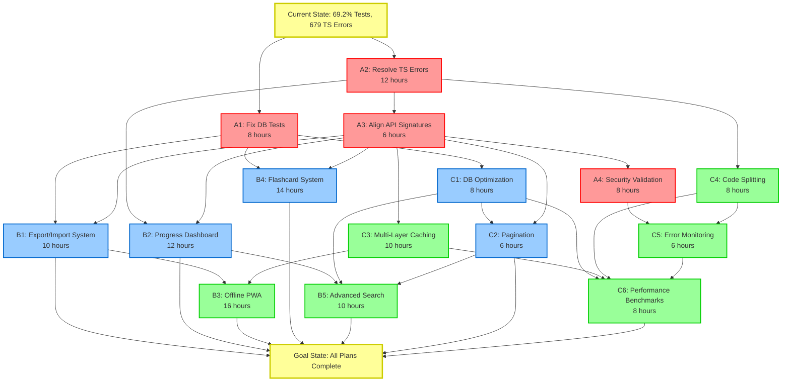
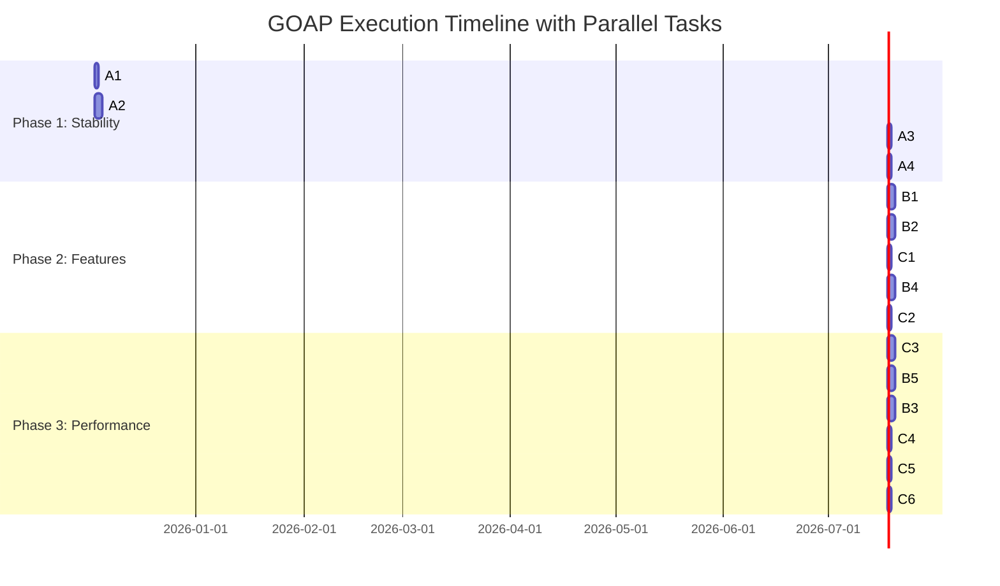
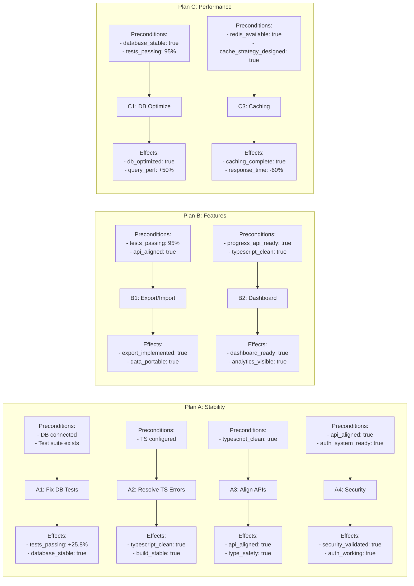
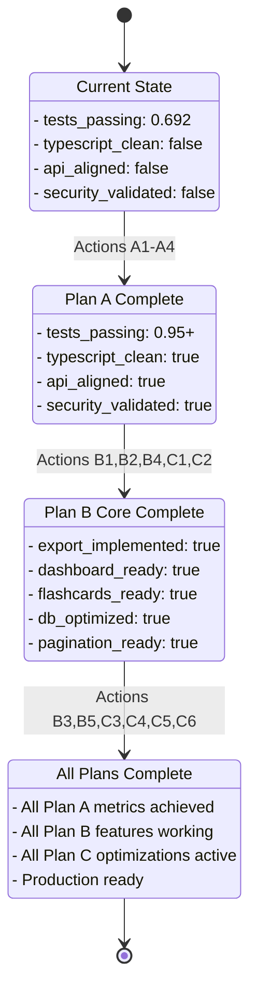
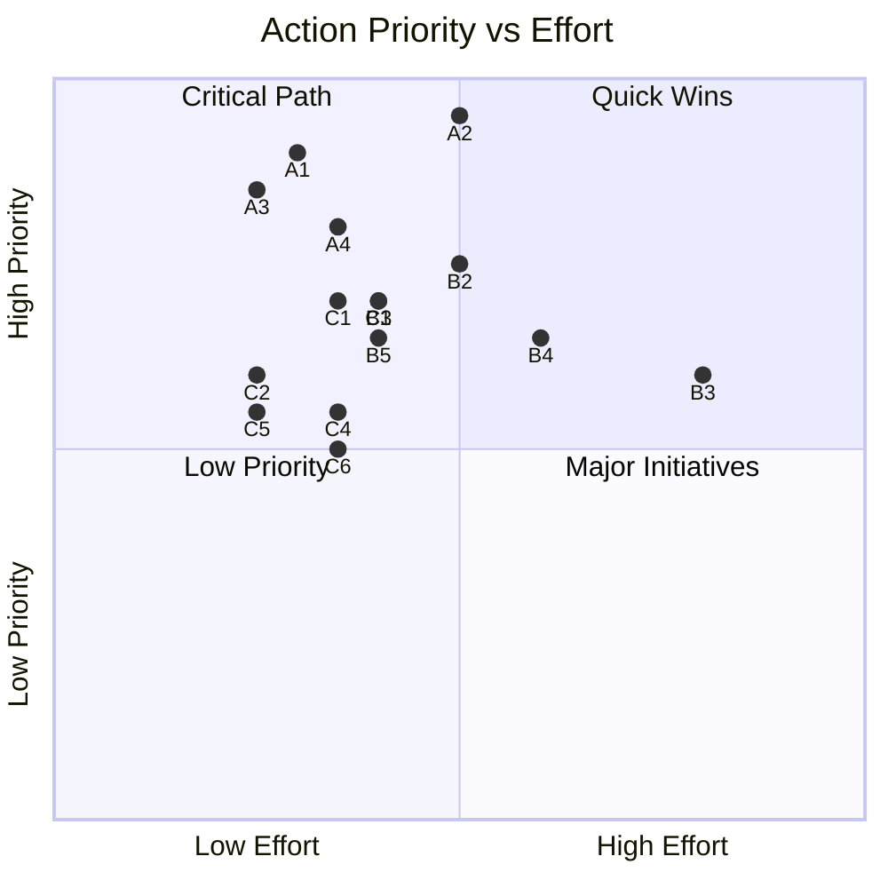
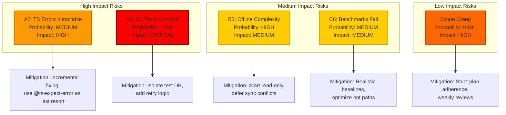
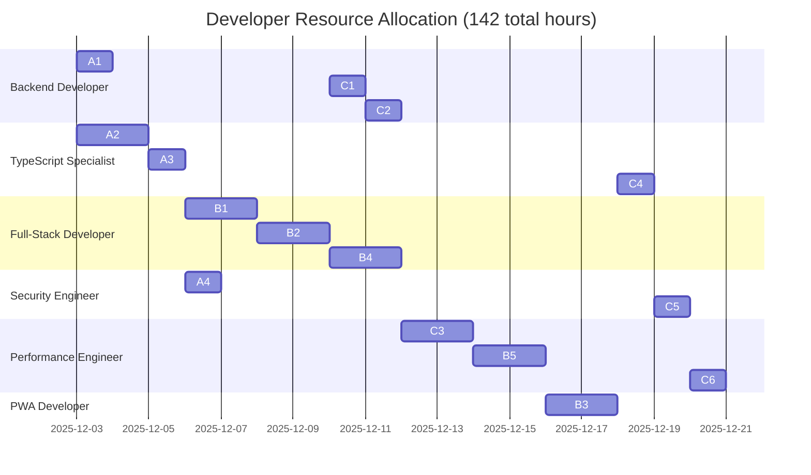

# GOAP Action Dependency Graph

This document visualizes the action dependencies for completing Plans A, B, and C using GOAP (Goal-Oriented Action Planning) methodology.

## Critical Path Visualization

## Parallel Execution Opportunities

## Action Preconditions and Effects

## World State Evolution

## Priority Matrix

## Risk Heatmap

## Success Criteria Breakdown

```mermaid
graph TB
    subgraph "Plan A Success Metrics"
        A_M1["Test Pass Rate ≥95%"]
        A_M2["TypeScript Errors = 0"]
        A_M3["API Coverage ≥90%"]
        A_M4["Security Audit: PASS"]
        A_M5["CI/CD Pipeline: GREEN"]
    end

    subgraph "Plan B Success Metrics"
        B_M1["Export Formats ≥2"]
        B_M2["Dashboard Components ≥5"]
        B_M3["Flashcard Coverage: 100%"]
        B_M4["Search Response <200ms"]
        B_M5["Offline Features ≥3"]
    end

    subgraph "Plan C Success Metrics"
        C_M1["DB Queries <100ms avg"]
        C_M2["Cache Hit Rate >80%"]
        C_M3["Bundle Size -30%"]
        C_M4["Error Monitoring: 100%"]
        C_M5["Lighthouse Score ≥90"]
    end

    A_M1 --> PRODUCTION_READY
    A_M2 --> PRODUCTION_READY
    A_M3 --> PRODUCTION_READY
    A_M4 --> PRODUCTION_READY
    A_M5 --> PRODUCTION_READY

    B_M1 --> PRODUCTION_READY
    B_M2 --> PRODUCTION_READY
    B_M3 --> PRODUCTION_READY
    B_M4 --> PRODUCTION_READY
    B_M5 --> PRODUCTION_READY

    C_M1 --> PRODUCTION_READY
    C_M2 --> PRODUCTION_READY
    C_M3 --> PRODUCTION_READY
    C_M4 --> PRODUCTION_READY
    C_M5 --> PRODUCTION_READY

    PRODUCTION_READY[Production Ready ✅]

    style PRODUCTION_READY fill:#00cc00,stroke:#009900,stroke-width:4px
```

## Resource Allocation Timeline

---

## Legend

- **Red Nodes (Phase 1):** Critical stability actions (Plan A)
- **Blue Nodes (Phase 2):** Feature enhancement actions (Plan B core)
- **Green Nodes (Phase 3):** Performance and polish actions (Plan B+C)
- **Yellow Nodes:** Milestones (start/goal states)
- **Arrow Thickness:** Indicates dependency strength

## How to Read This Graph

1. **Critical Path:** Follow the longest path from START to GOAL to identify the minimum timeline
2. **Parallel Opportunities:** Actions at the same vertical level can be executed concurrently
3. **Blockers:** An action cannot start until all incoming arrows are satisfied
4. **Resource Optimization:** Use the Gantt chart to allocate team members efficiently

## Next Step

Begin with actions **A1** (Fix DB Tests) and **A2** (Resolve TS Errors) as they have no dependencies and can run in parallel.
