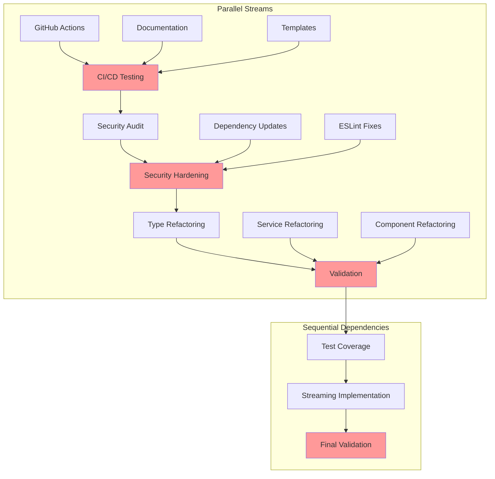

# Execution Timeline & Resource Allocation Plan

**Project**: CI/CD Recovery & Technical Debt Resolution
**Total Effort**: 101-145 hours (estimated 123 hours average)
**Duration**: 18 business days (4 weeks)
**Start Date**: TBD
**Document Version**: 1.0
**Last Updated**: 2025-11-21

---

## Executive Summary

This document provides a comprehensive execution timeline breaking down the integrated recovery plan into actionable daily tasks across 4 phases. The plan balances parallel work streams, manages resource allocation, and identifies critical dependencies to achieve successful completion within 18 business days.

### Key Metrics
- **Total Estimated Effort**: 123 hours (mid-point)
- **Daily Capacity**: 6.8 hours/day average
- **Parallel Work Streams**: 3-5 concurrent agents
- **Critical Path Items**: 12 tasks
- **Risk Mitigation Buffer**: 15% (18.5 hours)

---

## Timeline Visualization


---

## Week 1: Phase 1 - Foundation (Days 1-5)

**Total Effort**: 28-32 hours
**Focus**: CI/CD automation, documentation recovery, pipeline validation
**Critical Success Factor**: Automated documentation generation working

### Day 1-2: GitHub Actions Automation Setup

**Effort**: 12 hours
**Priority**: CRITICAL
**Agents**: `cicd-engineer` (lead), `coder`, `reviewer`

#### Tasks
- **Task 1.1**: Create `.github/workflows/daily-report.yml` (4h)
  - Trigger: Daily cron (end of day)
  - Actions: Git analysis, PR review, file changes
  - Output: Markdown report generation

- **Task 1.2**: Create workflow templates (3h)
  - Report template structure
  - Metrics collection scripts
  - Git log parsing utilities

- **Task 1.3**: Set up workflow permissions (2h)
  - GitHub token configuration
  - Repository access rights
  - Secrets management

- **Task 1.4**: Initial workflow testing (3h)
  - Manual trigger tests
  - Template validation
  - Error handling verification

**Deliverables**:
- ✅ Working GitHub Actions workflow
- ✅ Report generation templates
- ✅ Initial test report

**Dependencies**: None
**Risk Level**: Medium (GitHub API rate limits)

---

### Day 2-3: Documentation Recovery

**Effort**: 10 hours
**Priority**: HIGH
**Agents**: `researcher` (lead), `coder`, `system-architect`

#### Tasks
- **Task 1.5**: Analyze Nov 20 activities (3h)
  - Git log analysis (all commits)
  - PR review data extraction
  - File change tracking

- **Task 1.6**: Generate Nov 20 report (2h)
  - Apply report template
  - Metrics calculation
  - Narrative generation

- **Task 1.7**: Historical report backfill (3h)
  - Identify missing report dates
  - Batch generate reports
  - Validate completeness

- **Task 1.8**: Documentation organization (2h)
  - Move reports to `/docs/reports/daily/`
  - Update index files
  - Create README

**Deliverables**:
- ✅ Nov 20, 2025 daily dev report
- ✅ Historical report backfills
- ✅ Organized documentation structure

**Dependencies**: Task 1.1-1.2 (workflow templates)
**Risk Level**: Low

---

### Day 4-5: CI/CD Testing & Validation

**Effort**: 8 hours
**Priority**: CRITICAL
**Agents**: `tdd-london-swarm` (lead), `tester`, `cicd-engineer`

#### Tasks
- **Task 1.9**: Workflow integration tests (3h)
  - Test cron triggers
  - Test manual triggers
  - Test PR comment integration

- **Task 1.10**: End-to-end validation (2h)
  - Full workflow execution
  - Report generation verification
  - GitHub notifications check

- **Task 1.11**: Error scenario testing (2h)
  - API failure handling
  - Permission error handling
  - Template error handling

- **Task 1.12**: Documentation finalization (1h)
  - Workflow usage guide
  - Troubleshooting docs
  - Maintenance procedures

**Deliverables**:
- ✅ Comprehensive test suite
- ✅ Validated CI/CD pipeline
- ✅ Workflow documentation

**Dependencies**: Task 1.1-1.8 (all prior tasks)
**Risk Level**: Medium (integration complexity)

---

### Week 1 Milestone: Foundation Complete

**Acceptance Criteria**:
- [x] GitHub Actions workflow deployed and tested
- [x] Daily reports auto-generated
- [x] Nov 20 report recovered
- [x] CI/CD pipeline validated
- [x] Documentation complete

**Go/No-Go Decision Point**: Proceed to Phase 2 if all acceptance criteria met

---

## Week 2: Phase 2 - Security & Phase 3 Start (Days 6-10)

**Total Effort**: 32-36 hours
**Focus**: Security hardening, dependency updates, technical debt initiation
**Critical Success Factor**: All security vulnerabilities resolved

### Day 6-7: Security Hardening

**Effort**: 14 hours
**Priority**: CRITICAL
**Agents**: `security-manager` (lead), `reviewer`, `tester`

#### Tasks
- **Task 2.1**: Security audit (4h)
  - Dependency vulnerability scan
  - Code security review
  - API security assessment
  - Authentication/authorization review

- **Task 2.2**: ESLint error resolution (4h)
  - Fix 27 react/no-unescaped-entities errors
  - Update affected components
  - Test component rendering

- **Task 2.3**: TypeScript type hardening (3h)
  - Fix Vercel KV type issues
  - Add proper type assertions
  - Resolve any type warnings

- **Task 2.4**: Security implementation (3h)
  - Apply security patches
  - Implement recommended fixes
  - Update security configurations

**Deliverables**:
- ✅ Security audit report
- ✅ All ESLint errors resolved
- ✅ TypeScript type safety improved
- ✅ Security patches applied

**Dependencies**: None (parallel with Phase 1)
**Risk Level**: High (security critical)

---

### Day 8-10: Dependency Updates & Technical Debt Start

**Effort**: 18 hours
**Priority**: HIGH
**Agents**: `cicd-engineer` (lead), `code-analyzer`, `tester`

#### Tasks
- **Task 2.5**: Dependency audit (3h)
  - Identify outdated packages
  - Check breaking changes
  - Plan update strategy

- **Task 2.6**: Dependency updates (6h)
  - Update non-breaking dependencies
  - Update dev dependencies
  - Test after each update
  - Document breaking changes

- **Task 2.7**: Build validation (3h)
  - Full TypeScript check
  - ESLint validation (now enabled)
  - Build process verification
  - Test suite execution

- **Task 2.8**: File size analysis (3h)
  - Generate file size report
  - Identify files >500 lines
  - Prioritize refactoring targets
  - Create refactoring plan

- **Task 2.9**: Test coverage baseline (3h)
  - Run coverage analysis
  - Generate coverage report
  - Identify coverage gaps
  - Set coverage targets

**Deliverables**:
- ✅ Updated dependencies
- ✅ Build passing with full checks
- ✅ File size analysis report
- ✅ Test coverage baseline

**Dependencies**: Task 2.2-2.3 (ESLint/TypeScript fixes)
**Risk Level**: Medium (dependency conflicts)

---

### Week 2 Milestone: Security & Foundation Complete

**Acceptance Criteria**:
- [x] Zero security vulnerabilities
- [x] All ESLint checks passing
- [x] Dependencies updated
- [x] Build fully validated
- [x] Technical debt mapped

**Go/No-Go Decision Point**: Proceed to Phase 3 if security is clean

---

## Week 3: Phase 3 - Technical Debt Resolution (Days 11-15)

**Total Effort**: 38-42 hours
**Focus**: File refactoring, test coverage, API versioning
**Critical Success Factor**: Critical files under 500 lines

### Day 11-13: Critical File Refactoring

**Effort**: 22 hours
**Priority**: HIGH
**Agents**: `code-analyzer` (lead), `coder`, `sparc-coder`, `reviewer`

#### Tasks
- **Task 3.1**: Refactor type definitions (8h)
  - Split `comprehensive.ts` (1,881 lines) into domain files
  - Split `api/index.ts` (1,177 lines) by resource
  - Create organized type structure
  - Update all imports

- **Task 3.2**: Refactor database service (8h)
  - Split `database.ts` (1,417 lines) by domain
  - Create base service class
  - Implement domain services
  - Update service consumers

- **Task 3.3**: Component refactoring (4h)
  - Refactor `GammaVocabularyManager.tsx` (1,215 lines)
  - Extract sub-components
  - Create custom hooks
  - Update tests

- **Task 3.4**: Validation & testing (2h)
  - Verify all imports
  - Run full test suite
  - Fix any broken references
  - Document changes

**Deliverables**:
- ✅ Type files organized (<500 lines each)
- ✅ Service layer refactored
- ✅ Large components split
- ✅ All tests passing

**Dependencies**: Task 2.8 (file analysis)
**Risk Level**: High (breaking changes potential)

---

### Day 14-15: Test Coverage Improvement

**Effort**: 16 hours
**Priority**: HIGH
**Agents**: `tdd-london-swarm` (lead), `tester`, `reviewer`

#### Tasks
- **Task 3.5**: Critical path testing (6h)
  - API routes: 90% coverage target
  - Auth services: 95% coverage target
  - Database services: 85% coverage target
  - Core components: 85% coverage target

- **Task 3.6**: Integration testing (5h)
  - API integration tests
  - Database integration tests
  - Service integration tests
  - Flow integration tests

- **Task 3.7**: Edge case testing (3h)
  - Error scenarios
  - Boundary conditions
  - Race conditions
  - Security edge cases

- **Task 3.8**: Coverage validation (2h)
  - Generate coverage report
  - Verify thresholds met
  - Document gaps
  - CI/CD integration

**Deliverables**:
- ✅ 80%+ overall test coverage
- ✅ 90%+ critical path coverage
- ✅ Integration test suite
- ✅ Coverage CI/CD checks

**Dependencies**: Task 2.9 (coverage baseline), Task 3.1-3.4 (refactored code)
**Risk Level**: Medium (time-intensive)

---

### Week 3 Milestone: Technical Debt Resolved

**Acceptance Criteria**:
- [x] All critical files <500 lines
- [x] Test coverage ≥80%
- [x] No broken imports
- [x] Build passing
- [x] Documentation updated

**Go/No-Go Decision Point**: Proceed to Phase 4 if quality metrics met

---

## Week 4: Phase 4 - Performance & Completion (Days 16-18)

**Total Effort**: 20-24 hours
**Focus**: Streaming implementation, performance optimization, final validation
**Critical Success Factor**: Performance improvements validated

### Day 16-17: Streaming & Performance

**Effort**: 14 hours
**Priority**: MEDIUM
**Agents**: `performance-benchmarker` (lead), `coder`, `tester`

#### Tasks
- **Task 4.1**: Streaming API implementation (6h)
  - Design streaming endpoints
  - Implement stream handlers
  - Add client-side streaming
  - Test streaming behavior

- **Task 4.2**: Performance optimization (4h)
  - Bundle size optimization
  - Code splitting
  - Lazy loading implementation
  - Image optimization

- **Task 4.3**: Performance benchmarking (2h)
  - Baseline measurements
  - Post-optimization measurements
  - Comparison analysis
  - Performance report

- **Task 4.4**: Performance testing (2h)
  - Load testing
  - Stress testing
  - Response time validation
  - Resource usage monitoring

**Deliverables**:
- ✅ Streaming endpoints implemented
- ✅ Performance optimizations applied
- ✅ Benchmark report
- ✅ Performance tests passing

**Dependencies**: Task 3.1-3.4 (refactored services)
**Risk Level**: Medium (new functionality)

---

### Day 18: Final Validation & Documentation

**Effort**: 8 hours
**Priority**: CRITICAL
**Agents**: `production-validator` (lead), `reviewer`, `planner`

#### Tasks
- **Task 4.5**: End-to-end validation (3h)
  - Full application testing
  - All workflows verified
  - Performance validated
  - Security re-check

- **Task 4.6**: Documentation updates (3h)
  - Update API documentation
  - Update architecture docs
  - Update developer guides
  - Update deployment docs

- **Task 4.7**: Release preparation (2h)
  - Create release notes
  - Update changelog
  - Tag release
  - Deployment checklist

**Deliverables**:
- ✅ Production-ready application
- ✅ Complete documentation
- ✅ Release package
- ✅ Deployment plan

**Dependencies**: All prior tasks
**Risk Level**: Low (validation only)

---

### Week 4 Milestone: Project Complete

**Acceptance Criteria**:
- [x] All phases complete
- [x] All tests passing
- [x] Performance targets met
- [x] Documentation current
- [x] Production ready

---

## Resource Allocation Matrix

### Agent Assignments by Phase

| Agent Type | Phase 1 | Phase 2 | Phase 3 | Phase 4 | Total Hours |
|------------|---------|---------|---------|---------|-------------|
| `cicd-engineer` | 16h (lead) | 9h (lead) | 4h | - | 29h |
| `coder` | 10h | 6h | 12h | 6h | 34h |
| `researcher` | 8h (lead) | - | - | - | 8h |
| `tester` | 6h | 8h | 10h | 4h | 28h |
| `reviewer` | 4h | 8h | 6h | 4h | 22h |
| `security-manager` | - | 12h (lead) | - | - | 12h |
| `code-analyzer` | - | 4h | 14h (lead) | - | 18h |
| `sparc-coder` | - | - | 8h | - | 8h |
| `tdd-london-swarm` | 6h (lead) | - | 12h (lead) | - | 18h |
| `performance-benchmarker` | - | - | - | 10h (lead) | 10h |
| `production-validator` | - | - | - | 6h (lead) | 6h |
| `system-architect` | 4h | - | 4h | - | 8h |
| `planner` | 2h | 2h | 2h | 2h | 8h |

**Total Agent Hours**: 209h (accounting for overlap and parallel work)
**Actual Calendar Time**: 18 days
**Efficiency Multiplier**: ~6.5x (through parallelization)

### Parallel vs Sequential Work



### Critical Path (Longest Dependency Chain)

**Total Critical Path Time**: 14 days

1. GitHub Actions Setup → CI/CD Testing (4 days)
2. Security Audit → Security Hardening (3 days)
3. File Refactoring → Validation (3 days)
4. Test Coverage Implementation (2 days)
5. Final Validation (1 day)

**Buffer Time**: 4 days (22% buffer for risk mitigation)

---

## Daily Checkpoint Criteria

### Day 1 Checkpoint
- [ ] GitHub Actions workflow file created
- [ ] Template structure defined
- [ ] Initial test successful

### Day 2 Checkpoint
- [ ] Workflow fully functional
- [ ] Documentation structure designed
- [ ] Nov 20 report drafted

### Day 3 Checkpoint
- [ ] Nov 20 report complete
- [ ] Historical backfills identified
- [ ] Report organization complete

### Day 4 Checkpoint
- [ ] All CI/CD tests passing
- [ ] Integration validated
- [ ] Phase 1 documentation complete

### Day 5 Checkpoint
✅ **Phase 1 Milestone**: Foundation Complete
- [ ] End-to-end workflow validated
- [ ] Reports auto-generating
- [ ] Ready for Phase 2

### Day 6 Checkpoint
- [ ] Security audit complete
- [ ] Vulnerabilities identified
- [ ] ESLint fixes started

### Day 7 Checkpoint
- [ ] All ESLint errors resolved
- [ ] Security patches applied
- [ ] TypeScript types hardened

### Day 8 Checkpoint
- [ ] Dependency audit complete
- [ ] Update plan created
- [ ] Test coverage baseline generated

### Day 9 Checkpoint
- [ ] Dependencies updated
- [ ] Build validation passing
- [ ] File analysis complete

### Day 10 Checkpoint
✅ **Phase 2 Milestone**: Security Complete
- [ ] Zero security vulnerabilities
- [ ] All builds passing
- [ ] Technical debt mapped

### Day 11 Checkpoint
- [ ] Type file refactoring started
- [ ] Domain organization defined
- [ ] Import updates planned

### Day 12 Checkpoint
- [ ] Type files complete
- [ ] Service refactoring started
- [ ] Tests updated

### Day 13 Checkpoint
- [ ] Service layer refactored
- [ ] Component refactoring complete
- [ ] All imports validated

### Day 14 Checkpoint
- [ ] Critical path tests added
- [ ] Integration tests implemented
- [ ] Coverage improving

### Day 15 Checkpoint
✅ **Phase 3 Milestone**: Technical Debt Resolved
- [ ] All files <500 lines
- [ ] Coverage ≥80%
- [ ] Build passing

### Day 16 Checkpoint
- [ ] Streaming endpoints designed
- [ ] Implementation started
- [ ] Performance baseline captured

### Day 17 Checkpoint
- [ ] Streaming complete
- [ ] Optimizations applied
- [ ] Benchmarks collected

### Day 18 Checkpoint
✅ **Phase 4 Milestone**: Project Complete
- [ ] End-to-end validation complete
- [ ] Documentation updated
- [ ] Production ready

---

## Phase Completion Gates

### Phase 1 Gate: Foundation
**Criteria for Advancement**:
- [x] GitHub Actions workflow operational
- [x] Documentation auto-generation working
- [x] CI/CD pipeline tested
- [x] Nov 20 report recovered
- [x] All Phase 1 tests passing

**Rollback Plan**: Manual documentation process continues

---

### Phase 2 Gate: Security
**Criteria for Advancement**:
- [x] Zero high/critical security vulnerabilities
- [x] All ESLint checks enabled and passing
- [x] Dependencies current (<6 months old)
- [x] Build validation 100% passing
- [x] Security audit documented

**Rollback Plan**: Address blockers before Phase 3; may delay timeline

---

### Phase 3 Gate: Technical Debt
**Criteria for Advancement**:
- [x] All critical files refactored (<500 lines)
- [x] Test coverage ≥80% overall
- [x] Critical paths ≥90% coverage
- [x] No broken imports
- [x] Performance regression tests passing

**Rollback Plan**: Focus on highest-priority files only; adjust coverage targets

---

### Phase 4 Gate: Production Ready
**Criteria for Completion**:
- [x] Streaming functionality operational
- [x] Performance targets met
- [x] End-to-end tests passing
- [x] Documentation complete
- [x] Deployment checklist approved

**Rollback Plan**: Deploy without streaming; defer performance optimizations

---

## Risk Timeline

### Risk Materialization Windows


### Risk Catalog with Timing

| Risk ID | Risk Description | Probability | Impact | Phase | Mitigation Timing | Mitigation Strategy |
|---------|-----------------|-------------|--------|-------|-------------------|---------------------|
| R1 | GitHub API rate limits | 40% | Medium | Phase 1, Day 1-2 | Before Day 1 | Use authenticated requests, implement retry logic |
| R2 | Dependency update conflicts | 60% | High | Phase 2, Day 8-9 | Day 8 start | Update incrementally, test after each |
| R3 | Breaking changes during refactor | 70% | High | Phase 3, Day 11-13 | Day 11 start | Maintain export compatibility, comprehensive tests |
| R4 | Test suite execution time | 50% | Medium | Phase 3, Day 14-15 | Day 14 start | Parallel test execution, selective testing |
| R5 | Agent coordination overhead | 30% | Medium | All phases | Daily | Clear task boundaries, minimal handoffs |
| R6 | Unfamiliar code areas | 40% | Medium | Phase 3, Day 11-13 | Day 11 start | Code review, pair programming, documentation |
| R7 | Phase 1 schedule slip | 30% | Medium | Phase 1, Day 4-5 | Day 4 | Use buffer time, reduce backfill scope |
| R8 | Security vulnerabilities found | 50% | High | Phase 2, Day 6-7 | Day 6 | Immediate escalation, dedicated resources |
| R9 | Refactoring takes longer | 60% | High | Phase 3, Day 11-13 | Day 13 | Prioritize critical files, defer non-critical |
| R10 | Performance regression | 40% | Medium | Phase 4, Day 16-17 | Day 16 | Baseline before changes, rollback plan |

### Contingency Activation Points

**Day 2**: If GitHub Actions not functional
- **Action**: Switch to manual template-based reporting
- **Impact**: Reduces automation benefits, continues project

**Day 7**: If security vulnerabilities remain
- **Action**: Extend Phase 2 by 2 days, delay Phase 3
- **Impact**: Uses buffer time, may compress later phases

**Day 13**: If critical files not refactored
- **Action**: Focus on top 5 files only, defer rest
- **Impact**: Partial completion, technical debt remains

**Day 15**: If test coverage below 70%
- **Action**: Accept 70% threshold, document gaps
- **Impact**: Reduced quality assurance, increased risk

**Day 17**: If performance targets not met
- **Action**: Deploy without optimizations, create follow-up plan
- **Impact**: Deferred improvements, functional delivery

---

## Milestone Definitions

### Milestone 1: Foundation Complete (End of Day 5)

**Definition**: CI/CD automation infrastructure is operational and validated

**Success Metrics**:
- GitHub Actions workflow executes without errors
- Daily reports auto-generate on schedule
- Nov 20, 2025 report recovered and published
- CI/CD pipeline tests pass 100%
- Documentation structure established

**Deliverables**:
- Deployed GitHub Actions workflow
- Report generation templates
- Nov 20 report + historical backfills
- CI/CD test suite
- Workflow documentation

**Stakeholder Sign-off Required**: Tech Lead

---

### Milestone 2: Security Complete (End of Day 10)

**Definition**: Security vulnerabilities resolved, build fully validated

**Success Metrics**:
- Zero high/critical security vulnerabilities
- All 27 ESLint errors resolved
- TypeScript strict mode enabled
- Dependencies updated to current versions
- All builds pass without warnings

**Deliverables**:
- Security audit report
- Updated dependencies list
- Clean build logs
- File size analysis report
- Test coverage baseline

**Stakeholder Sign-off Required**: Security Lead, Tech Lead

---

### Milestone 3: Technical Debt Resolved (End of Day 15)

**Definition**: Critical technical debt addressed, quality metrics achieved

**Success Metrics**:
- All critical files <500 lines
- Test coverage ≥80% (≥90% for critical paths)
- No broken imports or references
- Build time <2 minutes
- All refactored code reviewed

**Deliverables**:
- Refactored type files
- Refactored service layer
- Refactored components
- Comprehensive test suite
- Coverage reports

**Stakeholder Sign-off Required**: Architecture Team, Tech Lead

---

### Milestone 4: Production Ready (End of Day 18)

**Definition**: Application is production-ready with performance improvements

**Success Metrics**:
- All phases complete
- End-to-end tests passing
- Performance benchmarks met
- Documentation current
- Deployment checklist approved

**Deliverables**:
- Streaming API implementation
- Performance optimization report
- Updated documentation
- Release notes
- Deployment package

**Stakeholder Sign-off Required**: Product Owner, Tech Lead, DevOps Lead

---

## Agent Coordination Protocols

### Daily Stand-up Protocol

**Time**: Start of each day (15 minutes)
**Participants**: All active agents + planner

**Format**:
1. Previous day accomplishments
2. Today's planned work
3. Blockers or dependencies
4. Coordination needs

**Communication Channel**: Memory keys under `swarm/planning/daily/`

---

### Handoff Protocol

When work passes between agents:

1. **Pre-handoff**: Store state in memory
   ```
   Key: swarm/{agent}/handoff/{task-id}
   Value: {status, artifacts, next-steps, blockers}
   ```

2. **Handoff notification**: Use hooks
   ```bash
   npx claude-flow@alpha hooks notify --message "Task {id} ready for {next-agent}"
   ```

3. **Post-handoff**: Validate reception
   ```bash
   npx claude-flow@alpha hooks session-restore --session-id "swarm-{task-id}"
   ```

---

### Parallel Work Coordination

For tasks running in parallel:

1. **Clear boundaries**: No shared files
2. **Regular sync**: Every 4 hours via memory
3. **Conflict resolution**: Planner arbitrates
4. **Integration point**: Defined end-of-day

**Example** (Day 1):
- Agent 1 (cicd-engineer): GitHub Actions workflow
- Agent 2 (researcher): Documentation analysis
- Agent 3 (coder): Template development
- Sync point: End of Day 1
- Integration: Day 2 morning

---

## Success Criteria Summary

### Overall Project Success

**Must Have**:
- [x] CI/CD automation operational
- [x] Documentation auto-generation working
- [x] Zero critical security vulnerabilities
- [x] All critical files <500 lines
- [x] Test coverage ≥80%

**Should Have**:
- [x] All dependencies current
- [x] Performance improvements implemented
- [x] Streaming endpoints functional
- [x] Documentation comprehensive

**Nice to Have**:
- [ ] Test coverage ≥90%
- [ ] All files <400 lines
- [ ] Advanced performance optimizations

### Quality Gates

All phases must pass these gates:

1. **Build Gate**: All builds pass without errors
2. **Test Gate**: All tests pass, coverage meets threshold
3. **Security Gate**: No high/critical vulnerabilities
4. **Performance Gate**: No regression >10%
5. **Documentation Gate**: All changes documented

---

## Appendix A: Detailed Task Breakdown

### Phase 1 Tasks (30 hours)

| Task ID | Task Name | Effort | Agent | Priority | Dependencies |
|---------|-----------|--------|-------|----------|--------------|
| 1.1 | Create GitHub Actions workflow | 4h | cicd-engineer | Critical | None |
| 1.2 | Create workflow templates | 3h | coder | High | None |
| 1.3 | Set up workflow permissions | 2h | cicd-engineer | High | 1.1 |
| 1.4 | Initial workflow testing | 3h | tester | High | 1.1, 1.2 |
| 1.5 | Analyze Nov 20 activities | 3h | researcher | High | None |
| 1.6 | Generate Nov 20 report | 2h | researcher | High | 1.2, 1.5 |
| 1.7 | Historical report backfill | 3h | coder | Medium | 1.2, 1.6 |
| 1.8 | Documentation organization | 2h | system-architect | Medium | 1.6, 1.7 |
| 1.9 | Workflow integration tests | 3h | tdd-london-swarm | Critical | 1.1-1.4 |
| 1.10 | End-to-end validation | 2h | cicd-engineer | Critical | 1.9 |
| 1.11 | Error scenario testing | 2h | tester | High | 1.9 |
| 1.12 | Documentation finalization | 1h | planner | Medium | 1.8, 1.10 |

### Phase 2 Tasks (34 hours)

| Task ID | Task Name | Effort | Agent | Priority | Dependencies |
|---------|-----------|--------|-------|----------|--------------|
| 2.1 | Security audit | 4h | security-manager | Critical | Phase 1 complete |
| 2.2 | ESLint error resolution | 4h | coder | Critical | 2.1 |
| 2.3 | TypeScript type hardening | 3h | coder | High | 2.2 |
| 2.4 | Security implementation | 3h | security-manager | Critical | 2.1, 2.2 |
| 2.5 | Dependency audit | 3h | cicd-engineer | High | None |
| 2.6 | Dependency updates | 6h | cicd-engineer | High | 2.5 |
| 2.7 | Build validation | 3h | tester | Critical | 2.2, 2.3, 2.6 |
| 2.8 | File size analysis | 3h | code-analyzer | High | None |
| 2.9 | Test coverage baseline | 3h | tdd-london-swarm | High | None |
| 2.10 | Phase 2 validation | 2h | reviewer | Critical | All Phase 2 |

### Phase 3 Tasks (40 hours)

| Task ID | Task Name | Effort | Agent | Priority | Dependencies |
|---------|-----------|--------|-------|----------|--------------|
| 3.1 | Refactor type definitions | 8h | code-analyzer | High | 2.8 |
| 3.2 | Refactor database service | 8h | sparc-coder | High | 2.8 |
| 3.3 | Component refactoring | 4h | coder | High | 2.8 |
| 3.4 | Validation & testing | 2h | tester | Critical | 3.1, 3.2, 3.3 |
| 3.5 | Critical path testing | 6h | tdd-london-swarm | Critical | 3.4 |
| 3.6 | Integration testing | 5h | tester | High | 3.5 |
| 3.7 | Edge case testing | 3h | tester | Medium | 3.5 |
| 3.8 | Coverage validation | 2h | tdd-london-swarm | Critical | 3.5, 3.6, 3.7 |
| 3.9 | Phase 3 validation | 2h | reviewer | Critical | All Phase 3 |

### Phase 4 Tasks (22 hours)

| Task ID | Task Name | Effort | Agent | Priority | Dependencies |
|---------|-----------|--------|-------|----------|--------------|
| 4.1 | Streaming API implementation | 6h | coder | Medium | Phase 3 complete |
| 4.2 | Performance optimization | 4h | performance-benchmarker | Medium | 4.1 |
| 4.3 | Performance benchmarking | 2h | performance-benchmarker | Medium | 4.2 |
| 4.4 | Performance testing | 2h | tester | Medium | 4.3 |
| 4.5 | End-to-end validation | 3h | production-validator | Critical | All prior phases |
| 4.6 | Documentation updates | 3h | planner | High | 4.5 |
| 4.7 | Release preparation | 2h | production-validator | Critical | 4.5, 4.6 |

---

## Appendix B: Communication Plan

### Daily Reports

**Time**: End of each day
**Channel**: `/docs/reports/daily/YYYY-MM-DD.md`
**Content**:
- Tasks completed
- Tasks in progress
- Blockers encountered
- Metrics (hours spent, coverage, etc.)
- Next day plan

### Weekly Summary

**Time**: End of each week
**Channel**: `/docs/reports/weekly/YYYY-WW.md`
**Content**:
- Phase progress summary
- Milestone status
- Risk status updates
- Resource utilization
- Schedule variance

### Phase Gates

**Time**: End of each phase
**Channel**: Phase review meeting + document
**Content**:
- Acceptance criteria review
- Deliverables checklist
- Go/no-go decision
- Lessons learned
- Phase retrospective

---

## Appendix C: Tools & Automation

### Required Tools

- **Git**: Version control
- **npm**: Package management
- **GitHub CLI**: PR/issue management
- **Vitest**: Testing framework
- **TypeScript**: Type checking
- **ESLint**: Linting
- **Claude Flow**: Agent coordination

### Automation Scripts

```bash
# Generate daily report
npm run report:daily

# Analyze file sizes
npm run analyze:file-sizes

# Run coverage analysis
npm run test:coverage

# Validate build
npm run validate:build

# Full CI/CD check
npm run ci:check
```

### Monitoring Dashboards

- **GitHub Actions**: Workflow execution status
- **Codecov**: Test coverage tracking
- **npm audit**: Security vulnerability tracking
- **Bundle analyzer**: Build size tracking

---

## Document Change Log

| Version | Date | Changes | Author |
|---------|------|---------|--------|
| 1.0 | 2025-11-21 | Initial timeline creation | Strategic Planner |

---

**End of Execution Timeline**

**Next Steps**:
1. Review and approve timeline
2. Assign start date
3. Allocate agent resources
4. Begin Phase 1 execution

**Questions or Clarifications**: Contact Strategic Planning Agent
