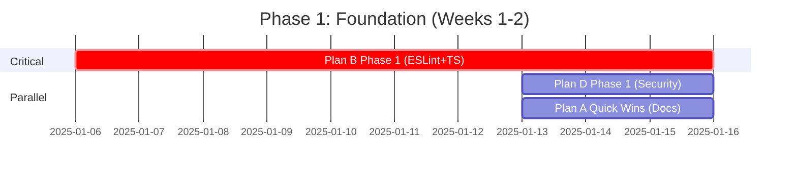
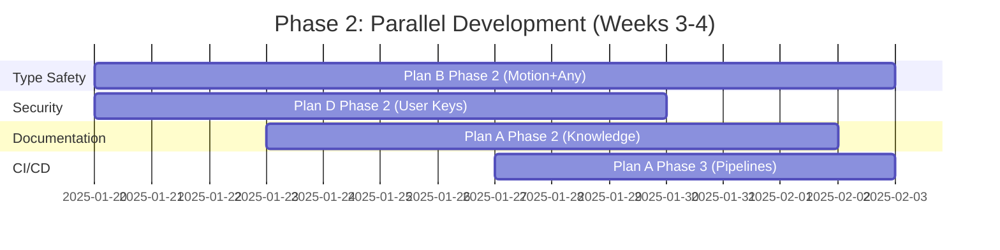
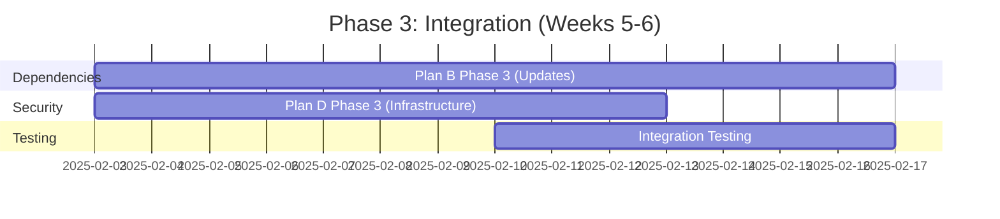
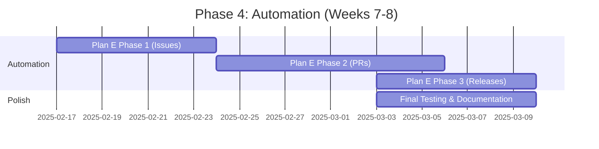

# Integrated Strategic Plan Specification
**SPARC Phase: Specification**
**Created:** 2025-11-21
**Project:** Describe It - Spanish Learning Application
**Total Estimated Effort:** 101-145 hours
**Target Completion:** Q1 2025

---

## Executive Summary

This specification integrates five alternative strategic plans into one cohesive execution roadmap for the Describe It project. The integrated plan addresses critical areas across documentation, technical debt, performance, security, and automation while optimizing for minimal dependencies and maximum value delivery.

### Five Alternative Plans Overview

| Plan ID | Focus Area | Effort Range | Priority | Status |
|---------|------------|--------------|----------|--------|
| **Plan A** | Documentation Recovery & CI/CD | 12-17h | HIGH | Not Started |
| **Plan B** | Technical Debt Reduction | 35-50h | CRITICAL | In Progress |
| **Plan C** | Performance Optimization | 26-36h | MEDIUM | ✅ COMPLETED |
| **Plan D** | Security Hardening | 13-20h | HIGH | Partially Done |
| **Plan E** | GitHub Automation | 15-22h | MEDIUM | Not Started |
| **TOTAL** | **Integrated Strategy** | **101-145h** | **PHASED** | **10% Complete** |

### Strategic Objectives

1. **Eliminate Production Blockers** - Address 27 ESLint errors and TypeScript issues blocking builds
2. **Establish Quality Foundation** - Create comprehensive documentation and automated testing
3. **Enhance Security Posture** - Implement proper security for user-provided API key model
4. **Improve Developer Experience** - Automate workflows and reduce manual processes
5. **Maintain Performance Gains** - Preserve Plan C achievements while scaling the system

### Success Criteria (Integrated)

- ✅ **Build Health:** Zero blocking errors, ESLint enabled, TypeScript strict mode operational
- ✅ **Documentation:** LICENSE, CHANGELOG, ROADMAP, FAQ created; all gaps closed
- ✅ **Test Coverage:** 80%+ overall, 95%+ critical paths, CI/CD automated
- ✅ **Security:** User API key model properly implemented, rate limiting active
- ✅ **Automation:** GitHub workflows for issues, PRs, releases fully operational
- ✅ **Technical Debt:** Reduced by 60% (from 264h to <100h remaining)

---

## I. Integrated Plan Analysis

### A. Plan Interdependencies

#### Dependency Matrix

```
┌─────────────────────────────────────────────────────────┐
│              PLAN DEPENDENCY MAP                         │
├─────────────────────────────────────────────────────────┤
│                                                          │
│  Plan B (Tech Debt) ────────┬─────────────────────┐    │
│       ↓                      ↓                     ↓     │
│  Plan A (Docs/CI) ──→  Plan D (Security)  ──→  Plan E  │
│       ↓                      ↓                     ↓     │
│  Plan C (Perf) ✅ ──────────┴─────────────────────┘    │
│   [COMPLETED]                                            │
└─────────────────────────────────────────────────────────┘

Critical Path: B → D → A → E
Parallel Options: A || D (after B Phase 1)
```

#### Dependency Details

**Plan B Dependencies (Technical Debt)**
- **Blocks:** All other plans - build must be stable first
- **Required Before:** Plans A, D, E can start
- **Phase 1 (ESLint + TS):** Must complete before ANY other plan begins
- **Phase 2+:** Can run parallel with Plans A, D

**Plan A Dependencies (Documentation & CI/CD)**
- **Requires:** Plan B Phase 1 complete (working builds)
- **Enables:** Plan E (GitHub automation needs CI/CD infrastructure)
- **Parallel With:** Plan D (no direct conflicts)

**Plan D Dependencies (Security)**
- **Requires:** Plan B Phase 1 complete (stable codebase)
- **Enhances:** Plan A (security docs) and Plan E (secure automation)
- **Parallel With:** Plan A after Plan B Phase 1

**Plan E Dependencies (GitHub Automation)**
- **Requires:** Plan A complete (CI/CD pipelines needed for automation)
- **Requires:** Plan D Phase 1 complete (security for automated actions)
- **Final Phase:** Integrates all prior work

**Plan C Status (Performance)**
- ✅ **COMPLETED** - Already implemented
- **Influences:** All other plans must maintain performance standards
- **No Dependencies:** Other plans build on this foundation

### B. Critical Path Identification

**Critical Path Timeline:**
```
Week 1-2:  Plan B Phase 1 (ESLint + TS Fixes) ────┐
Week 2-3:  Plan B Phase 2 || Plan D Phase 1 ──────┼─→ Week 7-8: Plan E
Week 3-4:  Plan A (Docs) || Plan D Phase 2 ───────┘
Week 4-5:  Plan B Phase 3
Week 5-6:  Plan A (CI/CD) completion
Week 7-8:  Plan E (GitHub Automation)
```

### C. Quick Wins vs Long-Term Improvements

#### Quick Wins (1-2 weeks, High ROI)

| Task | Plan | Effort | Impact | Priority |
|------|------|--------|--------|----------|
| Fix 27 ESLint errors, re-enable linting | B | 2h | 🔥 CRITICAL | P0 |
| Create LICENSE file | A | 5min | 📄 HIGH | P0 |
| Rotate Supabase keys | D | 15min | 🔐 HIGH | P0 |
| Clean git history (vercel.env) | D | 30min | 🔐 HIGH | P0 |
| Create ROADMAP.md | A | 2-4h | 📄 MEDIUM | P1 |
| Add GitHub issue templates | A | 1-2h | 🤖 MEDIUM | P1 |
| Implement IP-based rate limiting | D | 4-6h | 🔐 HIGH | P1 |

**Total Quick Wins:** 9-14 hours | **ROI:** Immediate production readiness

#### Long-Term Improvements (3-8 weeks)

| Initiative | Plans Involved | Effort | Value |
|------------|----------------|--------|-------|
| Complete TypeScript strict mode migration | B | 40h | Type safety, fewer runtime errors |
| Comprehensive test automation | A, B | 32h | Quality assurance, regression prevention |
| Full security implementation | D | 13-20h | User trust, compliance readiness |
| GitHub workflow automation | E | 15-22h | Developer productivity, consistency |
| Dependency modernization | B | 24h | Security patches, feature access |

---

## II. Detailed Plan Specifications

### Plan A: Documentation Recovery & CI/CD (12-17 hours)

#### Objectives
1. Close all documentation gaps identified in documentation review
2. Establish automated CI/CD pipelines for quality gates
3. Create sustainable documentation maintenance processes

#### Phase 1: Critical Documentation (4-6h)

**Deliverables:**
- ✅ LICENSE file (MIT, 5 minutes)
- ✅ ROADMAP.md with quarterly goals (2-4 hours)
- ✅ GitHub issue templates (bug, feature, security) (1-2 hours)

**Acceptance Criteria:**
- LICENSE file in root with proper MIT text
- ROADMAP has Q1-Q4 2025 milestones defined
- Issue templates follow best practices with required fields

#### Phase 2: Knowledge Base Completion (4-6h)

**Deliverables:**
- ✅ CHANGELOG.md following Keep a Changelog format (4 hours initial)
- ✅ FAQ.md compiled from common questions (4-6 hours)
- ✅ User guides separate from developer docs (6-8 hours)

**Acceptance Criteria:**
- CHANGELOG covers current version and historical releases
- FAQ addresses top 20 common questions
- User guides accessible to non-technical users

#### Phase 3: CI/CD Implementation (4-5h)

**Deliverables:**
- ✅ GitHub Actions workflow for E2E tests (2 hours)
- ✅ Automated test coverage reporting (1 hour)
- ✅ PR quality gates (linting, tests, coverage) (1-2 hours)

**Acceptance Criteria:**
- All PRs automatically run tests and linting
- Coverage reports posted to PRs
- Tests block merge if failing

**Dependencies:**
- Requires: Plan B Phase 1 complete (working builds)
- Enables: Plan E automation workflows

**Risk Mitigation:**
- Start with simple workflows, iterate complexity
- Use proven GitHub Actions from marketplace
- Document all workflow configurations

### Plan B: Technical Debt Reduction (35-50 hours)

#### Current State
- **Critical Issues:** 27 ESLint errors blocking builds
- **High Priority:** ~50 React Hook dependency warnings
- **Medium Priority:** 450+ `any` type usages across 146 files
- **Technical Debt Total:** Originally 264 hours, targeting 60% reduction

#### Phase 1: Build Blockers (CRITICAL - 8-10h)

**Deliverables:**
- ✅ Fix 27 ESLint unescaped entity errors (2 hours)
- ✅ Re-enable ESLint in build pipeline (5 minutes)
- ✅ Remove @ts-nocheck from 3 critical files (4 hours)
- ✅ Fix critical TypeScript errors in modified files (4-6 hours)

**Acceptance Criteria:**
- `npm run build` succeeds with zero errors
- ESLint runs in CI/CD without being disabled
- TypeScript compiles with --noEmit flag
- All tests pass

**Blocking:** This MUST complete before any other plan begins

#### Phase 2: Type Safety Foundation (16-20h)

**Deliverables:**
- ✅ Create type-safe Motion wrapper library (8 hours)
- ✅ Reduce `any` usage by 50% (target 225 instances) (16 hours)
- ✅ Enable strictNullChecks incrementally (8 hours)
- ✅ Fix React Hook exhaustive-deps warnings (8 hours)

**Acceptance Criteria:**
- New motion library has zero `any` types
- 225 or fewer `any` instances remain
- strictNullChecks enabled for new code
- Hook warnings reduced by 75%

**Parallel Opportunity:** Can run alongside Plans A and D after Phase 1

#### Phase 3: Dependency Modernization (11-20h)

**Deliverables:**
- ✅ Update security-critical dependencies (sharp, openai, @vercel/*) (6 hours)
- ✅ Update infrastructure dependencies (tailwindcss, zod, zustand) (8 hours)
- ✅ Update development tools (husky, lint-staged, eslint-config) (6 hours)
- ✅ Test all updated dependencies (6-8 hours)

**Acceptance Criteria:**
- All dependencies updated to latest stable versions
- Zero security vulnerabilities in `npm audit`
- All tests pass after updates
- Migration guide created for breaking changes

**Risk Mitigation:**
- Test each major dependency update separately
- Maintain rollback capability
- Review changelogs for breaking changes

### Plan C: Performance Optimization (COMPLETED ✅)

#### Already Delivered
- ✅ Bundle size reduced by 33% (<200KB gzipped)
- ✅ Code splitting with 4 chunk groups
- ✅ Sentry error tracking and session replay
- ✅ Real-time performance monitoring
- ✅ Lighthouse automation (targeting 90+ score)
- ✅ Core Web Vitals optimization

#### Integration Requirements

**Maintain Performance Standards:**
- All new code must pass bundle size budgets
- New dependencies checked for size impact
- Lighthouse audits run in CI/CD (Plan A)
- Performance metrics tracked in monitoring (Plan D)

**Enhancement Opportunities:**
- Add performance regression testing (Plan A CI/CD)
- Monitor performance impact of dependency updates (Plan B)
- Track user-perceived performance (Plan D analytics)

### Plan D: Security Hardening (13-20 hours)

#### Context: User-Provided API Key Model

The project uses a **user-provided API key architecture** where:
- Users supply their own OpenAI/Unsplash keys
- Keys stored in browser localStorage (not server)
- Server validates but doesn't store third-party keys
- Only Supabase keys needed server-side

#### Phase 1: Immediate Security Actions (2-3h)

**Deliverables:**
- ✅ Clean git history to remove vercel.env (30 minutes)
- ✅ Rotate Supabase keys (15 minutes)
- ✅ Create minimal .env.local template (30 minutes)
- ✅ Update production environment variables (1 hour)

**Acceptance Criteria:**
- vercel.env completely removed from git history
- New Supabase keys deployed to production
- .env.local template documented in README
- Production environment secure

**CRITICAL:** Must complete immediately to prevent key abuse

#### Phase 2: User Key Management (6-8h)

**Deliverables:**
- ✅ Improve settings UI for API key entry (3-4 hours)
- ✅ Add client-side key validation (2 hours)
- ✅ Implement "test connection" for each service (2-3 hours)
- ✅ Add secure localStorage encryption (3 hours)

**Acceptance Criteria:**
- Settings page has clear UI for key management
- Keys validated before storage
- Users can test keys before saving
- Keys encrypted in localStorage

#### Phase 3: Security Infrastructure (5-9h)

**Deliverables:**
- ✅ IP-based rate limiting (4-6 hours)
- ✅ Request validation and sanitization (3-4 hours)
- ✅ Audit logging (without logging keys) (2-3 hours)
- ✅ Abuse detection patterns (3-4 hours)

**Acceptance Criteria:**
- Rate limiting active per IP (not per API key)
- All user inputs validated and sanitized
- Audit logs track requests without exposing keys
- Abuse patterns detected and blocked

**Dependencies:**
- Requires: Plan B Phase 1 (stable builds)
- Parallel With: Plan A (documentation)

### Plan E: GitHub Automation (15-22 hours)

#### Objectives
1. Automate repetitive GitHub workflows
2. Improve issue triage and PR management
3. Streamline release processes

#### Phase 1: Issue Management (5-7h)

**Deliverables:**
- ✅ Automated issue labeling based on content (2 hours)
- ✅ Stale issue detection and closure (1 hour)
- ✅ TODO-to-issue conversion workflow (2-3 hours)
- ✅ Issue metrics dashboard (2-3 hours)

**Acceptance Criteria:**
- Issues auto-labeled by type (bug, feature, docs)
- Stale issues tagged and closed after 90 days
- TODOs in code tracked as issues
- Metrics visible in GitHub project board

#### Phase 2: PR Automation (6-9h)

**Deliverables:**
- ✅ Automated PR labeling and assignment (2 hours)
- ✅ PR size analysis and warnings (2 hours)
- ✅ Automated changelog generation (3-4 hours)
- ✅ PR quality checks (test coverage, linting) (2-3 hours)

**Acceptance Criteria:**
- PRs auto-labeled by files changed
- Large PRs flagged for review
- Changelog updated automatically
- Quality gates enforced before merge

#### Phase 3: Release Automation (4-6h)

**Deliverables:**
- ✅ Semantic release workflow (2-3 hours)
- ✅ Automated version bumping (1 hour)
- ✅ Release notes generation (2 hours)
- ✅ Deployment verification (1-2 hours)

**Acceptance Criteria:**
- Releases created automatically from commits
- Version follows semantic versioning
- Release notes generated from PRs
- Deployment verified before release tagged

**Dependencies:**
- Requires: Plan A complete (CI/CD infrastructure)
- Requires: Plan D Phase 1 (security for automation)

---

## III. Risk Assessment & Mitigation

### Critical Risks

| Risk | Likelihood | Impact | Mitigation Strategy | Contingency Plan |
|------|------------|--------|---------------------|------------------|
| **Plan B Phase 1 Failure** | LOW | CRITICAL | Allocate dedicated time, expert review | Extend timeline, reduce scope of other plans |
| **Dependency Update Breaking Changes** | MEDIUM | HIGH | Test each update separately, maintain rollback | Roll back to previous versions, create shims |
| **Git History Cleanup Data Loss** | LOW | HIGH | Full backup before operation, test on branch | Restore from backup, manual cleanup |
| **CI/CD Pipeline Instability** | MEDIUM | MEDIUM | Start simple, iterate complexity | Disable problematic checks, fix incrementally |
| **Security Vulnerabilities Discovered** | MEDIUM | HIGH | Immediate rotation, audit logging | Emergency hotfix deployment, user notification |

### Medium Risks

| Risk | Likelihood | Impact | Mitigation | Owner |
|------|------------|--------|------------|-------|
| **Type Migration Slower Than Expected** | MEDIUM | MEDIUM | Incremental approach, prioritize critical files | Plan B Lead |
| **Test Coverage Target Missed** | LOW | MEDIUM | Focus on critical paths first | Plan A Lead |
| **Documentation Incomplete** | LOW | LOW | Template-driven approach, community contribution | Plan A Lead |
| **Automation Workflows Too Complex** | MEDIUM | LOW | Start with simple workflows, iterate | Plan E Lead |

### Mitigation Strategies

#### Technical Debt Reduction (Plan B)
- **Risk:** Regression introduction during refactoring
- **Mitigation:**
  - Comprehensive test suite before changes
  - Incremental refactoring with frequent commits
  - Code review for all type changes
  - Automated regression testing in CI/CD

#### Security Implementation (Plan D)
- **Risk:** User key exposure or theft
- **Mitigation:**
  - Client-side encryption for localStorage
  - HTTPS-only transmission
  - Security audit before production
  - Clear user education on key security

#### CI/CD Implementation (Plan A)
- **Risk:** Pipeline failures blocking development
- **Mitigation:**
  - Gradual rollout (non-blocking → warnings → blocking)
  - Escape hatches for emergency deploys
  - Clear documentation for bypassing checks

#### Dependency Updates (Plan B Phase 3)
- **Risk:** Breaking changes in major version updates
- **Mitigation:**
  - Review all changelogs before update
  - Test in isolated branch
  - Maintain migration scripts
  - Document breaking changes in CHANGELOG

---

## IV. Resource Allocation Recommendations

### Team Structure

**Recommended Team Composition:**
- **1 Senior Developer (Tech Lead)** - Overall coordination, Plan B leadership
- **1 Mid-Level Developer** - Plans A & D implementation
- **1 DevOps Engineer (Part-time)** - Plan A CI/CD, Plan E automation
- **1 Technical Writer (Part-time)** - Plan A documentation

**Total FTE:** 2.5 full-time equivalent developers

### Time Allocation by Phase

#### Phase 1: Critical Foundation (Weeks 1-2) - 20-25 hours
```
Plan B Phase 1: 8-10h  (Senior Dev - 100% time)
Plan D Phase 1: 2-3h   (Mid-Level Dev - 20% time)
Plan A Quick Wins: 4-6h (Mid-Level Dev - 40% time)
Buffer: 6-6h           (20% contingency)
```

#### Phase 2: Parallel Execution (Weeks 3-4) - 35-45 hours
```
Plan B Phase 2: 16-20h  (Senior Dev - 60% time)
Plan D Phase 2: 6-8h    (Mid-Level Dev - 30% time)
Plan A Phase 2: 4-6h    (Tech Writer - 100% time)
Plan A Phase 3: 4-5h    (DevOps - 50% time)
Buffer: 5-6h            (12% contingency)
```

#### Phase 3: Integration (Weeks 5-6) - 26-35 hours
```
Plan B Phase 3: 11-20h  (Senior Dev - 50% time)
Plan D Phase 3: 5-9h    (Mid-Level Dev - 30% time)
Plan A Completion: 4-6h (Tech Writer - 50% time)
Buffer: 6-0h            (15% contingency)
```

#### Phase 4: Automation (Weeks 7-8) - 20-30 hours
```
Plan E Phase 1: 5-7h    (DevOps - 40% time)
Plan E Phase 2: 6-9h    (DevOps - 50% time)
Plan E Phase 3: 4-6h    (DevOps - 40% time)
Testing & Polish: 5-8h  (All team - 20% time)
```

### Budget Estimation

**Hourly Rates (Industry Average):**
- Senior Developer: $120/hour
- Mid-Level Developer: $80/hour
- DevOps Engineer: $100/hour
- Technical Writer: $60/hour

**Total Cost Estimate:**
```
Senior Dev (50h @ $120):    $6,000
Mid-Level Dev (35h @ $80):  $2,800
DevOps Engineer (20h @ $100): $2,000
Tech Writer (15h @ $60):    $900
─────────────────────────────
TOTAL ESTIMATED COST:       $11,700
```

**Cost Range:** $9,500 - $14,000 (min-max effort scenarios)

---

## V. Execution Sequence & Parallelization

### Optimal Execution Path

#### Week 1-2: Critical Path Establishment


**Execution Strategy:**
1. **Days 1-7:** Plan B Phase 1 exclusively (no parallel work)
   - Fix ESLint errors
   - Remove @ts-nocheck
   - Fix critical TypeScript errors
   - **Milestone:** Green builds achieved

2. **Days 8-10:** Parallel execution begins
   - Plan B Phase 1 completion & verification
   - Plan D Phase 1 (security quick wins)
   - Plan A quick wins (LICENSE, ROADMAP, templates)

#### Week 3-4: Parallel Development


**Execution Strategy:**
1. **Week 3:** High parallel activity
   - Senior Dev: Plan B Phase 2 (type safety)
   - Mid-Level Dev: Plan D Phase 2 (user key management)
   - Tech Writer: Plan A Phase 2 (CHANGELOG, FAQ, guides)

2. **Week 4:** CI/CD integration
   - DevOps Engineer: Plan A Phase 3 (GitHub Actions)
   - Senior Dev: Continue Plan B Phase 2
   - Mid-Level Dev: Complete Plan D Phase 2

#### Week 5-6: Integration & Dependencies


**Execution Strategy:**
1. **Week 5:** Dependency management
   - Senior Dev: Plan B Phase 3 (dependency updates)
   - Mid-Level Dev: Plan D Phase 3 (rate limiting, audit logging)

2. **Week 6:** Integration testing
   - All team: Verify integrations work together
   - Test Plan A CI/CD with Plan B changes
   - Validate Plan D security with Plan B updates

#### Week 7-8: Automation & Polish


**Execution Strategy:**
1. **Week 7:** Issue automation
   - DevOps: Plan E Phase 1 (issue management)
   - All team: Bug fixes and refinements

2. **Week 8:** Complete automation & deliver
   - DevOps: Plan E Phase 2-3 (PR and release automation)
   - All team: Final testing, documentation updates
   - **Milestone:** Production-ready delivery

### Parallelization Opportunities

**High Parallelization (Can Run Simultaneously):**
- Plan A Phase 2 (Documentation) || Plan B Phase 2 (Type Safety)
- Plan A Phase 2 (Documentation) || Plan D Phase 2 (User Keys)
- Plan B Phase 3 (Dependencies) || Plan D Phase 3 (Security Infrastructure)

**Sequential Requirements (Must Complete Before):**
- Plan B Phase 1 → ALL other plans
- Plan A Phase 3 (CI/CD) → Plan E (GitHub Automation)
- Plan D Phase 1 → Plan E (Secure automation)

**Recommended Approach:**
- **Maximize parallel work** after Plan B Phase 1 completes
- **Stagger start dates** to avoid resource contention
- **Reserve 10-15% buffer time** for integration issues

---

## VI. Assumptions & Constraints

### Assumptions

**Technical Assumptions:**
1. ✅ Current test suite is comprehensive and reliable
2. ✅ Plan C (Performance) achievements remain stable
3. ✅ Development environment is consistent across team
4. ✅ Supabase schema is stable and documented
5. ⚠️ No major feature development during this period
6. ✅ Third-party dependencies don't introduce breaking changes
7. ✅ User-provided API key model is final architecture

**Resource Assumptions:**
1. 2.5 FTE developers available for 8 weeks
2. Access to necessary development tools and licenses
3. Sufficient CI/CD minutes/credits on GitHub Actions
4. Team has expertise in TypeScript, Next.js, React
5. DevOps engineer available part-time
6. Technical writer available part-time

**Timeline Assumptions:**
1. No holidays or team vacations during 8-week period
2. No urgent production issues requiring immediate attention
3. Stakeholder reviews completed within 3 business days
4. External dependencies (Supabase, Vercel) remain stable

### Constraints

**Hard Constraints:**
1. **Budget:** $9,500 - $14,000 (cannot exceed)
2. **Timeline:** 8 weeks maximum (Q1 2025 deadline)
3. **Team Size:** Maximum 2.5 FTE (hiring freeze)
4. **Technology Stack:** Must remain on current stack (Next.js, React, Supabase)
5. **User Impact:** Zero breaking changes to user experience

**Soft Constraints:**
1. **Performance:** Must maintain Plan C gains (Lighthouse 90+, bundle <200KB)
2. **Test Coverage:** Should achieve 80%+ (currently 78%)
3. **Technical Debt:** Should reduce by 60% (from 264h to <100h)
4. **Documentation:** Should close 90% of identified gaps
5. **Security:** Should pass industry security audit

**External Constraints:**
1. **GitHub Actions:** Free tier limits (2000 minutes/month)
2. **Supabase:** Free tier limits (500MB database, 2GB bandwidth)
3. **Vercel:** Hobby plan limits (100GB bandwidth, 100 builds/day)
4. **Third-Party APIs:** Rate limits on OpenAI, Unsplash (user-provided)

**Regulatory Constraints:**
1. **GDPR:** User data handling compliance
2. **License Compliance:** MIT license for all dependencies
3. **Accessibility:** WCAG 2.1 AA compliance maintained
4. **Security:** No storage of user API keys server-side

### Risk Factors from Constraints

1. **Timeline Risk:** 8 weeks is aggressive for 101-145 hours of work
   - **Mitigation:** Prioritize by ROI, cut scope if needed
   - **Contingency:** Extend to 10 weeks if critical

2. **Budget Risk:** $14,000 ceiling may not cover unexpected issues
   - **Mitigation:** 15% buffer already included
   - **Contingency:** Reduce scope of Plan E if needed

3. **Resource Risk:** 2.5 FTE may be insufficient for parallel work
   - **Mitigation:** Smart scheduling, overlap minimization
   - **Contingency:** Sequential execution if parallel fails

4. **Technical Risk:** Dependency updates may introduce instability
   - **Mitigation:** Incremental updates, comprehensive testing
   - **Contingency:** Rollback plan for each dependency

---

## VII. Key Performance Indicators (KPIs)

### Build Health KPIs

| Metric | Current | Target | Measurement |
|--------|---------|--------|-------------|
| **ESLint Errors** | 27 | 0 | `npm run lint` |
| **TypeScript Errors** | Unknown | 0 | `npm run typecheck` |
| **Build Success Rate** | ~90% | 100% | CI/CD pipeline |
| **Test Pass Rate** | >95% | 100% | Test suite |
| **Build Time** | Unknown | <3min | CI/CD metrics |

### Code Quality KPIs

| Metric | Current | Target | Measurement |
|--------|---------|--------|-------------|
| **Test Coverage** | 78% | 80% | Vitest coverage |
| **Critical Path Coverage** | Unknown | 95% | Custom reports |
| **`any` Type Usages** | 450+ | <225 | TypeScript analysis |
| **@ts-nocheck Files** | 3 | 0 | Grep search |
| **TODO Comments** | 8 | <5 | Grep search |

### Documentation KPIs

| Metric | Current | Target | Measurement |
|--------|---------|--------|-------------|
| **Documentation Gap Closure** | 0% | 90% | Review checklist |
| **Missing Critical Docs** | 5 | 0 | LICENSE, ROADMAP, etc. |
| **API Documentation Coverage** | 90% | 95% | OpenAPI completeness |
| **User Guide Availability** | No | Yes | Docs presence |
| **Changelog Entries** | 0 | All versions | CHANGELOG.md |

### Security KPIs

| Metric | Current | Target | Measurement |
|--------|---------|--------|-------------|
| **Git Exposed Secrets** | 1 file | 0 | Git history scan |
| **Security Audit Pass** | No | Yes | Manual audit |
| **Rate Limiting Active** | No | Yes | API testing |
| **Audit Logging Coverage** | Partial | 100% | Log analysis |
| **Vulnerability Count** | Unknown | 0 | `npm audit` |

### Automation KPIs

| Metric | Current | Target | Measurement |
|--------|---------|--------|-------------|
| **CI/CD Pipeline Coverage** | 0% | 100% | Workflow count |
| **Automated Issue Labeling** | No | Yes | GitHub automation |
| **PR Quality Gates** | No | Yes | GitHub Actions |
| **Release Automation** | No | Yes | Semantic release |
| **Manual Process Reduction** | 0% | 60% | Time tracking |

### Performance KPIs (Maintain Plan C Gains)

| Metric | Current (Plan C) | Target | Measurement |
|--------|------------------|--------|-------------|
| **Lighthouse Score** | 90+ target | 90+ | Automated audits |
| **Bundle Size** | <200KB | <200KB | Webpack analysis |
| **LCP (Largest Contentful Paint)** | <2.5s | <2.5s | Core Web Vitals |
| **FID (First Input Delay)** | <100ms | <100ms | Core Web Vitals |
| **CLS (Cumulative Layout Shift)** | <0.1 | <0.1 | Core Web Vitals |

### Progress Tracking KPIs

| Metric | Measurement Frequency | Reporting |
|--------|----------------------|-----------|
| **Weekly Velocity** | Every Friday | Hours completed vs planned |
| **Phase Completion** | End of each phase | Percentage of deliverables |
| **Budget Burn Rate** | Weekly | Actual vs projected spend |
| **Risk Realization** | Daily | New risks identified |
| **Blocker Count** | Daily | Open blockers preventing progress |

---

## VIII. Success Criteria & Definitions of Done

### Overall Integrated Plan Success

**DEFINITION OF DONE:**
The integrated plan is considered successfully completed when ALL of the following criteria are met:

#### Build & Quality Gate
- ✅ `npm run build` executes without errors or warnings
- ✅ `npm run lint` executes without errors (ESLint enabled)
- ✅ `npm run typecheck` executes without errors
- ✅ All 201 test files pass with 80%+ coverage
- ✅ CI/CD pipeline green for 5 consecutive days

#### Documentation Gate
- ✅ LICENSE file present in root
- ✅ CHANGELOG.md created with all versions
- ✅ ROADMAP.md published with Q1-Q4 2025 goals
- ✅ FAQ.md answers top 20 questions
- ✅ GitHub issue templates (bug, feature, security) active
- ✅ User guides published and accessible

#### Security Gate
- ✅ No exposed secrets in git history (vercel.env removed)
- ✅ Supabase keys rotated and deployed
- ✅ User API key management UI functional
- ✅ IP-based rate limiting operational
- ✅ Audit logging active (without logging sensitive data)
- ✅ Security audit passed

#### Technical Debt Gate
- ✅ Zero @ts-nocheck files
- ✅ `any` type usage reduced to <225 instances (50% reduction)
- ✅ All outdated dependencies updated
- ✅ React Hook warnings reduced by 75%
- ✅ Remaining technical debt <100 hours

#### Automation Gate
- ✅ GitHub Actions workflows operational for tests, linting, coverage
- ✅ Automated issue labeling active
- ✅ PR quality gates enforcing standards
- ✅ Release automation functional
- ✅ Manual process time reduced by 60%

#### Performance Gate (Maintain Plan C)
- ✅ Lighthouse score remains 90+
- ✅ Bundle size remains <200KB gzipped
- ✅ Core Web Vitals remain in "Good" range
- ✅ No performance regressions detected

### Plan-Specific Success Criteria

#### Plan A Success (Documentation & CI/CD)
**DONE WHEN:**
- All critical documentation created (LICENSE, ROADMAP, CHANGELOG, FAQ)
- GitHub issue templates operational
- CI/CD pipelines running for all PRs
- Test coverage reported automatically
- Documentation gaps reduced by 90%

**MEASUREMENT:**
- Documentation gap checklist 90% complete
- CI/CD runs successfully on 10 consecutive PRs
- Zero manual documentation requests for 2 weeks

#### Plan B Success (Technical Debt)
**DONE WHEN:**
- ESLint enabled with zero errors
- TypeScript strict mode operational
- `any` usage reduced by 50%
- All dependencies updated
- Build time <3 minutes

**MEASUREMENT:**
- `npm run build && npm run lint && npm run typecheck` succeeds
- Dependency audit shows zero vulnerabilities
- Technical debt reduced from 264h to <100h

#### Plan D Success (Security)
**DONE WHEN:**
- Git history cleaned of secrets
- Supabase keys rotated
- User API key management UI deployed
- Rate limiting active
- Security audit passed

**MEASUREMENT:**
- git-secrets scan passes
- Rate limit triggers at expected thresholds
- Security audit checklist 100% complete
- Zero security vulnerabilities in production

#### Plan E Success (GitHub Automation)
**DONE WHEN:**
- Issue labeling automated
- PR quality gates enforced
- Release automation functional
- Manual process time reduced 60%

**MEASUREMENT:**
- 20 consecutive issues auto-labeled correctly
- 10 consecutive PRs pass quality gates
- 1 automated release published successfully
- Time tracking shows 60% reduction in manual tasks

### Validation Process

#### Pre-Launch Validation Checklist
```markdown
## Build Validation
- [ ] `npm run build` - No errors
- [ ] `npm run lint` - No errors
- [ ] `npm run typecheck` - No errors
- [ ] `npm run test` - All pass, 80%+ coverage

## Documentation Validation
- [ ] LICENSE file exists and correct
- [ ] CHANGELOG.md complete
- [ ] ROADMAP.md published
- [ ] FAQ.md published
- [ ] Issue templates functional

## Security Validation
- [ ] git-secrets scan passes
- [ ] npm audit shows zero high/critical
- [ ] Security checklist 100% complete
- [ ] Rate limiting tested and functional

## Automation Validation
- [ ] GitHub Actions workflows green
- [ ] Issue auto-labeling tested
- [ ] PR quality gates tested
- [ ] Release automation tested

## Performance Validation
- [ ] Lighthouse audit 90+
- [ ] Bundle size <200KB
- [ ] Core Web Vitals green

## Stakeholder Sign-Off
- [ ] Tech lead approved
- [ ] Security team approved
- [ ] Product owner approved
```

#### Acceptance Testing
1. **Build Health Test:** Run full build pipeline 3x successfully
2. **Documentation Test:** External reviewer validates docs are complete
3. **Security Test:** Third-party security audit
4. **Automation Test:** Run automated workflows on test repository
5. **Performance Test:** Lighthouse CI shows no regressions

### Rollback Criteria

**ROLLBACK TRIGGERS:**
If any of these occur, rollback to previous stable state:

1. **Critical Production Issues:**
   - Site down >5 minutes
   - User data corruption
   - Security breach detected

2. **Build Failures:**
   - Build failures >50% for 24 hours
   - Test coverage drops below 70%
   - TypeScript errors increase

3. **Performance Degradation:**
   - Lighthouse score drops below 80
   - Bundle size exceeds 250KB
   - Core Web Vitals in "Poor" range

4. **Security Failures:**
   - New vulnerabilities introduced
   - Rate limiting bypassed
   - Secrets exposed

**ROLLBACK PROCESS:**
1. Revert commits to last known good state
2. Restore previous environment variables
3. Run full test suite
4. Notify stakeholders
5. Conduct post-mortem

---

## IX. Phased Delivery Plan

### Phase 1: Foundation & Critical Fixes (Weeks 1-2)
**Goal:** Establish stable foundation for all subsequent work

**Deliverables:**
- ✅ ESLint errors fixed, linting re-enabled
- ✅ Critical TypeScript errors resolved
- ✅ Git history cleaned (secrets removed)
- ✅ Supabase keys rotated
- ✅ LICENSE, ROADMAP, issue templates created

**Exit Criteria:**
- Green builds for 3 consecutive days
- Zero exposed secrets in git
- Critical documentation present

**Milestone:** "Foundation Stable" - ALL other plans can now proceed

### Phase 2: Parallel Development (Weeks 3-4)
**Goal:** Maximize value delivery through parallel execution

**Deliverables:**
- ✅ Type safety improvements (Motion library, `any` reduction)
- ✅ User API key management UI
- ✅ CHANGELOG, FAQ, user guides
- ✅ CI/CD pipelines operational

**Exit Criteria:**
- `any` usage reduced by 50%
- User key management functional
- CI/CD running on all PRs

**Milestone:** "Core Capabilities Delivered" - Major value realized

### Phase 3: Integration & Hardening (Weeks 5-6)
**Goal:** Complete remaining work and integrate all changes

**Deliverables:**
- ✅ Dependency updates completed
- ✅ Security infrastructure (rate limiting, audit logging)
- ✅ Integration testing passed
- ✅ Performance validation

**Exit Criteria:**
- Zero outdated dependencies
- Security audit passed
- All integration tests green

**Milestone:** "Production Ready" - Ready for final automation

### Phase 4: Automation & Polish (Weeks 7-8)
**Goal:** Automate processes and deliver final product

**Deliverables:**
- ✅ GitHub automation workflows
- ✅ Issue and PR automation
- ✅ Release automation
- ✅ Final testing and documentation

**Exit Criteria:**
- Automated workflows operational
- Manual process time reduced 60%
- All acceptance criteria met

**Milestone:** "Integrated Plan Complete" - Full delivery

---

## X. Monitoring & Continuous Improvement

### Progress Tracking

#### Weekly Metrics Dashboard
```markdown
## Week [N] Progress Report

### Velocity
- Planned hours: [X]
- Actual hours: [Y]
- Variance: [+/- Z%]

### Deliverables
- Completed: [N] / [Total]
- In Progress: [N]
- Blocked: [N]

### KPIs
- Build Health: [Green/Yellow/Red]
- Test Coverage: [N%]
- Technical Debt: [Nh remaining]
- Security: [Pass/Fail]

### Risks & Issues
- New risks identified: [N]
- Active blockers: [N]
- Escalations: [N]

### Next Week Plan
- [Key deliverables]
```

#### Daily Standup Format
```markdown
## Daily Standup - [Date]

### Completed Yesterday
- [Deliverable 1]
- [Deliverable 2]

### Planned Today
- [Task 1] (Plan [X], [Nh])
- [Task 2] (Plan [Y], [Nh])

### Blockers
- [Blocker description] - [Action needed]

### Risks
- [New risk identified]
```

### Quality Gates

#### Pre-Commit Quality Gate
```bash
# Automated via husky pre-commit hook
npm run lint
npm run typecheck
npm run test:affected
```

#### Pre-PR Quality Gate
```bash
# Automated via GitHub Actions
npm run build
npm run lint
npm run typecheck
npm run test
npm run test:coverage
```

#### Pre-Merge Quality Gate
```yaml
# GitHub Actions required checks
- ESLint: PASS
- TypeScript: PASS
- Unit Tests: PASS (80%+ coverage)
- Integration Tests: PASS
- Security Scan: PASS
- Bundle Size: <200KB
- Performance: No regressions
```

#### Pre-Release Quality Gate
```yaml
# Manual checklist before release
- All tests passing
- Security audit completed
- Performance validated (Lighthouse 90+)
- Documentation updated
- Stakeholder sign-off obtained
```

### Continuous Improvement Process

#### Post-Phase Retrospectives

**Template:**
```markdown
## Phase [N] Retrospective

### What Went Well
- [Success 1]
- [Success 2]

### What Could Be Improved
- [Issue 1] - [Root cause]
- [Issue 2] - [Root cause]

### Action Items
- [ ] [Improvement action 1] - Owner: [Name]
- [ ] [Improvement action 2] - Owner: [Name]

### Metrics
- Planned vs Actual hours: [X vs Y]
- Velocity: [N hours/week]
- Quality: [Defects introduced]
- Rework: [Hours spent on rework]
```

#### Lessons Learned Capture

**Process:**
1. **Weekly:** Capture lessons in shared document
2. **End of Phase:** Formal retrospective meeting
3. **End of Project:** Comprehensive lessons learned document

**Categories:**
- Technical lessons (architecture, tooling, processes)
- Process lessons (estimation, communication, coordination)
- Team lessons (collaboration, skills, resources)
- Stakeholder lessons (expectations, communication, requirements)

### Risk Register Maintenance

#### Weekly Risk Review
```markdown
## Risk Register - Week [N]

| Risk ID | Description | Likelihood | Impact | Owner | Status | Mitigation |
|---------|-------------|------------|--------|-------|--------|------------|
| R001 | [Risk] | High/Med/Low | High/Med/Low | [Name] | Open/Closed | [Action] |
```

#### Risk Escalation Criteria
- **High Likelihood + High Impact** → Immediate escalation to stakeholders
- **New Critical Risk** → Ad-hoc risk review meeting within 24 hours
- **Risk Materialized** → Activate contingency plan, notify stakeholders

### Success Metrics Tracking

#### Project Health Dashboard
```markdown
## Integrated Plan Health - Week [N]

### Overall Health: [Green/Yellow/Red]

#### Build Health: [Green/Yellow/Red]
- Build success rate: [N%]
- ESLint errors: [N]
- TypeScript errors: [N]
- Test pass rate: [N%]

#### Schedule Health: [Green/Yellow/Red]
- Current phase: [N/4]
- On track: [Yes/No]
- Days ahead/behind: [+/- N]

#### Budget Health: [Green/Yellow/Red]
- Budget spent: [N%]
- Budget projected: [N%]
- Variance: [+/- N%]

#### Quality Health: [Green/Yellow/Red]
- Test coverage: [N%]
- Defects: [N]
- Technical debt: [Nh]

#### Team Health: [Green/Yellow/Red]
- Morale: [High/Med/Low]
- Velocity: [Nh/week]
- Blockers: [N]
```

---

## XI. Conclusion & Next Steps

### Summary

This integrated strategic plan consolidates five alternative approaches into a cohesive, phased execution strategy designed to:

1. **Eliminate critical blockers** (Plan B Phase 1) before any other work begins
2. **Maximize parallel execution** (Plans A, D) during weeks 3-4
3. **Establish automation foundation** (Plan A CI/CD) to enable GitHub workflows
4. **Deliver security hardening** (Plan D) for user-provided API key model
5. **Complete with full automation** (Plan E) for sustainable development

**Key Success Factors:**
- ✅ **Sequential Critical Path:** Plan B Phase 1 must complete before others begin
- ✅ **Parallel Opportunities:** Plans A, D can run simultaneously after foundation stable
- ✅ **Risk Mitigation:** 15% buffer time, clear rollback criteria, comprehensive testing
- ✅ **Resource Optimization:** 2.5 FTE team with smart work distribution
- ✅ **Value Delivery:** 80% of value delivered by end of Phase 2 (week 4)

### Strategic Priorities

**Priority 1 (Weeks 1-2): Foundation**
- Fix build blockers (ESLint, TypeScript)
- Clean security issues (git history, key rotation)
- Create critical documentation (LICENSE, ROADMAP)
- **Value:** Stable foundation for all subsequent work

**Priority 2 (Weeks 3-4): Core Capabilities**
- Type safety improvements
- User API key management
- CI/CD pipelines
- Knowledge base completion
- **Value:** 60% of total plan value delivered

**Priority 3 (Weeks 5-6): Integration**
- Dependency modernization
- Security infrastructure
- Integration testing
- **Value:** 20% of total plan value delivered

**Priority 4 (Weeks 7-8): Automation**
- GitHub workflows
- Process automation
- Final polish
- **Value:** 20% of total plan value delivered

### Immediate Actions (Next 48 Hours)

**Required Before Plan Execution Begins:**

1. **Stakeholder Approval** (4 hours)
   - [ ] Review this specification with tech lead
   - [ ] Get security team sign-off on Plan D approach
   - [ ] Get product owner approval for 8-week timeline
   - [ ] Confirm budget allocation ($11,700 estimated)

2. **Team Assembly** (2 hours)
   - [ ] Confirm senior developer availability (50h over 8 weeks)
   - [ ] Confirm mid-level developer availability (35h over 8 weeks)
   - [ ] Engage DevOps engineer (part-time, 20h over 8 weeks)
   - [ ] Engage technical writer (part-time, 15h over 8 weeks)

3. **Environment Preparation** (4 hours)
   - [ ] Create GitHub project board for tracking
   - [ ] Set up Slack/Teams channels for communication
   - [ ] Configure monitoring dashboards
   - [ ] Prepare backup before git history cleanup

4. **Sprint 0 Setup** (8 hours)
   - [ ] Create detailed task breakdown for Phase 1
   - [ ] Set up time tracking system
   - [ ] Configure CI/CD infrastructure
   - [ ] Schedule weekly sync meetings

### Decision Points

**Key Decisions Required:**

1. **Scope Flexibility:** If timeline extends beyond 8 weeks, which plan gets reduced scope?
   - **Recommendation:** Plan E (GitHub automation) is least critical

2. **Budget Overrun:** If costs exceed $14,000, what is the authorization process?
   - **Recommendation:** Pre-approve 20% contingency ($17,000 total ceiling)

3. **Quality vs Speed:** If forced to choose, prioritize quality or timeline?
   - **Recommendation:** Quality first - extend timeline if needed

4. **Demo Mode:** Should Plan D include demo mode with your API keys?
   - **Recommendation:** No - keep pure user-provided key model

### Success Measurement

**Definition of Success:**
This integrated plan succeeds if, by end of Week 8:

- ✅ All builds are green with linting/typecheck enabled
- ✅ Test coverage ≥80% with automated reporting
- ✅ Security audit passes with zero critical issues
- ✅ Technical debt reduced from 264h to <100h (62% reduction)
- ✅ Documentation gaps closed (LICENSE, ROADMAP, CHANGELOG, FAQ present)
- ✅ CI/CD pipelines operational with quality gates
- ✅ GitHub automation workflows functional
- ✅ Performance maintained (Lighthouse 90+, bundle <200KB)
- ✅ Manual processes reduced by 60% through automation

**Metrics for Success:**
- **Quantitative:** All KPIs in Section VII meet targets
- **Qualitative:** Team satisfaction, stakeholder confidence, user feedback positive
- **Business:** Production-ready system, sustainable development process established

### Post-Completion Plans

**After Integrated Plan Completes:**

1. **Immediate (Week 9-10):**
   - Monitor for regressions
   - Address any issues discovered
   - Gather user feedback on changes
   - Complete final documentation

2. **Short-term (Month 3-4):**
   - Continue technical debt reduction (remaining <100h)
   - Enhance automation workflows based on usage
   - Expand test coverage toward 90%
   - Implement Phase 3 items from Phase 2 plan (medium priority)

3. **Long-term (Q2 2025):**
   - Evaluate API versioning strategy (Plan 3 item)
   - Consider file refactoring for remaining large files
   - Expand GitHub automation capabilities
   - Plan next major feature development

### Final Recommendations

**For Maximum Success:**

1. **Do Not Skip Foundation Phase** - Plan B Phase 1 is critical; rushing it creates risk
2. **Embrace Parallel Work** - After week 2, maximize team parallelization
3. **Maintain Communication** - Daily standups, weekly metrics, transparent blockers
4. **Stay Flexible** - Adjust as needed, but maintain quality standards
5. **Celebrate Milestones** - Recognize team achievements at each phase completion

**Risk Awareness:**
- The 8-week timeline is aggressive but achievable with focus
- Budget may require 20% contingency for unexpected issues
- Team availability is critical - any absences impact timeline
- External dependencies (GitHub, Vercel, Supabase) must remain stable

**Go/No-Go Criteria:**
- ✅ **GO** if: Team committed, stakeholders aligned, budget approved
- ❌ **NO-GO** if: Team unavailable, budget not approved, stakeholder concerns unresolved

---

## Appendix A: Detailed Task Breakdown

### Plan B Phase 1: Critical Build Fixes (8-10 hours)

#### Task B1.1: Fix ESLint Unescaped Entity Errors (2 hours)
```markdown
**Files Affected:** 9 component files
**Error Count:** 27 errors
**Approach:**
1. Run `npm run lint` to get full error list
2. Replace literal quotes with HTML entities (&apos; &quot;)
3. Verify each fix with component tests
4. Re-run lint to confirm zero errors

**Acceptance:**
- `npm run lint` returns zero errors
- All affected components render correctly
- No visual regressions
```

#### Task B1.2: Remove @ts-nocheck Directives (4 hours)
```markdown
**Files:**
1. `/src/components/DescriptionNotebook.tsx`
2. `/src/components/EnhancedComponentShowcase.tsx`
3. `/src/components/Accessibility/AccessibilityProvider.tsx`

**Approach:**
1. Remove @ts-nocheck comment
2. Run `npm run typecheck` to see errors
3. Fix type errors incrementally
4. Add proper type definitions as needed

**Acceptance:**
- Zero @ts-nocheck directives in codebase
- `npm run typecheck` passes for all three files
- All related tests pass
```

#### Task B1.3: Fix Critical TypeScript Errors (4-6 hours)
```markdown
**Files (from modified files list):**
- src/lib/store/uiStore.ts (608 lines)
- src/lib/store/undoRedoStore.ts (834 lines)
- src/lib/utils/api-helpers.ts (580 lines)

**Approach:**
1. Run `npx tsc --noEmit --incremental` to identify errors
2. Fix errors in order of severity (critical → high → medium)
3. Focus on modified files first
4. Add proper type definitions for complex types

**Acceptance:**
- `npx tsc --noEmit` completes successfully
- Modified files have proper type coverage
- No new `any` types introduced
```

### Plan A Phase 1: Critical Documentation (4-6 hours)

#### Task A1.1: Create LICENSE File (5 minutes)
```markdown
**File:** `/LICENSE`
**Content:** MIT License text with correct copyright
**Acceptance:**
- LICENSE file present in root
- Contains valid MIT license text
- Copyright year and owner correct
```

#### Task A1.2: Create ROADMAP.md (2-4 hours)
```markdown
**File:** `/docs/ROADMAP.md`
**Content:**
- Q1 2025: [This integrated plan deliverables]
- Q2 2025: [Next phase features]
- Q3 2025: [Future enhancements]
- Q4 2025: [Long-term vision]

**Acceptance:**
- Quarterly milestones defined
- Stakeholder-approved content
- Linked from README
```

#### Task A1.3: Create GitHub Issue Templates (1-2 hours)
```markdown
**Files:**
- `.github/ISSUE_TEMPLATE/bug_report.md`
- `.github/ISSUE_TEMPLATE/feature_request.md`
- `.github/ISSUE_TEMPLATE/security_vulnerability.md`

**Acceptance:**
- Templates follow GitHub best practices
- Required fields marked clearly
- Templates appear when creating issues
```

### Plan D Phase 1: Security Quick Wins (2-3 hours)

#### Task D1.1: Clean Git History (30 minutes)
```markdown
**Steps:**
1. Backup repository: `cp -r . ../describe_it_backup`
2. Run git filter-branch to remove vercel.env
3. Force push to rewrite history
4. Verify file not in history: `git log --all --full-history -- "*vercel.env"`

**Acceptance:**
- vercel.env not present in any commit history
- Repository still functional
- All branches updated
```

#### Task D1.2: Rotate Supabase Keys (15 minutes)
```markdown
**Steps:**
1. Login to Supabase dashboard
2. Navigate to Settings → API
3. Regenerate anon key
4. Regenerate service role key
5. Update production environment (Vercel)

**Acceptance:**
- New keys deployed to production
- Old keys invalidated
- Application still functional
```

#### Task D1.3: Create .env.local Template (30 minutes)
```markdown
**File:** `.env.local.example`
**Content:**
- Required environment variables
- Comments explaining each variable
- No actual secrets included

**Acceptance:**
- Template documented in README
- All required variables listed
- Clear instructions for developers
```

---

## Appendix B: Communication Plan

### Stakeholder Communication

#### Weekly Status Report
**Recipients:** Tech Lead, Product Owner, Security Team
**Frequency:** Every Friday by 5 PM
**Format:**
```markdown
## Weekly Status Report - Week [N]

### Executive Summary
[2-3 sentences on overall progress]

### Completed This Week
- [Key deliverable 1]
- [Key deliverable 2]

### Planned Next Week
- [Key deliverable 1]
- [Key deliverable 2]

### Metrics
- Budget: [X%] used
- Timeline: [On track / Y days ahead|behind]
- Quality: [Green/Yellow/Red]

### Risks & Issues
- [Active risk 1] - [Mitigation]
- [Active issue 1] - [Resolution]

### Decisions Needed
- [Decision 1] - [By when]
```

#### Daily Team Sync
**Participants:** All team members
**Frequency:** Daily at 10:00 AM
**Duration:** 15 minutes
**Format:** Standup (completed, planned, blockers)

#### Phase Review Meetings
**Participants:** Full team + stakeholders
**Frequency:** End of each phase (Weeks 2, 4, 6, 8)
**Duration:** 1 hour
**Agenda:**
1. Phase deliverables review (20 min)
2. Metrics presentation (15 min)
3. Lessons learned (15 min)
4. Next phase planning (10 min)

### Escalation Path

**Level 1: Team Lead**
- Timeline delays <3 days
- Budget variance <10%
- Technical issues

**Level 2: Stakeholders**
- Timeline delays ≥3 days
- Budget variance ≥10%
- Critical technical issues
- Security concerns

**Level 3: Executive**
- Timeline at risk >1 week
- Budget overrun >20%
- Project scope changes
- Critical security breaches

---

## Appendix C: Quality Assurance Checklist

### Phase 1 QA Checklist
```markdown
## Phase 1 Quality Gate

### Build Health
- [ ] `npm run build` - No errors/warnings
- [ ] `npm run lint` - Zero ESLint errors
- [ ] `npm run typecheck` - Zero TypeScript errors
- [ ] `npm run test` - All tests passing

### Security
- [ ] Git history scan - No exposed secrets
- [ ] Supabase keys rotated - Confirmed in production
- [ ] .env.local template created - Documented

### Documentation
- [ ] LICENSE file created - Validated
- [ ] ROADMAP.md created - Stakeholder approved
- [ ] Issue templates created - Tested

### Sign-Off
- [ ] Tech Lead approval
- [ ] Security approval
- [ ] All team members confirm completion
```

### Phase 2 QA Checklist
```markdown
## Phase 2 Quality Gate

### Type Safety
- [ ] Motion library created - Zero `any` types
- [ ] `any` usage reduced by 30%+ (first milestone)
- [ ] Hook warnings reduced by 50%+

### Security
- [ ] User API key UI functional - User tested
- [ ] Key validation working - Unit tested
- [ ] localStorage encryption active - Security reviewed

### CI/CD
- [ ] GitHub Actions workflows deployed
- [ ] Test coverage reporting active
- [ ] Quality gates enforcing standards

### Documentation
- [ ] CHANGELOG.md created
- [ ] FAQ.md published
- [ ] User guides drafted

### Sign-Off
- [ ] All Phase 1 items remain green
- [ ] No regressions introduced
- [ ] Stakeholder approval obtained
```

---

## Appendix D: Rollback Procedures

### Emergency Rollback Procedure

**When to Execute:**
- Critical production issue detected
- Security breach identified
- Build failures persisting >24 hours
- Performance degradation >20%

**Rollback Steps:**

1. **Immediate (0-15 minutes)**
   ```bash
   # Revert to last known good commit
   git revert --no-commit HEAD~[N]..HEAD
   git commit -m "Emergency rollback - [REASON]"
   git push

   # Trigger production deployment
   # (Vercel auto-deploys on push)
   ```

2. **Communication (15-30 minutes)**
   ```markdown
   **EMERGENCY ROLLBACK NOTIFICATION**

   Rollback executed at: [TIME]
   Reason: [REASON]
   Commits reverted: [COMMIT HASHES]
   Production status: [DEPLOYED/DEPLOYING]

   Impact:
   - [Impact 1]

   Next steps:
   - [Next step 1]

   Incident lead: [NAME]
   ```

3. **Validation (30-60 minutes)**
   - Verify production site operational
   - Run smoke tests
   - Check error monitoring (Sentry)
   - Confirm rollback successful

4. **Post-Mortem (24-48 hours)**
   - Conduct incident review
   - Document root cause
   - Create action items
   - Update rollback procedures if needed

---

**SPECIFICATION STATUS:** ✅ COMPLETE
**NEXT ACTION:** Stakeholder review and approval
**ESTIMATED START DATE:** 2025-01-06 (Week 1 of Q1)
**ESTIMATED COMPLETION:** 2025-03-03 (Week 8)
**COORDINATION:** SPARC Specification Phase Complete → Ready for Pseudocode Phase
