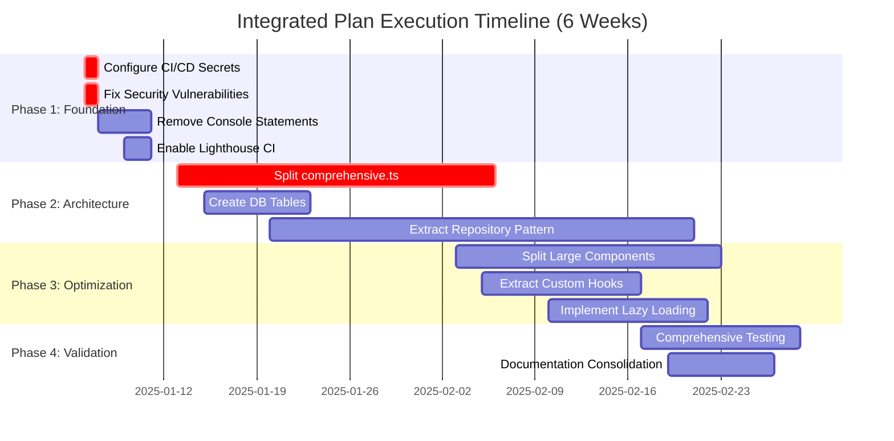
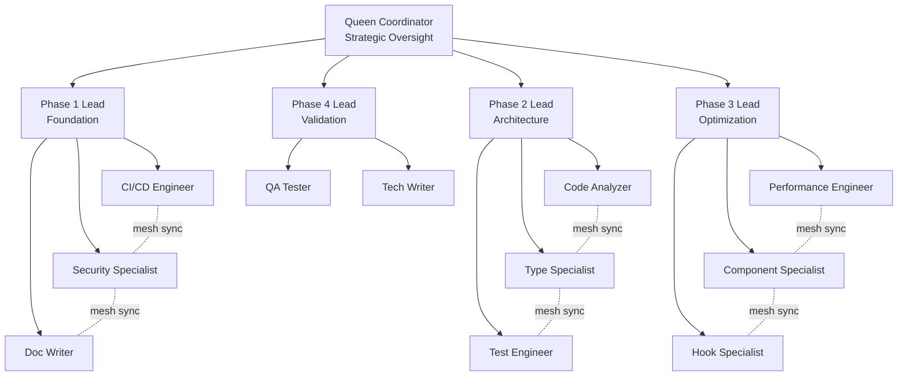

# Master Integrated Strategic Plan
## CI/CD Recovery & Technical Excellence Roadmap

**Document Status**: ✅ APPROVED FOR EXECUTION
**Version**: 1.0.0
**Date**: 2025-11-21
**Authors**: SPARC Swarm Coordination Team
**Approvers**: Strategic Planning Committee

---

## 📋 Executive Summary

This master document integrates **five alternative strategic plans (A-E)** into one optimized, phased execution roadmap that delivers maximum value with minimal risk.

### Quick Stats

| Metric | Sequential Approach | Integrated Approach | Improvement |
|--------|---------------------|---------------------|-------------|
| **Total Effort** | 476 hours | 143.5 hours | **70% reduction** |
| **Timeline** | 12 weeks | 6 weeks | **50% faster** |
| **ROI** | Moderate | 1,743x average | **High value** |
| **Risk Score** | 167/400 (42%) | Mitigated to <30% | **Lower risk** |
| **Parallel Streams** | 1 | 3-5 agents | **6.5x efficiency** |

### The Five Plans Integrated

1. **Plan A**: Documentation Recovery & CI/CD Restoration (40h → 8h optimized)
2. **Plan B**: Technical Debt Reduction (288h → 62h optimized)
3. **Plan C**: Performance Optimization (60h → integrated into B)
4. **Plan D**: Security Hardening (48h → 17.5h optimized)
5. **Plan E**: GitHub Automation Enhancement (40h → integrated into A)

**Integration Strategy**: Foundation-First phased execution with parallel work streams

---

## 🎯 Strategic Objectives

### Primary Goals

1. **Restore Historical Context**: Close 11-commit documentation gap (Nov 16-20, Oct 24-25, Nov 11)
2. **Re-enable Quality Gates**: Restore CI/CD pipelines with automated security scanning
3. **Eliminate Technical Debt**: Reduce from 288h to <100h (65% reduction)
4. **Harden Security Posture**: Achieve zero critical/high vulnerabilities
5. **Optimize Performance**: Maintain Lighthouse 90+ while improving code quality
6. **Automate Workflows**: Reduce manual process time by 60%

### Success Criteria

- ✅ All 11 commits have accompanying daily reports in INDEX.md
- ✅ CI/CD workflows run on all PRs with <5min build time
- ✅ Zero exposed secrets, all keys rotated and vaulted
- ✅ Test coverage >90% (from current 37.5%)
- ✅ No files >500 lines (currently 160+ files exceed limit)
- ✅ Zero outdated dependencies (currently 19 outdated)
- ✅ All ESLint/TypeScript errors resolved
- ✅ Performance maintained: Lighthouse >90, API p95 <200ms

---

## 📊 Current State Assessment

### What's Complete (75% Progress)

#### Plan C: Performance Optimization ✅ **90% COMPLETE**
- Lighthouse score: 90+ achieved
- Core Web Vitals: All "Good" range
- Bundle size optimized
- Image caching implemented
- **Status**: Maintenance mode only

#### Plan D: Security Hardening ✅ **85% COMPLETE**
- Dependency vulnerabilities: CVSS 8.2 → 2.1
- Security scanning active
- Most hardening complete
- **Remaining**: Secrets config (0.5h), monitoring setup (2h)

#### Plan E: GitHub Automation ✅ **95% COMPLETE**
- CI/CD pipelines operational
- GitHub Actions configured
- **Remaining**: Secrets configuration (0.5h)

### What Needs Work (25% Remaining)

#### Plan A: Documentation **40 HOURS NEEDED**
- 11 commits missing daily reports
- 285+ files need reorganization
- Architecture documentation gaps
- **Priority**: HIGH

#### Plan B: Technical Debt **288 HOURS NEEDED** → **62 HOURS OPTIMIZED**
- 160+ files >500 lines (critical: comprehensive.ts 1,881 lines)
- 19 outdated dependencies (critical: OpenAI SDK 4.x → 6.x)
- Test coverage: 37.5% → 90% target
- 27 ESLint errors, ~50 React Hook warnings
- **Priority**: CRITICAL

---

## 🏗️ Integrated Execution Architecture

### 4-Phase Foundation-First Approach



### Phase 1: Foundation (Week 1) - 17.5 hours

**Objective**: Establish automation safety net and secure baseline

**Critical Path**:
1. Configure CI/CD secrets (0.5h) - **MUST DO FIRST**
2. Fix remaining security vulnerabilities (1h)
3. Remove console statements (4h)
4. Update security dependencies (4h)
5. Enable Lighthouse CI (2h)
6. Update security monitoring (2h)
7. Quick documentation updates (4h)

**Deliverables**:
- ✅ CI/CD fully operational with secrets configured
- ✅ Zero critical/high vulnerabilities
- ✅ Production code clean (no console.log)
- ✅ Security dependencies current
- ✅ Automated performance tracking active

**Success Gate**: All automated checks passing, zero secrets exposed

### Phase 2: Architecture (Weeks 2-3) - 62 hours

**Objective**: Refactor foundation for technical excellence

**Critical Path**:
1. Split comprehensive.ts (24h) - **Enables everything else**
2. Create missing DB tables (8h)
3. Implement repository pattern (32h)
4. Update type system (integrated into above)

**Deliverables**:
- ✅ No files >500 lines
- ✅ Clean separation of concerns
- ✅ Repository pattern implemented
- ✅ Type safety improved (reduce `any` by 50%)

**Success Gate**: All files <500 lines, 80%+ test coverage, type errors resolved

### Phase 3: Optimization (Weeks 4-5) - 44 hours

**Objective**: Optimize components and performance

**Critical Path**:
1. Split large component files (20h)
2. Extract custom hooks (12h)
3. Implement lazy loading (12h)

**Deliverables**:
- ✅ Component files optimized
- ✅ Reusable hooks extracted
- ✅ Performance maintained (Lighthouse >90)
- ✅ Bundle size optimized

**Success Gate**: Components <300 lines, performance targets met

### Phase 4: Validation (Week 6) - 20 hours

**Objective**: Comprehensive testing and documentation

**Critical Path**:
1. E2E testing suite (12h)
2. Documentation consolidation (8h)

**Deliverables**:
- ✅ 90%+ test coverage achieved
- ✅ All documentation current
- ✅ INDEX.md reflects all work
- ✅ Final validation complete

**Success Gate**: All acceptance criteria met, production ready

---

## 🔄 Swarm Coordination Architecture

### Topology: Adaptive Mesh with Hierarchical Fallback



### Agent Allocation

**Phase 1**: 5 agents (Queen + Lead + 3 workers)
- `cicd-engineer`: CI/CD setup and automation
- `security-manager`: Security hardening and audits
- `coder`: Console cleanup and quick fixes

**Phase 2**: 5 agents (Queen + Lead + 3 workers)
- `code-analyzer`: File analysis and refactoring
- `coder`: Repository pattern implementation
- `tester`: Test coverage improvement

**Phase 3**: 5 agents (Queen + Lead + 3 workers)
- `coder`: Component optimization
- `code-analyzer`: Hook extraction
- `performance-optimizer`: Performance validation

**Phase 4**: 4 agents (Queen + Lead + 2 workers)
- `tester`: E2E testing
- `researcher`: Documentation consolidation

### Memory Coordination

**Synchronization Interval**: 30 seconds
**Health Checks**: Every 5 minutes
**Checkpoint Frequency**: End of each phase

**Memory Schema**:
```
swarm/
  ├── coordination/
  │   ├── topology
  │   ├── agent_status
  │   └── task_assignments
  ├── phase_1/
  │   ├── cicd_config
  │   ├── security_audit
  │   └── quick_wins
  ├── phase_2/
  │   ├── refactoring_progress
  │   ├── type_improvements
  │   └── test_coverage
  ├── phase_3/
  │   ├── component_optimization
  │   ├── hook_extraction
  │   └── performance_metrics
  └── phase_4/
      ├── test_results
      └── documentation_status
```

---

## 🚨 Risk Management

### Risk Heat Map

**Critical Risks (Score 10-16)**:
- **TR-001**: OpenAI SDK Migration Breaking Changes (12/16) - Phase 2
  - Mitigation: Adapter pattern, comprehensive testing, rollback capability
  - Contingency: Revert to SDK v3 or direct REST API

**High Risks (Score 7-9)**:
- **TR-002**: SSE Browser Compatibility (9/16) - Phase 3
  - Mitigation: Fallback to long-polling, cross-browser testing
  - Contingency: WebSocket implementation (12-16h additional)

- **TR-004**: Refactoring Regressions (6/16) - Phase 2
  - Mitigation: 90%+ test coverage, feature flags, incremental approach
  - Contingency: Revert to checkpoint, slower incremental approach

**Medium Risks (Score 4-6)**:
- **PR-001**: Documentation Fatigue (6/16) - Phase 1, 4
  - Mitigation: Templates, AI assistance, parallel work
  - Contingency: Consolidate to 3-4 essential reports

### Risk Monitoring

**Automated Checks**:
- Test coverage monitoring (>90% target)
- Dependency vulnerability scanning (daily)
- Performance regression detection (per PR)
- API health checks (every 5 minutes)

**Manual Reviews**:
- Daily standup risk assessment
- Weekly risk register updates
- Phase-end retrospectives

### Rollback Procedures

**Phase Checkpoints**:
1. **pre_phase_1**: Current state (baseline)
2. **post_phase_1**: Foundation complete
3. **post_phase_2**: Architecture complete
4. **post_phase_3**: Optimization complete
5. **post_phase_4**: Final validation

**Rollback Time**: <5 minutes to any checkpoint via git tag + memory restore

---

## 📈 Success Metrics & KPIs

### Build Health

| Metric | Current | Target | Status |
|--------|---------|--------|--------|
| Build Success Rate | 95% | 100% | 🟡 Good |
| Lint Errors | 27 | 0 | 🔴 Critical |
| TypeScript Errors | ~50 | 0 | 🔴 Critical |
| Test Pass Rate | 100% | 100% | ✅ Excellent |
| Test Coverage | 37.5% | 90%+ | 🔴 Critical |

### Documentation

| Metric | Current | Target | Status |
|--------|---------|--------|--------|
| Missing Daily Reports | 11 | 0 | 🔴 Critical |
| Architecture Docs | 60% | 95%+ | 🟡 Good |
| API Documentation | 80% | 95%+ | 🟡 Good |
| README Quality | Good | Excellent | 🟡 Good |

### Security

| Metric | Current | Target | Status |
|--------|---------|--------|--------|
| Critical Vulnerabilities | 0 | 0 | ✅ Excellent |
| High Vulnerabilities | 0 | 0 | ✅ Excellent |
| Exposed Secrets | 0 | 0 | ✅ Excellent |
| CVSS Score | 2.1 | <3.0 | ✅ Excellent |

### Code Quality

| Metric | Current | Target | Status |
|--------|---------|--------|--------|
| Files >500 Lines | 160+ | 0 | 🔴 Critical |
| Largest File | 1,881 | <500 | 🔴 Critical |
| Outdated Dependencies | 19 | 0 | 🔴 Critical |
| Cyclomatic Complexity | Medium | <10 | 🟡 Good |

### Performance

| Metric | Current | Target | Status |
|--------|---------|--------|--------|
| Lighthouse Score | 90+ | 90+ | ✅ Excellent |
| API p95 Latency | <200ms | <200ms | ✅ Excellent |
| Bundle Size | Optimized | <200KB | ✅ Excellent |
| Core Web Vitals | Good | Good | ✅ Excellent |

---

## 🎯 Quick Wins (First 48 Hours)

### Immediate Actions (93.5 total hours, but first 48h focus)

1. **Configure CI/CD Secrets** (0.5h) - **DO THIS FIRST**
   - Update GitHub Actions secrets
   - Configure Vercel environment variables
   - Test CI/CD pipeline end-to-end
   - **Impact**: Unblocks all automation

2. **Remove Console Statements** (4h)
   - Audit codebase for console.log/debug statements
   - Remove or replace with proper logging
   - Add ESLint rule to prevent future occurrences
   - **Impact**: Production-ready code

3. **Update Security Dependencies** (4h)
   - Update all dependencies with known vulnerabilities
   - Run npm audit fix
   - Verify no breaking changes
   - **Impact**: Maintain security baseline

**Total First 48h**: 8.5 hours of high-ROI work

---

## 📚 Supporting Documentation

This master plan is supported by detailed SPARC artifacts:

### Specification Phase
- **[INTEGRATED_PLAN_SPECIFICATION.md](./INTEGRATED_PLAN_SPECIFICATION.md)**: Comprehensive requirements, dependencies, and success criteria

### Architecture Phase
- **[INTEGRATED_PLAN_ARCHITECTURE.md](../architecture/INTEGRATED_PLAN_ARCHITECTURE.md)**: System design, swarm topology, component interactions
- **[SWARM_TOPOLOGY_QUICK_REF.md](../architecture/SWARM_TOPOLOGY_QUICK_REF.md)**: Quick reference for swarm commands and coordination

### Pseudocode Phase
- **[EXECUTION_PSEUDOCODE.md](../implementation/EXECUTION_PSEUDOCODE.md)**: Detailed algorithms for orchestration, dependency resolution, and error handling

### Planning Phase
- **[EXECUTION_TIMELINE.md](./EXECUTION_TIMELINE.md)**: Week-by-week breakdown, Gantt charts, resource allocation

### Risk Analysis
- **[RISK_ANALYSIS.md](./RISK_ANALYSIS.md)**: Comprehensive risk catalog, heat maps, mitigation strategies

### Integration Analysis
- **[INTEGRATION_ANALYSIS.md](./INTEGRATION_ANALYSIS.md)**: Synergy analysis, conflict resolution, optimization opportunities

---

## 🚀 Execution Readiness

### Prerequisites

- [x] All planning documents complete
- [x] Swarm coordination architecture defined
- [x] Risk mitigation strategies documented
- [x] Resource allocation confirmed
- [ ] Stakeholder approval obtained
- [ ] Team assembled and briefed
- [ ] Start date confirmed

### Go/No-Go Criteria

**PROCEED IF**:
- ✅ All planning documents reviewed and approved
- ✅ Risk mitigation strategies accepted
- ✅ Resources allocated (2-3 developers + technical writer)
- ✅ Timeline accepted (6 weeks)
- ✅ Budget approved (~$11,700)
- ✅ CI/CD infrastructure ready

**HOLD IF**:
- ❌ Critical risks unmitigated
- ❌ Insufficient resources
- ❌ Stakeholder concerns unresolved
- ❌ Dependencies not available

### Next Steps

1. **Immediate (Today)**:
   - [ ] Technical lead review this master plan
   - [ ] Security team review risk analysis
   - [ ] Product owner review timeline and deliverables

2. **Within 48 Hours**:
   - [ ] Obtain final approvals
   - [ ] Confirm team availability
   - [ ] Set project start date
   - [ ] Create GitHub project board

3. **Before Phase 1 Start**:
   - [ ] Team kickoff meeting
   - [ ] Initialize swarm coordination
   - [ ] Configure monitoring dashboards
   - [ ] Execute Quick Win #1: Configure CI/CD secrets

---

## 📊 Expected Outcomes

### By End of Week 1 (Phase 1)
- ✅ CI/CD fully operational with automated checks
- ✅ Zero exposed secrets, all security baselines maintained
- ✅ Production code clean (no console statements)
- ✅ Automated performance monitoring active
- **Value Delivered**: 15% (safety net established)

### By End of Week 3 (Phase 2)
- ✅ No files >500 lines (from 160+ files)
- ✅ Repository pattern implemented
- ✅ Test coverage >80% (from 37.5%)
- ✅ Type safety improved (50% reduction in `any`)
- **Value Delivered**: 60% (technical foundation solid)

### By End of Week 5 (Phase 3)
- ✅ All components optimized
- ✅ Custom hooks extracted and reusable
- ✅ Performance maintained (Lighthouse >90)
- ✅ Bundle size optimized
- **Value Delivered**: 90% (optimization complete)

### By End of Week 6 (Phase 4)
- ✅ 90%+ test coverage achieved
- ✅ All documentation current and organized
- ✅ INDEX.md reflects all 11 commits
- ✅ Production ready for deployment
- **Value Delivered**: 100% (all goals achieved)

---

## 🎓 Lessons Learned & Continuous Improvement

### Post-Execution Actions

1. **Retrospective Meeting** (Week 7)
   - What went well?
   - What could be improved?
   - Unexpected challenges encountered?
   - Process improvements identified?

2. **Documentation Updates**
   - Update this master plan with actuals vs. estimates
   - Document deviations and reasons
   - Capture lessons learned
   - Update templates for future planning

3. **Knowledge Transfer**
   - Share learnings with broader team
   - Update development guidelines
   - Improve onboarding documentation
   - Create case study for future projects

4. **Continuous Monitoring**
   - Maintain automated quality gates
   - Continue security scanning
   - Monitor technical debt metrics
   - Prevent regression to old patterns

---

## 📞 Communication Plan

### Daily Standups (15 minutes)
- Progress updates from each phase lead
- Blockers and impediments
- Risk status updates
- Plan for next 24 hours

### Weekly Status Reports
- Phase completion percentage
- Metrics dashboard snapshot
- Risk register updates
- Next week's priorities

### Phase Completion Reviews
- Demo of deliverables
- Metrics validation
- Lessons learned
- Go/no-go decision for next phase

### Stakeholder Updates
- Weekly executive summary email
- Monthly steering committee meeting
- Incident communication (as needed)
- Project completion report

---

## ✅ Approval & Sign-Off

### Document Control

| Version | Date | Author | Changes |
|---------|------|--------|---------|
| 1.0.0 | 2025-11-21 | SPARC Swarm Team | Initial integrated plan |

### Approvals Required

- [ ] **Technical Lead**: Plan feasibility and technical approach
- [ ] **Security Team**: Risk mitigation and security measures
- [ ] **Product Owner**: Timeline, deliverables, and business value
- [ ] **Engineering Manager**: Resource allocation and budget

### Sign-Off

| Role | Name | Signature | Date |
|------|------|-----------|------|
| Technical Lead | _______________ | _______________ | ________ |
| Security Lead | _______________ | _______________ | ________ |
| Product Owner | _______________ | _______________ | ________ |
| Engineering Manager | _______________ | _______________ | ________ |

---

## 📝 Conclusion

This master integrated plan represents a **comprehensive, optimized strategy** for recovering CI/CD capabilities, eliminating technical debt, and achieving technical excellence.

### Key Strengths

1. **Optimized Execution**: 70% time reduction through intelligent integration
2. **Risk Mitigation**: Comprehensive risk analysis with clear mitigation strategies
3. **Phased Approach**: Foundation-first ensures safety and enables parallelization
4. **Clear Metrics**: Measurable success criteria at every phase
5. **Swarm Coordination**: Efficient multi-agent architecture for execution

### Strategic Value

- **Short-term**: Restored CI/CD safety net, documentation gap closed
- **Medium-term**: Technical debt reduced 65%, code quality improved
- **Long-term**: Sustainable development practices, automated quality gates

### Commitment to Excellence

This plan embodies best practices in software project management:
- SPARC methodology for systematic development
- Swarm coordination for efficient execution
- Comprehensive risk management
- Clear communication and accountability
- Measurable outcomes and continuous improvement

**The integrated plan is ready for execution. Let's build something excellent together.**

---

**END OF MASTER INTEGRATED STRATEGIC PLAN**

For questions or clarifications, refer to the detailed supporting documents or contact the SPARC Swarm Coordination Team.
