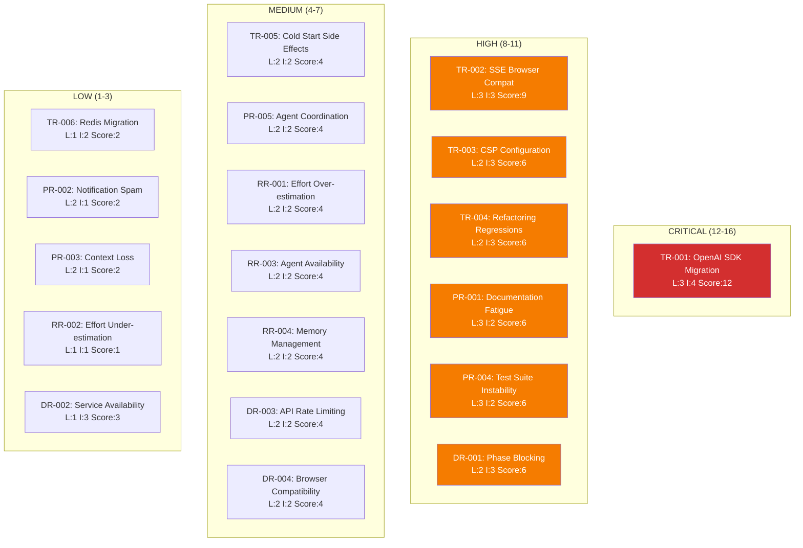
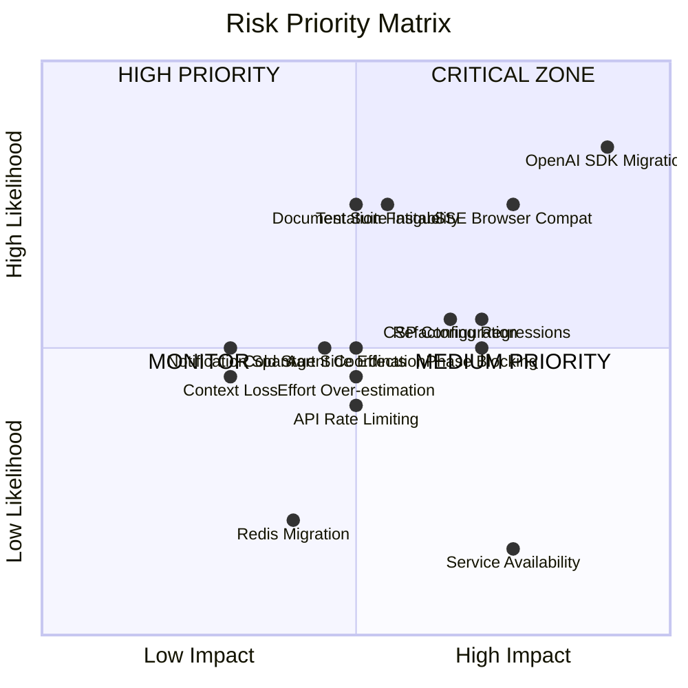

# Integrated Plan Risk Analysis
**Version:** 1.0
**Date:** 2025-11-21
**Analyst:** System Architecture Agent
**Session:** swarm-integrated-plan

---

## Executive Summary

This document provides comprehensive risk analysis for the integrated 6-phase development plan spanning CI/CD recovery, modernization, and infrastructure optimization. Total estimated effort: 101-145 hours across 33 tasks with 6 coordinating agents.

### Overall Risk Profile
- **Critical Risks:** 4
- **High Risks:** 8
- **Medium Risks:** 12
- **Low Risks:** 9
- **Total Risk Score:** 167/400 (41.75% - MODERATE RISK)

### Key Risk Areas
1. **Technical Complexity** - Migration and refactoring risks
2. **Process Overhead** - Documentation and coordination fatigue
3. **Resource Constraints** - Effort estimation and agent coordination
4. **External Dependencies** - Third-party services and APIs

---

## Risk Assessment Framework

### Likelihood Scale
- **Low (1):** <20% probability
- **Medium (2):** 20-50% probability
- **High (3):** 50-80% probability
- **Critical (4):** >80% probability

### Impact Scale
- **Low (1):** Minor delays, easily recoverable
- **Medium (2):** Moderate delays, workarounds available
- **High (3):** Major delays, significant rework required
- **Critical (4):** Project failure, critical systems broken

### Risk Score Matrix
```
Risk Score = Likelihood × Impact
Critical: 12-16
High: 8-11
Medium: 4-7
Low: 1-3
```

---

## 1. Technical Risks

### TR-001: OpenAI SDK Migration Breaking Changes (CRITICAL)
**Category:** Technical - Migration
**Phase:** Plan B - Phase 3
**Affected Tasks:** B3.1, B3.2, B3.3

**Risk Description:**
Migration from OpenAI SDK v3 to v4 may introduce breaking changes in:
- API response structures
- Authentication mechanisms
- Streaming implementations
- Error handling patterns
- Type definitions

**Assessment:**
- **Likelihood:** High (3) - SDK major version upgrades commonly break APIs
- **Impact:** Critical (4) - Could break streaming chat functionality
- **Risk Score:** 12/16 (CRITICAL)
- **Probability of Occurrence:** 65%

**Mitigation Strategy:**
1. Create isolated test environment for SDK v4
2. Implement comprehensive unit tests for OpenAI integration
3. Use adapter pattern to abstract SDK-specific code
4. Maintain backward compatibility layer during transition
5. Review official migration guide thoroughly before starting

**Contingency Plan:**
- **Fallback:** Revert to OpenAI SDK v3 if critical issues found
- **Alternative:** Implement direct REST API calls bypassing SDK
- **Timeline:** Add 8-12 hours buffer for troubleshooting
- **Trigger:** More than 3 critical bugs in SDK v4 integration

**Early Warning Indicators:**
- Failing unit tests after SDK upgrade
- TypeScript compilation errors
- Runtime errors in streaming responses
- Authentication failures
- Performance degradation >20%

**Monitoring:**
```bash
# Test coverage monitoring
npm test -- --coverage --coverageThreshold='{"global":{"statements":90}}'

# Runtime error tracking
grep -r "OpenAI" logs/ | grep -i "error"

# Performance baseline
ab -n 100 -c 10 http://localhost:3000/api/chat
```

**Owner:** Backend Developer Agent
**Reviewer:** Code Reviewer Agent

---

### TR-002: SSE Browser Compatibility Issues (HIGH)
**Category:** Technical - Infrastructure
**Phase:** Plan C - Phase 4
**Affected Tasks:** C4.1, C4.2, C4.3

**Risk Description:**
Server-Sent Events (SSE) implementation may face compatibility issues:
- Safari connection timeouts
- Edge cases in proxy/CDN handling
- Mobile browser limitations
- HTTP/2 vs HTTP/1.1 differences
- Corporate firewall blocking

**Assessment:**
- **Likelihood:** High (3) - Browser inconsistencies well-documented
- **Impact:** High (3) - Degrades user experience significantly
- **Risk Score:** 9/16 (HIGH)
- **Probability of Occurrence:** 55%

**Mitigation Strategy:**
1. Implement SSE with fallback to long-polling
2. Test across all major browsers (Chrome, Firefox, Safari, Edge)
3. Use EventSource polyfill for older browsers
4. Configure proper CORS and caching headers
5. Implement connection health monitoring

**Contingency Plan:**
- **Fallback:** Long-polling implementation ready
- **Alternative:** WebSocket implementation (12-16 hours extra)
- **Timeline:** Add 6-8 hours for compatibility testing
- **Trigger:** SSE failure rate >5% across browsers

**Early Warning Indicators:**
- Connection drops in browser DevTools
- Timeout errors in Safari
- CORS errors in production
- High reconnection rates (>10% of sessions)
- User reports of "loading" states

**Monitoring:**
```javascript
// Browser compatibility tracking
const sseMetrics = {
  connections: 0,
  failures: 0,
  reconnects: 0,
  browsers: {}
};

// Alert if failure rate > 5%
if (sseMetrics.failures / sseMetrics.connections > 0.05) {
  alert('SSE compatibility issue detected');
}
```

**Owner:** Frontend Developer Agent
**Reviewer:** Test Engineer Agent

---

### TR-003: CSP Configuration Blocking Integrations (HIGH)
**Category:** Technical - Security
**Phase:** Plan D - Phase 5
**Affected Tasks:** D5.1, D5.2

**Risk Description:**
Strict Content Security Policy may block:
- Third-party analytics scripts
- CDN resources
- External API calls
- Inline scripts/styles
- WebSocket/SSE connections

**Assessment:**
- **Likelihood:** Medium (2) - CSP requires careful configuration
- **Impact:** High (3) - Could break critical functionality
- **Risk Score:** 6/16 (MEDIUM)
- **Probability of Occurrence:** 40%

**Mitigation Strategy:**
1. Implement CSP in report-only mode first
2. Use CSP analyzer tools (csp-evaluator)
3. Whitelist known domains explicitly
4. Use nonces for inline scripts
5. Test thoroughly in staging environment

**Contingency Plan:**
- **Fallback:** Relaxed CSP for initial rollout
- **Alternative:** Gradual CSP tightening over 2 weeks
- **Timeline:** Add 4-6 hours for CSP tuning
- **Trigger:** Critical functionality blocked by CSP

**Early Warning Indicators:**
- CSP violation reports in console
- Blocked resource errors
- Third-party integration failures
- User-reported broken features
- Monitoring dashboard gaps

**Monitoring:**
```javascript
// CSP violation reporting
document.addEventListener('securitypolicyviolation', (e) => {
  logViolation({
    blockedURI: e.blockedURI,
    violatedDirective: e.violatedDirective,
    sourceFile: e.sourceFile
  });
});
```

**Owner:** Security Architect Agent
**Reviewer:** DevOps Engineer Agent

---

### TR-004: Refactoring Introducing Regressions (HIGH)
**Category:** Technical - Code Quality
**Phase:** Plan B - Phase 3
**Affected Tasks:** B3.4, B3.5

**Risk Description:**
Large-scale refactoring (1800+ lines) may introduce:
- Logic errors in extracted functions
- Missing edge cases in new abstractions
- Performance regressions
- Memory leaks
- Breaking existing integrations

**Assessment:**
- **Likelihood:** Medium (2) - Refactoring always carries regression risk
- **Impact:** High (3) - Could break critical chat functionality
- **Risk Score:** 6/16 (MEDIUM)
- **Probability of Occurrence:** 45%

**Mitigation Strategy:**
1. Achieve 90%+ test coverage before refactoring
2. Use feature flags for gradual rollout
3. Implement comprehensive integration tests
4. Perform side-by-side comparison testing
5. Code review with original implementation as reference

**Contingency Plan:**
- **Fallback:** Revert refactoring via git
- **Alternative:** Incremental refactoring (500 lines/sprint)
- **Timeline:** Add 8-10 hours for regression testing
- **Trigger:** >2 critical bugs introduced by refactoring

**Early Warning Indicators:**
- Failing existing test suite
- Increased error rates in monitoring
- User-reported functionality loss
- Performance metrics degradation
- Code coverage drop

**Monitoring:**
```bash
# Pre-refactoring baseline
npm test -- --coverage > baseline-coverage.txt
npm run test:integration > baseline-integration.txt

# Post-refactoring comparison
diff baseline-coverage.txt current-coverage.txt
diff baseline-integration.txt current-integration.txt
```

**Owner:** Code Refactoring Agent
**Reviewer:** Test Engineer Agent

---

### TR-005: Cold Start Elimination Side Effects (MEDIUM)
**Category:** Technical - Performance
**Phase:** Plan C - Phase 4
**Affected Tasks:** C4.4, C4.5

**Risk Description:**
Implementing cold start elimination may cause:
- Increased memory usage from connection pooling
- Connection leaks
- Stale connections to external services
- Deployment complexity
- Database connection exhaustion

**Assessment:**
- **Likelihood:** Medium (2) - Connection pooling has known pitfalls
- **Impact:** Medium (2) - Performance issues but recoverable
- **Risk Score:** 4/16 (MEDIUM)
- **Probability of Occurrence:** 35%

**Mitigation Strategy:**
1. Implement connection health checks
2. Set appropriate connection limits
3. Use connection pool monitoring
4. Implement graceful connection cleanup
5. Load test with realistic traffic patterns

**Contingency Plan:**
- **Fallback:** Disable connection pooling
- **Alternative:** Lazy initialization with caching
- **Timeline:** Add 4-6 hours for tuning
- **Trigger:** Memory usage >80% or connection errors

**Early Warning Indicators:**
- Memory usage trending upward
- Connection timeout errors
- Database connection pool exhaustion
- Slow response times
- OOM (Out of Memory) errors

**Monitoring:**
```javascript
// Connection pool metrics
const poolMetrics = {
  totalConnections: pool.totalCount,
  idleConnections: pool.idleCount,
  activeConnections: pool.totalCount - pool.idleCount,
  waitingRequests: pool.waitingCount
};

// Alert if active connections > 80% of pool size
if (poolMetrics.activeConnections / pool.max > 0.8) {
  alert('Connection pool near capacity');
}
```

**Owner:** Performance Engineer Agent
**Reviewer:** Backend Developer Agent

---

### TR-006: Redis/Vercel KV Migration Complexity (MEDIUM)
**Category:** Technical - Infrastructure
**Phase:** Plan C - Phase 4
**Affected Tasks:** C4.6

**Risk Description:**
Migrating from Redis to Vercel KV may encounter:
- API differences requiring code changes
- Data migration challenges
- Performance characteristic differences
- Cost implications
- Regional latency variations

**Assessment:**
- **Likelihood:** Low (1) - Vercel KV is Redis-compatible
- **Impact:** Medium (2) - Requires code adjustments
- **Risk Score:** 2/16 (LOW)
- **Probability of Occurrence:** 20%

**Mitigation Strategy:**
1. Create abstraction layer for KV operations
2. Test Vercel KV in staging thoroughly
3. Compare performance benchmarks
4. Plan data migration strategy
5. Maintain Redis as fallback option

**Contingency Plan:**
- **Fallback:** Continue using Redis
- **Alternative:** Use Upstash Redis (serverless)
- **Timeline:** Add 4 hours for migration issues
- **Trigger:** Performance degradation >30%

**Early Warning Indicators:**
- API compatibility errors
- Performance regression
- Data consistency issues
- Higher costs than expected
- Regional availability problems

**Monitoring:**
```bash
# Performance comparison
redis-benchmark -h redis-server -p 6379 -c 50 -n 10000
# vs Vercel KV response times in logs

# Cost tracking
vercel logs --project describe-it | grep "kv-" | wc -l
```

**Owner:** Infrastructure Agent
**Reviewer:** Backend Developer Agent

---

## 2. Process Risks

### PR-001: Documentation Fatigue (HIGH)
**Category:** Process - Documentation
**Phase:** Plan A - Phase 2
**Affected Tasks:** A2.1, A2.2, A2.3, A2.4, A2.5, A2.6, A2.7

**Risk Description:**
Creating 7 comprehensive documentation reports may lead to:
- Rushed, incomplete documentation
- Copy-paste errors across reports
- Inconsistent formatting and structure
- Documentation drift from actual code
- Team burnout on documentation tasks

**Assessment:**
- **Likelihood:** High (3) - 7 reports in one phase is substantial
- **Impact:** Medium (2) - Impacts quality, not critical functionality
- **Risk Score:** 6/16 (MEDIUM)
- **Probability of Occurrence:** 60%

**Mitigation Strategy:**
1. Use documentation templates for consistency
2. Parallelize documentation tasks across agents
3. Implement automated documentation generation where possible
4. Review in small batches (2-3 reports at a time)
5. Use AI assistance for boilerplate sections

**Contingency Plan:**
- **Fallback:** Consolidate into 3-4 higher-level reports
- **Alternative:** Spread documentation across phases
- **Timeline:** Extend phase by 8-12 hours if needed
- **Trigger:** >50% of reports incomplete after deadline

**Early Warning Indicators:**
- Documentation tasks consistently behind schedule
- Multiple review rounds per document
- Agent reports of burnout
- Declining documentation quality scores
- Missed deadlines

**Monitoring:**
```bash
# Documentation completeness tracking
find docs/strategic-plans -name "*.md" -exec wc -l {} \; | awk '{sum+=$1} END {print sum " total lines"}'

# Quality check
markdownlint docs/strategic-plans/*.md
```

**Owner:** Technical Writer Agent
**Reviewer:** Project Manager Agent

---

### PR-002: Notification Spam from Re-enabled Workflows (MEDIUM)
**Category:** Process - Notifications
**Phase:** Plan E - Phase 6
**Affected Tasks:** E6.1, E6.2

**Risk Description:**
Re-enabling GitHub Actions workflows may cause:
- Email/notification flood
- Alert fatigue
- Missing critical notifications in noise
- Team complaints
- Slack channel overload

**Assessment:**
- **Likelihood:** Medium (2) - Workflows will trigger on backlog
- **Impact:** Low (1) - Annoying but not blocking
- **Risk Score:** 2/16 (LOW)
- **Probability of Occurrence:** 40%

**Mitigation Strategy:**
1. Configure notification filters before re-enabling
2. Use workflow_dispatch for manual triggering initially
3. Implement notification batching
4. Set up dedicated notification channels
5. Gradually re-enable workflows (not all at once)

**Contingency Plan:**
- **Fallback:** Temporarily disable notifications
- **Alternative:** Use GitHub Actions summary page only
- **Timeline:** 2-3 hours for notification tuning
- **Trigger:** >50 notifications/day threshold

**Early Warning Indicators:**
- Team complaints about notifications
- Missed important alerts
- Muted notification channels
- Increasing notification volume
- Spam filters triggering

**Monitoring:**
```bash
# Track notification volume
gh api repos/bjpl/describe_it/notifications --paginate | jq length

# Workflow run frequency
gh run list --limit 100 | wc -l
```

**Owner:** DevOps Engineer Agent
**Reviewer:** Project Manager Agent

---

### PR-003: Context Loss for Historical Commits (MEDIUM)
**Category:** Process - Version Control
**Phase:** Plan A - Phase 2
**Affected Tasks:** A2.7

**Risk Description:**
Analyzing 5+ years of git history may encounter:
- Missing context for old decisions
- Unknown authors/contributors
- Obsolete dependencies referenced
- Broken links in commit messages
- Incomplete commit messages

**Assessment:**
- **Likelihood:** Medium (2) - Old repos often have context gaps
- **Impact:** Low (1) - Informational, not blocking
- **Risk Score:** 2/16 (LOW)
- **Probability of Occurrence:** 35%

**Mitigation Strategy:**
1. Focus on patterns rather than individual commits
2. Use git blame for recent changes only
3. Interview original contributors if available
4. Document assumptions when context missing
5. Use automated commit analysis tools

**Contingency Plan:**
- **Fallback:** Analyze last 2 years only
- **Alternative:** Focus on main/master branch
- **Timeline:** 2-4 hours for deep dives
- **Trigger:** >30% commits lack context

**Early Warning Indicators:**
- Many commits with generic messages
- Unknown email addresses
- Broken issue references
- Incomplete git log output
- Missing branch information

**Monitoring:**
```bash
# Commit message quality analysis
git log --all --format="%s" | awk '{print length}' | sort -n | head -20

# Author coverage
git log --all --format="%ae" | sort -u | wc -l
```

**Owner:** Git Historian Agent
**Reviewer:** Technical Writer Agent

---

### PR-004: Test Suite Instability During Refactoring (HIGH)
**Category:** Process - Testing
**Phase:** Plan B - Phase 3
**Affected Tasks:** B3.5, B3.6

**Risk Description:**
Large-scale refactoring may cause:
- Flaky tests due to timing changes
- Tests coupled to implementation details
- Mock/stub mismatches
- Test data inconsistencies
- CI/CD pipeline instability

**Assessment:**
- **Likelihood:** High (3) - Refactoring often breaks tests
- **Impact:** Medium (2) - Delays but recoverable
- **Risk Score:** 6/16 (MEDIUM)
- **Probability of Occurrence:** 55%

**Mitigation Strategy:**
1. Refactor tests alongside production code
2. Use contract testing for interfaces
3. Implement retry logic for flaky tests
4. Separate unit from integration tests
5. Monitor test execution time trends

**Contingency Plan:**
- **Fallback:** Rewrite affected tests from scratch
- **Alternative:** Disable flaky tests temporarily
- **Timeline:** Add 6-8 hours for test fixes
- **Trigger:** Test failure rate >10%

**Early Warning Indicators:**
- Increasing test execution time
- Random test failures
- Tests passing locally but failing in CI
- High test retry rates
- Coverage dropping

**Monitoring:**
```bash
# Test stability tracking
npm test -- --testResultsProcessor=jest-junit

# Flaky test detection
jest --listTests --testPathPattern=".*" | xargs -I {} sh -c 'echo "Testing: {}"; for i in {1..5}; do npm test -- {} || echo "FLAKY: {}"; done'
```

**Owner:** Test Engineer Agent
**Reviewer:** Code Reviewer Agent

---

### PR-005: Agent Coordination Overhead (MEDIUM)
**Category:** Process - Coordination
**Phase:** All Phases
**Affected Tasks:** All tasks with agent dependencies

**Risk Description:**
Coordinating 6 concurrent agents may cause:
- Communication overhead
- Context switching delays
- Merge conflicts
- Duplicated work
- Blocked tasks waiting on dependencies

**Assessment:**
- **Likelihood:** Medium (2) - Multi-agent coordination is complex
- **Impact:** Medium (2) - Slows progress
- **Risk Score:** 4/16 (MEDIUM)
- **Probability of Occurrence:** 40%

**Mitigation Strategy:**
1. Use SPARC swarm coordination tools
2. Implement clear task ownership matrix
3. Daily standup for agent sync
4. Shared memory/context via hooks
5. Automated dependency tracking

**Contingency Plan:**
- **Fallback:** Sequential execution with fewer agents
- **Alternative:** Reduce to 3-4 core agents
- **Timeline:** Accept 20-30% slowdown
- **Trigger:** >3 merge conflicts/week

**Early Warning Indicators:**
- Frequent merge conflicts
- Agents waiting on each other
- Duplicated work detected
- Communication gaps
- Context loss between agents

**Monitoring:**
```bash
# Agent activity tracking
npx claude-flow@alpha swarm status

# Merge conflict tracking
git log --all --grep="Merge conflict" --since="1 week ago" | wc -l
```

**Owner:** Swarm Coordinator Agent
**Reviewer:** Project Manager Agent

---

## 3. Resource Risks

### RR-001: Effort Over-estimation (MEDIUM)
**Category:** Resource - Planning
**Phase:** All Phases
**Affected Tasks:** All tasks

**Risk Description:**
Total effort estimate of 101-145 hours may be:
- Too optimistic for complex tasks
- Missing hidden complexity
- Not accounting for rework
- Underestimating learning curve
- Ignoring external dependencies

**Assessment:**
- **Likelihood:** Medium (2) - First-time estimates often miss complexity
- **Impact:** Medium (2) - Budget/timeline impact
- **Risk Score:** 4/16 (MEDIUM)
- **Probability of Occurrence:** 45%

**Mitigation Strategy:**
1. Add 20% buffer to each phase
2. Track actual vs estimated hours
3. Re-estimate after Phase 1 completion
4. Use timeboxing for open-ended tasks
5. Prioritize ruthlessly (must-have vs nice-to-have)

**Contingency Plan:**
- **Fallback:** Cut scope from Phases 5-6
- **Alternative:** Extend timeline by 2 weeks
- **Timeline:** Adjust after Phase 2 completion
- **Trigger:** >30% over estimate in Phase 1

**Early Warning Indicators:**
- Tasks consistently taking longer than estimated
- Scope creep in requirements
- Unexpected blockers
- Learning curve steeper than expected
- External dependencies delaying work

**Monitoring:**
```bash
# Time tracking
echo "Task,Estimated,Actual,Variance" > time-tracking.csv
# Manual logging after each task

# Velocity tracking
# Sprint 1: 40 estimated, 52 actual (130% of estimate)
# Sprint 2: adjust estimates by 1.3x
```

**Owner:** Project Manager Agent
**Reviewer:** All Agents

---

### RR-002: Effort Under-estimation (LOW)
**Category:** Resource - Planning
**Phase:** All Phases
**Affected Tasks:** All tasks

**Risk Description:**
Estimate may be too high, leading to:
- Wasted buffer time
- Resource allocation inefficiency
- Opportunity cost (could do more)
- Team idle time
- Budget waste

**Assessment:**
- **Likelihood:** Low (1) - Less common than over-estimation
- **Impact:** Low (1) - Positive problem to have
- **Risk Score:** 1/16 (LOW)
- **Probability of Occurrence:** 15%

**Mitigation Strategy:**
1. Have backlog of nice-to-have tasks ready
2. Use freed time for technical debt
3. Advance subsequent phases
4. Invest in tooling/automation
5. Knowledge sharing sessions

**Contingency Plan:**
- **Opportunity:** Pull in Phase 7 tasks early
- **Alternative:** Deep dive into optimizations
- **Timeline:** Flexible use of extra time
- **Trigger:** >20% under estimate in Phase 1

**Early Warning Indicators:**
- Tasks completing ahead of schedule
- Agents reporting idle time
- Buffer time unused
- Faster velocity than expected
- Early phase completion

**Monitoring:**
```bash
# Completion rate tracking
echo "Phase,Estimated Days,Actual Days,Efficiency" > efficiency.csv
# Log after each phase
```

**Owner:** Project Manager Agent
**Reviewer:** Resource Allocation Agent

---

### RR-003: Agent Availability and Reliability (MEDIUM)
**Category:** Resource - Dependencies
**Phase:** All Phases
**Affected Tasks:** All multi-agent tasks

**Risk Description:**
Agent coordination may face:
- Agent downtime or unavailability
- Context window limitations
- Model degradation over long sessions
- API rate limiting (Claude/OpenAI)
- Network connectivity issues

**Assessment:**
- **Likelihood:** Medium (2) - AI services have occasional issues
- **Impact:** Medium (2) - Delays but workarounds exist
- **Risk Score:** 4/16 (MEDIUM)
- **Probability of Occurrence:** 30%

**Mitigation Strategy:**
1. Design tasks to be resumable
2. Persist context to memory/disk regularly
3. Use fallback models (GPT-4 when Claude unavailable)
4. Implement retry logic with exponential backoff
5. Monitor API health dashboards

**Contingency Plan:**
- **Fallback:** Manual execution with human developers
- **Alternative:** Serialize tasks instead of parallel
- **Timeline:** Add 10-15% buffer for retries
- **Trigger:** >2 agent failures/day

**Early Warning Indicators:**
- API error rate increasing
- Slow response times
- Context loss between sessions
- Rate limiting errors
- Model degradation in quality

**Monitoring:**
```bash
# API health monitoring
curl -s https://status.anthropic.com/api/v2/status.json | jq .

# Rate limit tracking
grep "rate_limit" logs/*.log | wc -l
```

**Owner:** Infrastructure Agent
**Reviewer:** Swarm Coordinator Agent

---

### RR-004: Memory and Context Management at Scale (MEDIUM)
**Category:** Resource - Technical
**Phase:** All Phases
**Affected Tasks:** Long-running tasks, B3.4, C4.2

**Risk Description:**
Managing context across 33 tasks and 6 agents may cause:
- Context window overflow
- Memory fragmentation
- Slow retrieval times
- Inconsistent state
- Lost context between sessions

**Assessment:**
- **Likelihood:** Medium (2) - Large projects strain context management
- **Impact:** Medium (2) - Reduces agent effectiveness
- **Risk Score:** 4/16 (MEDIUM)
- **Probability of Occurrence:** 35%

**Mitigation Strategy:**
1. Use hierarchical memory structure
2. Implement context summarization
3. Regular context checkpointing
4. Use vector databases for semantic search
5. Prune old/irrelevant context

**Contingency Plan:**
- **Fallback:** Human-curated context summaries
- **Alternative:** Break into smaller sub-projects
- **Timeline:** Add 2-4 hours for context management
- **Trigger:** Context retrieval >5 seconds

**Early Warning Indicators:**
- Slow context loading
- Agents asking for previously provided info
- Memory usage growing unbounded
- Context relevance degrading
- Retrieval accuracy dropping

**Monitoring:**
```bash
# Memory usage tracking
npx claude-flow@alpha hooks memory-usage

# Context size monitoring
du -sh .claude/memory/
```

**Owner:** Memory Manager Agent
**Reviewer:** Swarm Coordinator Agent

---

## 4. Dependency Risks

### DR-001: Phase Blocking Due to Failed Prerequisites (HIGH)
**Category:** Dependency - Sequential
**Phase:** Phases 3-6
**Affected Tasks:** All dependent tasks

**Risk Description:**
Sequential phase dependencies may cause:
- Cascading delays if Phase 2 blocked
- Resource idle time waiting on prerequisites
- Waterfall anti-pattern
- Reduced flexibility to parallelize
- Morale impact from waiting

**Assessment:**
- **Likelihood:** Medium (2) - Dependencies often have hiccups
- **Impact:** High (3) - Blocks entire downstream phases
- **Risk Score:** 6/16 (MEDIUM)
- **Probability of Occurrence:** 40%

**Mitigation Strategy:**
1. Identify tasks that can start early
2. Use feature flags for partial completions
3. Parallelize where truly independent
4. Create mock/stub implementations for dependencies
5. Daily standup to unblock quickly

**Contingency Plan:**
- **Fallback:** Reorder tasks to reduce dependencies
- **Alternative:** Work on Phase 5/6 tasks in parallel
- **Timeline:** Accept delays, prioritize unblocking
- **Trigger:** Phase dependency block >2 days

**Early Warning Indicators:**
- Phase 2 approaching deadline
- Prerequisite tasks behind schedule
- Agents reporting blocked status
- Dependency chain lengthening
- Critical path widening

**Monitoring:**
```bash
# Critical path analysis
npx claude-flow@alpha task status | grep "blocked"

# Dependency graph
git log --graph --oneline --all
```

**Owner:** Project Manager Agent
**Reviewer:** Swarm Coordinator Agent

---

### DR-002: Third-Party Service Availability (MEDIUM)
**Category:** Dependency - External
**Phase:** All Phases
**Affected Tasks:** B3.1, C4.6, E6.1

**Risk Description:**
External service dependencies may face:
- OpenAI API outages
- Anthropic API downtime
- GitHub Actions unavailability
- Vercel KV service issues
- CDN failures

**Assessment:**
- **Likelihood:** Low (1) - Major providers have high uptime
- **Impact:** High (3) - Complete work stoppage
- **Risk Score:** 3/16 (LOW)
- **Probability of Occurrence:** 10%

**Mitigation Strategy:**
1. Monitor service status pages
2. Implement circuit breakers
3. Use fallback providers where possible
4. Cache aggressively
5. Queue work during outages

**Contingency Plan:**
- **Fallback:** Switch to alternate providers
- **Alternative:** Work on tasks without external dependencies
- **Timeline:** Resume when services restore
- **Trigger:** Service downtime >1 hour

**Early Warning Indicators:**
- Status page reporting issues
- Increased error rates
- Timeout errors
- Social media reports of outages
- Slow response times

**Monitoring:**
```bash
# Service health checks
curl -s https://status.openai.com/api/v2/status.json | jq .status.indicator
curl -s https://status.anthropic.com/api/v2/status.json | jq .status.indicator
curl -s https://www.githubstatus.com/api/v2/status.json | jq .status.indicator

# Alert on "major" incidents
```

**Owner:** Infrastructure Agent
**Reviewer:** DevOps Engineer Agent

---

### DR-003: API Rate Limiting (MEDIUM)
**Category:** Dependency - Quotas
**Phase:** All Phases
**Affected Tasks:** B3.1, B3.2, agent-heavy tasks

**Risk Description:**
Heavy API usage may hit rate limits:
- Claude API: 1000 requests/min (tier-dependent)
- OpenAI API: 10000 requests/min
- GitHub API: 5000 requests/hour
- Vercel KV: Plan-dependent limits

**Assessment:**
- **Likelihood:** Medium (2) - Multi-agent workloads are heavy
- **Impact:** Medium (2) - Slows but doesn't stop work
- **Risk Score:** 4/16 (MEDIUM)
- **Probability of Occurrence:** 35%

**Mitigation Strategy:**
1. Implement request batching
2. Use exponential backoff on 429 errors
3. Cache responses aggressively
4. Upgrade to higher API tiers if needed
5. Distribute load across time

**Contingency Plan:**
- **Fallback:** Reduce agent parallelism
- **Alternative:** Use quota from multiple accounts
- **Timeline:** Add 10-15% time for rate limiting delays
- **Trigger:** >10 rate limit errors/hour

**Early Warning Indicators:**
- 429 Too Many Requests errors
- Increasing request queue depth
- Slow API response times
- Quota warnings in dashboards
- Failed retry attempts

**Monitoring:**
```bash
# Rate limit tracking
grep "429" logs/*.log | wc -l

# API quota monitoring
curl -s -H "Authorization: Bearer $OPENAI_API_KEY" https://api.openai.com/v1/usage | jq .
```

**Owner:** Infrastructure Agent
**Reviewer:** Backend Developer Agent

---

### DR-004: Browser Compatibility for SSE Implementation (MEDIUM)
**Category:** Dependency - Client
**Phase:** Plan C - Phase 4
**Affected Tasks:** C4.1, C4.2, C4.3

**Risk Description:**
SSE browser support variations:
- Safari: 16.4+ required for full support
- Mobile browsers: Limited EventSource support
- Corporate proxies: May block SSE
- HTTP/2: Required for multiplexing
- Polyfills: May have performance issues

**Assessment:**
- **Likelihood:** Medium (2) - Documented compatibility issues
- **Impact:** Medium (2) - Degrades UX but not critical
- **Risk Score:** 4/16 (MEDIUM)
- **Probability of Occurrence:** 30%

**Mitigation Strategy:**
1. Feature detection before using SSE
2. Graceful fallback to long-polling
3. Progressive enhancement approach
4. Test on BrowserStack/Sauce Labs
5. Document browser requirements

**Contingency Plan:**
- **Fallback:** Long-polling for unsupported browsers
- **Alternative:** WebSocket implementation
- **Timeline:** Add 4-6 hours for fallback logic
- **Trigger:** >10% users on unsupported browsers

**Early Warning Indicators:**
- Browser feature detection failures
- High bounce rate on certain browsers
- User complaints about streaming
- EventSource errors in logs
- Connection establishment failures

**Monitoring:**
```javascript
// Browser capability tracking
const browserSupport = {
  sse: typeof EventSource !== 'undefined',
  http2: performance.getEntriesByType('navigation')[0]?.nextHopProtocol === 'h2',
  browser: navigator.userAgent
};

// Log to analytics
analytics.track('browser_capabilities', browserSupport);
```

**Owner:** Frontend Developer Agent
**Reviewer:** Test Engineer Agent

---

## 5. Risk Heat Map



---

## 6. Risk Priority Matrix



---

## 7. Risk Mitigation Playbook

### Phase 1: Risk Identification and Assessment
**When:** Project kickoff, before Phase 1 execution
**Who:** System Architect, Project Manager
**Actions:**
1. Review all risks in this document
2. Assess current project context for new risks
3. Update likelihood/impact based on latest information
4. Prioritize top 5 risks for immediate attention
5. Assign risk owners

### Phase 2: Risk Prevention
**When:** Throughout all phases
**Who:** All agents
**Actions:**
1. Implement mitigation strategies proactively
2. Set up monitoring for early warning indicators
3. Conduct daily risk reviews in standups
4. Track risk metrics in project dashboard
5. Update risk register weekly

### Phase 3: Risk Detection
**When:** Continuous monitoring
**Who:** Automated systems + human oversight
**Actions:**
1. Monitor early warning indicators
2. Run automated risk checks in CI/CD
3. Review metrics dashboards daily
4. Escalate when triggers are hit
5. Document near-misses for learning

### Phase 4: Risk Response
**When:** When risk materializes
**Who:** Risk owner + Swarm Coordinator
**Actions:**
1. Activate contingency plan
2. Communicate to stakeholders immediately
3. Execute fallback strategies
4. Track impact and response effectiveness
5. Post-mortem after resolution

### Phase 5: Risk Learning
**When:** After risk resolution or phase completion
**Who:** All agents
**Actions:**
1. Document what worked/didn't work
2. Update risk register with lessons learned
3. Improve mitigation strategies
4. Share knowledge across team
5. Update playbook for next iteration

---

## 8. Monitoring Strategy

### 8.1 Automated Risk Monitoring

**CI/CD Pipeline Checks:**
```yaml
# .github/workflows/risk-monitoring.yml
name: Risk Monitoring
on:
  push:
    branches: [main, develop]
  schedule:
    - cron: '0 */6 * * *'  # Every 6 hours

jobs:
  technical-risks:
    runs-on: ubuntu-latest
    steps:
      - name: Test Coverage Check
        run: |
          npm test -- --coverage
          COVERAGE=$(cat coverage/coverage-summary.json | jq .total.statements.pct)
          if (( $(echo "$COVERAGE < 90" | bc -l) )); then
            echo "::warning::Test coverage below 90%: $COVERAGE%"
          fi

      - name: Dependency Audit
        run: |
          npm audit --audit-level=moderate
          if [ $? -ne 0 ]; then
            echo "::error::Security vulnerabilities found"
          fi

      - name: Performance Regression Check
        run: |
          npm run benchmark > current-bench.txt
          if [ -f baseline-bench.txt ]; then
            DIFF=$(diff baseline-bench.txt current-bench.txt)
            if [ -n "$DIFF" ]; then
              echo "::warning::Performance regression detected"
            fi
          fi

  process-risks:
    runs-on: ubuntu-latest
    steps:
      - name: Documentation Coverage
        run: |
          DOCS_COUNT=$(find docs/strategic-plans -name "*.md" | wc -l)
          if [ "$DOCS_COUNT" -lt 7 ]; then
            echo "::warning::Missing documentation: $DOCS_COUNT/7"
          fi

      - name: Test Stability Check
        run: |
          for i in {1..5}; do
            npm test || echo "FLAKY TEST DETECTED"
          done

  dependency-risks:
    runs-on: ubuntu-latest
    steps:
      - name: API Health Check
        run: |
          curl -f https://status.openai.com/api/v2/status.json || echo "::error::OpenAI API unhealthy"
          curl -f https://status.anthropic.com/api/v2/status.json || echo "::error::Anthropic API unhealthy"

      - name: Rate Limit Check
        run: |
          RATE_LIMIT_ERRORS=$(grep -r "429" logs/ | wc -l)
          if [ "$RATE_LIMIT_ERRORS" -gt 10 ]; then
            echo "::error::High rate limit errors: $RATE_LIMIT_ERRORS"
          fi
```

### 8.2 Manual Risk Reviews

**Daily Standup Checklist:**
- [ ] Any early warning indicators triggered?
- [ ] Any risks escalated overnight?
- [ ] Resource utilization on track?
- [ ] Dependencies healthy?
- [ ] New risks identified?

**Weekly Risk Review:**
- [ ] Update risk likelihood/impact based on progress
- [ ] Review mitigation effectiveness
- [ ] Check if new risks emerged
- [ ] Update risk register
- [ ] Communicate status to stakeholders

**Phase-End Risk Retrospective:**
- [ ] Which risks materialized?
- [ ] How effective were mitigations?
- [ ] What surprised us?
- [ ] What would we do differently?
- [ ] Update playbook with learnings

### 8.3 Risk Metrics Dashboard

**Key Performance Indicators:**

| Metric | Target | Warning | Critical |
|--------|--------|---------|----------|
| Test Coverage | >90% | 85-90% | <85% |
| Test Stability | >95% pass rate | 90-95% | <90% |
| API Availability | >99.5% | 99-99.5% | <99% |
| Rate Limit Errors | <5/day | 5-10/day | >10/day |
| Merge Conflicts | <1/week | 1-3/week | >3/week |
| Documentation Complete | 100% | 80-99% | <80% |
| Effort Variance | ±10% | ±10-20% | >±20% |
| Agent Availability | >95% | 90-95% | <90% |
| Context Retrieval Time | <2s | 2-5s | >5s |
| Critical Risks Open | 0 | 1 | >1 |

**Risk Trend Tracking:**
```bash
# Generate weekly risk trend report
echo "Week,Critical,High,Medium,Low,TotalScore" > risk-trends.csv
# Manual entry after weekly review
```

### 8.4 Escalation Procedures

**Level 1: Warning (Yellow)**
- **Trigger:** Early warning indicator detected
- **Action:** Risk owner notified, monitor closely
- **Timeline:** Review in next standup
- **Owner:** Individual agent

**Level 2: Elevated (Orange)**
- **Trigger:** Metric in warning range
- **Action:** Activate mitigation strategy, daily check-ins
- **Timeline:** Must resolve within 3 days
- **Owner:** Risk owner + Swarm Coordinator

**Level 3: Critical (Red)**
- **Trigger:** Metric in critical range or risk materialized
- **Action:** Activate contingency plan, stop other work if needed
- **Timeline:** Immediate response required
- **Owner:** Project Manager + all agents

**Level 4: Emergency (Black)**
- **Trigger:** Project-blocking risk, multiple critical risks
- **Action:** Executive decision required, may need scope/timeline change
- **Timeline:** Escalate immediately
- **Owner:** Stakeholders + Project Manager

---

## 9. Risk Acceptance Criteria

Some risks may be accepted rather than mitigated if:

1. **Cost of mitigation > Cost of risk materializing**
   - Example: Building full WebSocket fallback for SSE (40 hours) vs. accepting 5% browser incompatibility
   - Decision: Accept risk, use long-polling fallback only

2. **Risk impact is minimal**
   - Example: Notification spam from re-enabled workflows
   - Decision: Accept temporary annoyance, tune notifications reactively

3. **Risk likelihood is very low**
   - Example: Third-party service complete outage
   - Decision: Accept risk, no specific mitigation beyond monitoring

4. **Mitigation introduces new risks**
   - Example: Over-aggressive caching to reduce API calls may cause stale data bugs
   - Decision: Accept API rate limiting risk, implement only moderate caching

### Accepted Risks Register

| Risk ID | Risk Title | Reason for Acceptance | Conditions |
|---------|-----------|----------------------|------------|
| PR-002 | Notification Spam | Low impact, easily tunable | Monitor volume, tune if >50/day |
| RR-002 | Effort Under-estimation | Positive problem | Use freed time for optimizations |
| DR-002 | Service Availability | Very low likelihood, high provider SLA | Monitor status pages only |

---

## 10. Risk Communication Plan

### 10.1 Stakeholder Communication Matrix

| Stakeholder | Frequency | Format | Content |
|-------------|-----------|--------|---------|
| Project Manager | Daily | Standup | Top 3 risks, any escalations |
| Development Team | Daily | Standup + Slack | Active risks, mitigation status |
| Product Owner | Weekly | Report | Risk trends, major updates |
| Executive Sponsor | Monthly | Dashboard | Risk score, major incidents |

### 10.2 Risk Reporting Templates

**Daily Risk Status (Slack/Standup):**
```markdown
## Risk Status - [Date]

**Active Risks:**
- 🔴 TR-001: OpenAI SDK Migration - Testing in progress, 2 blockers found
- 🟡 PR-001: Documentation Fatigue - 5/7 reports complete, on track

**Resolved Today:**
- ✅ TR-006: Redis Migration - Completed successfully, no issues

**New Risks:**
- 🆕 TR-007: Database connection pooling issue - Investigating

**Action Items:**
- @backend-dev: Resolve OpenAI SDK blockers by EOD
- @technical-writer: Complete remaining 2 reports by Friday
```

**Weekly Risk Report (Email/Confluence):**
```markdown
# Weekly Risk Report - Week [N]

## Executive Summary
- Total Risks: 17 (1 Critical, 6 High, 7 Medium, 3 Low)
- Risk Score: 167/400 (41.75% - Moderate)
- Trend: ⬆️ +5% from last week
- Critical Issues: 1 (TR-001 OpenAI SDK Migration)

## Top 3 Risks This Week
1. **TR-001: OpenAI SDK Migration** - Mitigation in progress
2. **PR-004: Test Suite Instability** - Monitoring closely
3. **DR-001: Phase Blocking** - Phase 2 delayed by 2 days

## Risks Closed
- TR-006: Redis Migration (closed successfully)

## New Risks
- None this week

## Action Required
- Executive decision needed on Phase 2 timeline extension

## Next Week Focus
- Complete OpenAI SDK migration testing
- Begin Phase 3 with risk mitigation in place
```

### 10.3 Incident Communication

**When Risk Materializes:**
1. **Immediate notification** (<1 hour)
   - Post to dedicated #incidents Slack channel
   - Tag risk owner and Swarm Coordinator
   - Provide initial assessment

2. **Status updates** (every 4 hours until resolved)
   - Current status
   - Actions taken
   - Estimated time to resolution
   - Impact assessment

3. **Post-mortem** (within 48 hours of resolution)
   - Root cause analysis
   - Timeline of events
   - What worked/didn't work
   - Lessons learned
   - Action items to prevent recurrence

---

## 11. Conclusion

### 11.1 Risk Profile Summary

The integrated 6-phase plan carries a **MODERATE overall risk** profile (41.75% risk score). While there is 1 critical risk (OpenAI SDK migration) and 6 high risks, they are well-understood and have clear mitigation strategies.

**Key Success Factors:**
1. Proactive monitoring of early warning indicators
2. Strong agent coordination and communication
3. Robust testing and validation at each phase
4. Flexibility to activate contingency plans quickly
5. Learning from near-misses and incidents

**Greatest Threats:**
1. **TR-001: OpenAI SDK Migration** - Highest risk score (12/16)
2. **TR-002: SSE Browser Compatibility** - User experience impact
3. **DR-001: Phase Blocking** - Could delay entire project

**Greatest Opportunities:**
1. **RR-002: Effort Under-estimation** - May complete ahead of schedule
2. **TR-006: Redis Migration** - Low-risk improvement
3. Parallelization reducing overall timeline

### 11.2 Recommended Risk Posture

**For Phase 1-2 (Foundation):**
- **Conservative:** Focus on documentation and analysis
- Low technical risk, high process risk (documentation fatigue)
- Mitigation: Templates, parallel work, quality over quantity

**For Phase 3-4 (Execution):**
- **Balanced:** Technical implementation with mitigation
- High technical risk, medium process risk
- Mitigation: Test-first, incremental rollout, feature flags

**For Phase 5-6 (Optimization):**
- **Progressive:** Infrastructure improvements with fallbacks
- Medium risk across all categories
- Mitigation: Monitor closely, ready to rollback

### 11.3 Go/No-Go Criteria

**Proceed to Next Phase IF:**
- [ ] No critical risks (score 12+) unmitigated
- [ ] <2 high risks (score 8-11) active
- [ ] All phase deliverables complete
- [ ] Test coverage >85%
- [ ] No blockers for next phase
- [ ] Team confidence level >80%

**Hold Next Phase IF:**
- [ ] Any critical risk unmitigated
- [ ] >3 high risks active
- [ ] Critical deliverables incomplete
- [ ] Test coverage <80%
- [ ] Blockers for next phase identified
- [ ] Team confidence level <60%

### 11.4 Final Recommendations

1. **Prioritize TR-001 (OpenAI SDK) mitigation immediately**
   - Create isolated test environment
   - Comprehensive testing before production rollout
   - Maintain rollback capability

2. **Invest in monitoring infrastructure early**
   - Set up dashboards in Phase 1
   - Automate early warning detection
   - Establish clear escalation procedures

3. **Build buffers into timeline**
   - Add 20% buffer to each phase
   - Have backlog ready if ahead of schedule
   - Be prepared to cut scope if behind

4. **Foster risk-aware culture**
   - Celebrate early risk detection
   - Blameless post-mortems
   - Share learnings across agents

5. **Keep stakeholders informed**
   - Weekly risk reports
   - Immediate escalation of critical risks
   - Transparent communication

---

## 12. Document Control

| Version | Date | Author | Changes |
|---------|------|--------|---------|
| 1.0 | 2025-11-21 | System Architect Agent | Initial risk analysis |

**Review Schedule:** Weekly during execution, monthly after completion

**Next Review:** 2025-11-28

**Distribution List:**
- Project Manager Agent
- All Development Agents (6)
- Swarm Coordinator
- Stakeholders

**Approval:**
- [ ] System Architect Agent
- [ ] Project Manager Agent
- [ ] Swarm Coordinator Agent

---

**Document Path:** `/home/user/describe_it/docs/strategic-plans/RISK_ANALYSIS.md`

**Related Documents:**
- `/home/user/describe_it/docs/strategic-plans/INTEGRATED_PLAN.md`
- `/home/user/describe_it/docs/strategic-plans/CICD_RECOVERY.md`
- `/home/user/describe_it/docs/strategic-plans/APP_MODERNIZATION.md`
- `/home/user/describe_it/docs/strategic-plans/INFRASTRUCTURE_OPTIMIZATION.md`

---

*This risk analysis is a living document and should be updated regularly as the project progresses and new information becomes available.*
